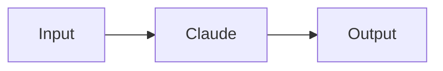

# Architecture

Detailed architecture documentation for Canvas as Data.

## System Overview

Canvas as Data transforms Stitch from an in-memory workflow system to a robust, versioned, database-backed architecture. The system is built on three core principles:

1. **Separation of Concerns**: Visual graphs for UI, execution graphs for runtime
2. **Immutable Versions**: Every change creates a new version
3. **Validation First**: Catch errors at save time, not runtime

## High-Level Architecture

```
┌─────────────────────────────────────────────────────────────────┐
│                         Frontend Layer                           │
│                                                                   │
│  ┌──────────────┐  ┌──────────────┐  ┌──────────────┐          │
│  │ React Flow   │  │ Canvas Editor│  │ Run Viewer   │          │
│  │ UI           │  │              │  │              │          │
│  │              │  │ - Edit nodes │  │ - View runs  │          │
│  │ - Render     │  │ - Edit edges │  │ - See status │          │
│  │ - Interact   │  │ - Save       │  │ - Debug      │          │
│  └──────┬───────┘  └──────┬───────┘  └──────┬───────┘          │
│         │                  │                  │                  │
└─────────┼──────────────────┼──────────────────┼──────────────────┘
          │                  │                  │
          ▼                  ▼                  ▼
┌─────────────────────────────────────────────────────────────────┐
│                          API Layer                               │
│                                                                   │
│  ┌──────────────┐  ┌──────────────┐  ┌──────────────┐          │
│  │ Flow CRUD    │  │ Version Mgmt │  │ Run Execution│          │
│  │              │  │              │  │              │          │
│  │ GET /flows   │  │ POST /flows/ │  │ POST /flows/ │          │
│  │ POST /flows  │  │ [id]/versions│  │ [id]/run     │          │
│  │ PATCH /flows │  │ GET /flows/  │  │ GET /runs/   │          │
│  │ DELETE /flows│  │ [id]/versions│  │ [id]         │          │
│  └──────┬───────┘  └──────┬───────┘  └──────┬───────┘          │
└─────────┼──────────────────┼──────────────────┼──────────────────┘
          │                  │                  │
          ▼                  ▼                  ▼
┌─────────────────────────────────────────────────────────────────┐
│                     Business Logic Layer                         │
│                                                                   │
│  ┌──────────────┐  ┌──────────────┐  ┌──────────────┐          │
│  │ Version      │  │ OEG Compiler │  │ Mermaid      │          │
│  │ Manager      │  │              │  │ Parser       │          │
│  │              │  │ - Validate   │  │              │          │
│  │ - Create     │  │ - Optimize   │  │ - Parse      │          │
│  │ - Retrieve   │  │ - Strip UI   │  │ - Generate   │          │
│  │ - List       │  │ - Index      │  │ - Auto-layout│          │
│  │ - Auto-ver   │  │              │  │              │          │
│  └──────┬───────┘  └──────┬───────┘  └──────┬───────┘          │
└─────────┼──────────────────┼──────────────────┼──────────────────┘
          │                  │                  │
          ▼                  ▼                  ▼
┌─────────────────────────────────────────────────────────────────┐
│                    Database Layer (Supabase)                     │
│                                                                   │
│  ┌──────────────┐  ┌──────────────┐  ┌──────────────┐          │
│  │ stitch_flows │  │ stitch_flow_ │  │ stitch_runs  │          │
│  │              │  │ versions     │  │              │          │
│  │ - id         │  │              │  │ - id         │          │
│  │ - name       │  │ - id         │  │ - flow_id    │          │
│  │ - user_id    │  │ - flow_id    │  │ - version_id │          │
│  │ - current_   │  │ - visual_    │  │ - status     │          │
│  │   version_id │  │   graph      │  │ - node_      │          │
│  │ - canvas_    │  │ - execution_ │  │   states     │          │
│  │   type       │  │   graph      │  │ - created_at │          │
│  │ - parent_id  │  │ - commit_msg │  │              │          │
│  │ - created_at │  │ - created_at │  │              │          │
│  └──────────────┘  └──────────────┘  └──────────────┘          │
└─────────────────────────────────────────────────────────────────┘
```

## Data Flow

### Save Flow

```
User edits canvas
    ↓
Frontend collects visual graph
    ↓
POST /api/flows/[id]/versions
    ↓
Version Manager receives visual graph
    ↓
OEG Compiler validates & compiles
    ↓
┌─────────────────────────────┐
│ Validation Checks:          │
│ - Cycle detection           │
│ - Required inputs           │
│ - Worker types              │
│ - Edge mappings             │
└─────────────────────────────┘
    ↓
If valid:
    ↓
Create version record
    ↓
Store visual_graph (for UI)
Store execution_graph (for runtime)
    ↓
Update current_version_id pointer
    ↓
Return success
```

### Run Flow

```
User clicks "Run"
    ↓
Frontend sends current visual graph
    ↓
POST /api/flows/[id]/run
    ↓
Auto-version checks for changes
    ↓
┌─────────────────────────────┐
│ If changes detected:        │
│ - Create new version        │
│ - Use new version for run   │
│                             │
│ If no changes:              │
│ - Use current version       │
└─────────────────────────────┘
    ↓
Create run record
    ↓
Link to flow_version_id
    ↓
Load execution_graph from version
    ↓
Initialize node states
    ↓
Start execution
    ↓
Edge walker uses OEG:
- O(1) edge lookup via adjacency
- O(1) node lookup via index
- Pre-computed entry nodes
- Pre-computed terminal nodes
    ↓
Return run ID
```

### View Historical Run

```
User selects old run
    ↓
GET /api/runs/[id]
    ↓
Load run record
    ↓
Get flow_version_id
    ↓
GET /api/flows/[id]/versions/[vid]
    ↓
Load version record
    ↓
Return visual_graph
    ↓
Frontend renders historical canvas
    ↓
Show execution results
```

## Component Details

### Visual Graph

**Purpose**: Render canvas in UI

**Contents**:
- Node positions, styles, labels
- Edge styles, animations
- Worker configurations
- Input/output schemas
- Entity movement configs

**Size**: ~100-500 KB for typical workflow

**Storage**: `stitch_flow_versions.visual_graph`

**Example**:
```json
{
  "nodes": [
    {
      "id": "A",
      "type": "worker",
      "position": { "x": 100, "y": 100 },
      "data": {
        "label": "Claude Script Generator",
        "worker_type": "claude",
        "config": {
          "model": "claude-3-sonnet-20240229"
        },
        "inputs": {
          "prompt": {
            "type": "string",
            "required": true
          }
        },
        "outputs": {
          "script": {
            "type": "object"
          }
        }
      },
      "style": { "background": "#fff" },
      "width": 200,
      "height": 100
    }
  ],
  "edges": [
    {
      "id": "e1",
      "source": "A",
      "target": "B",
      "animated": true,
      "data": {
        "mapping": {
          "prompt": "output.script.text"
        }
      }
    }
  ]
}
```

### Execution Graph (OEG)

**Purpose**: Execute workflow efficiently

**Contents**:
- Stripped nodes (no UI properties)
- Adjacency map for O(1) lookup
- Edge data index
- Entry and terminal nodes

**Size**: ~40-200 KB (60% smaller than visual graph)

**Storage**: `stitch_flow_versions.execution_graph`

**Example**:
```json
{
  "nodes": {
    "A": {
      "id": "A",
      "type": "worker",
      "worker_type": "claude",
      "config": {
        "model": "claude-3-sonnet-20240229"
      },
      "inputs": {
        "prompt": {
          "type": "string",
          "required": true
        }
      },
      "outputs": {
        "script": {
          "type": "object"
        }
      }
    }
  },
  "adjacency": {
    "A": ["B"]
  },
  "edgeData": {
    "A->B": {
      "prompt": "output.script.text"
    }
  },
  "entryNodes": ["A"],
  "terminalNodes": ["B"]
}
```

### OEG Compiler

**Purpose**: Validate and optimize visual graphs

**Process**:

1. **Validation**
   - Cycle detection using DFS
   - **Strict required input validation**: Required inputs must have explicit edge mappings or defaults
     - Implicit data passing is disabled for safety
     - Merely connecting an edge is not enough
     - Each required input must be satisfied by `edge.data.mapping[inputName]` or `inputDef.default`
   - Worker type validation
   - Edge mapping validation

2. **Optimization**
   - Build adjacency map: `{ sourceId: [targetIds] }`
   - Index edge data: `{ "source->target": mapping }`
   - Strip UI properties (position, style, etc.)

3. **Indexing**
   - Index nodes by ID: `{ nodeId: node }`
   - Compute entry nodes (no incoming edges)
   - Compute terminal nodes (no outgoing edges)

**Performance**:
- Validation: O(V + E) where V = nodes, E = edges
- Compilation: O(V + E)
- Total: O(V + E) - linear time

### Version Manager

**Purpose**: Manage flow versions

**Operations**:

1. **Create Version**
   ```typescript
   createVersion(flowId, visualGraph, commitMessage)
   ```
   - Compile to OEG
   - Validate graph
   - Insert version record
   - Update current_version_id

2. **Get Version**
   ```typescript
   getVersion(versionId)
   ```
   - Load version record
   - Return both graphs

3. **List Versions**
   ```typescript
   listVersions(flowId)
   ```
   - Query versions for flow
   - Order by created_at DESC
   - Return array

4. **Auto-Version**
   ```typescript
   autoVersionOnRun(flowId, currentGraph)
   ```
   - Load current version
   - Compare graphs
   - Create version if different
   - Return version ID

### Mermaid Parser

**Purpose**: Convert Mermaid to visual graphs

**Process**:

1. **Parse Syntax**
   - Extract nodes and edges
   - Parse node labels
   - Parse edge connections

2. **Infer Types**
   - Node types from labels
   - Worker types from labels
   - Apply defaults

3. **Apply Configs**
   - Merge nodeConfigs
   - Merge edgeMappings
   - Override defaults

4. **Auto-Layout**
   - Compute hierarchical levels
   - Position nodes
   - Prevent overlaps

**Example**:


Becomes:
```json
{
  "nodes": [
    {
      "id": "A",
      "type": "ux",
      "position": { "x": 0, "y": 0 },
      "data": { "label": "Input" }
    },
    {
      "id": "B",
      "type": "worker",
      "position": { "x": 300, "y": 0 },
      "data": {
        "label": "Claude",
        "worker_type": "claude"
      }
    },
    {
      "id": "C",
      "type": "ux",
      "position": { "x": 600, "y": 0 },
      "data": { "label": "Output" }
    }
  ],
  "edges": [
    { "id": "e1", "source": "A", "target": "B" },
    { "id": "e2", "source": "B", "target": "C" }
  ]
}
```

### Auto-Layout Algorithm

**Purpose**: Position nodes automatically

**Algorithm**: Longest Path Layering

**Steps**:

1. Build reverse adjacency (child → parents)
2. Find entry nodes (no parents)
3. Assign levels:
   - Entry nodes: level 0
   - Other nodes: max(parent_levels) + 1
   - Wait for all parents before assigning
4. Position nodes:
   - X = level × horizontalSpacing
   - Y = indexInLevel × verticalSpacing

**Complexity**: O(V + E)

**Example**:
```
A → B → D
A → C → D

Levels:
A: 0
B: 1
C: 1
D: 2

Positions:
A: (0, 0)
B: (300, 0)
C: (300, 150)
D: (600, 0)
```

## Database Schema

### stitch_flows

**Purpose**: Flow metadata

**Columns**:
- `id`: UUID primary key
- `name`: Flow name
- `user_id`: Owner
- `current_version_id`: Points to latest version
- `canvas_type`: 'workflow' | 'bmc' | 'detail'
- `parent_id`: For nested canvases
- `created_at`: Creation timestamp
- `updated_at`: Update timestamp

**Indexes**:
- Primary key on `id`
- Index on `user_id`
- Index on `parent_id`

### stitch_flow_versions

**Purpose**: Immutable version snapshots

**Columns**:
- `id`: UUID primary key
- `flow_id`: Parent flow
- `visual_graph`: JSONB for UI
- `execution_graph`: JSONB for runtime
- `commit_message`: Optional description
- `created_at`: Creation timestamp

**Indexes**:
- Primary key on `id`
- Index on `flow_id`
- Index on `created_at DESC`

**Constraints**:
- Foreign key: `flow_id` → `stitch_flows.id`

### stitch_runs

**Purpose**: Execution instances

**Columns**:
- `id`: UUID primary key
- `flow_id`: Parent flow
- `flow_version_id`: Specific version executed
- `status`: 'pending' | 'running' | 'completed' | 'failed'
- `node_states`: JSONB execution state
- `created_at`: Creation timestamp

**Indexes**:
- Primary key on `id`
- Index on `flow_id`
- Index on `flow_version_id`
- Index on `status`

**Constraints**:
- Foreign key: `flow_id` → `stitch_flows.id`
- Foreign key: `flow_version_id` → `stitch_flow_versions.id`

## Performance Characteristics

### Visual Graph

- **Size**: 100-500 KB
- **Load time**: 10-50 ms
- **Parse time**: 5-20 ms
- **Render time**: 50-200 ms

### Execution Graph

- **Size**: 40-200 KB (60% smaller)
- **Load time**: 5-20 ms
- **Parse time**: 2-10 ms
- **Edge lookup**: O(1) via adjacency map
- **Node lookup**: O(1) via index

### Compilation

- **Time**: O(V + E) - linear
- **Typical**: 10-50 ms for 10-50 nodes
- **Large**: 100-200 ms for 100+ nodes

### Version Creation

- **Time**: Compilation + DB insert
- **Typical**: 50-100 ms
- **Includes**: Validation, optimization, storage

### Auto-Versioning

- **Time**: Load + compare + create (if needed)
- **Typical**: 100-200 ms
- **Cached**: 50-100 ms if no changes

## Security

### Row Level Security (RLS)

All tables use Supabase RLS:

```sql
-- Flows: Users can only access their own
CREATE POLICY flows_policy ON stitch_flows
  FOR ALL USING (auth.uid() = user_id);

-- Versions: Inherit from flow
CREATE POLICY versions_policy ON stitch_flow_versions
  FOR ALL USING (
    flow_id IN (
      SELECT id FROM stitch_flows
      WHERE user_id = auth.uid()
    )
  );

-- Runs: Inherit from flow
CREATE POLICY runs_policy ON stitch_runs
  FOR ALL USING (
    flow_id IN (
      SELECT id FROM stitch_flows
      WHERE user_id = auth.uid()
    )
  );
```

### Validation

All graphs are validated before storage:

- Prevent cycles (DoS via infinite loops)
- Limit graph size (DoS via large payloads)
- Validate worker types (prevent injection)
- Validate edge mappings (prevent injection)

### API Authentication

All endpoints require authentication:

```typescript
// Middleware checks session
const session = await getSession();
if (!session) {
  return new Response('Unauthorized', { status: 401 });
}
```

## Scalability

### Horizontal Scaling

- **API servers**: Stateless, can scale horizontally
- **Database**: Supabase handles scaling
- **Execution**: Workers are external, scale independently

### Caching

- **Versions**: Immutable, cache aggressively
- **Flows**: Cache with TTL
- **Runs**: Cache active runs only

### Optimization

- **Lazy loading**: Load versions on demand
- **Pagination**: List versions with pagination
- **Compression**: Compress large graphs
- **Indexes**: Optimize frequent queries

## Monitoring

### Metrics

- Version creation rate
- Compilation time
- Validation error rate
- Run creation rate
- Execution time

### Logging

- Version creation events
- Validation errors
- Compilation errors
- Run execution events

### Alerts

- High validation error rate
- Slow compilation times
- Failed version creations
- Database errors

## Future Enhancements

### Graph Diffing

Visual diff between versions:
- Highlight added nodes
- Highlight removed nodes
- Highlight modified nodes
- Show edge changes

### Version Branching

Multiple version branches:
- Experimental changes
- Feature branches
- Merge branches

### Collaborative Editing

Real-time collaboration:
- Operational transforms
- Conflict resolution
- Presence indicators

### Graph Analytics

Execution analysis:
- Identify bottlenecks
- Suggest optimizations
- Performance metrics
