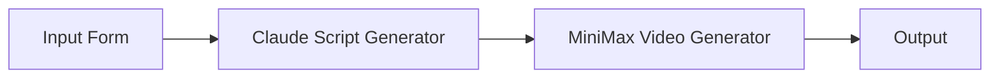
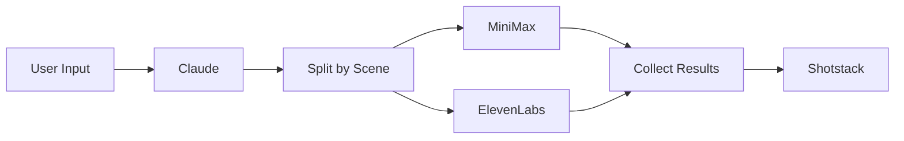
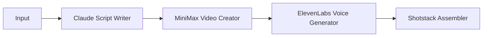
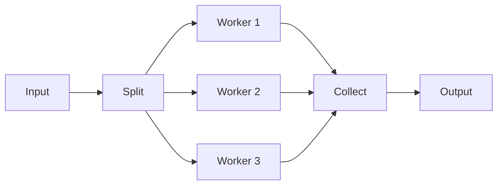
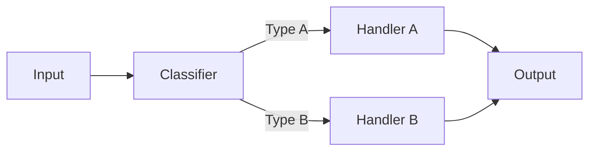
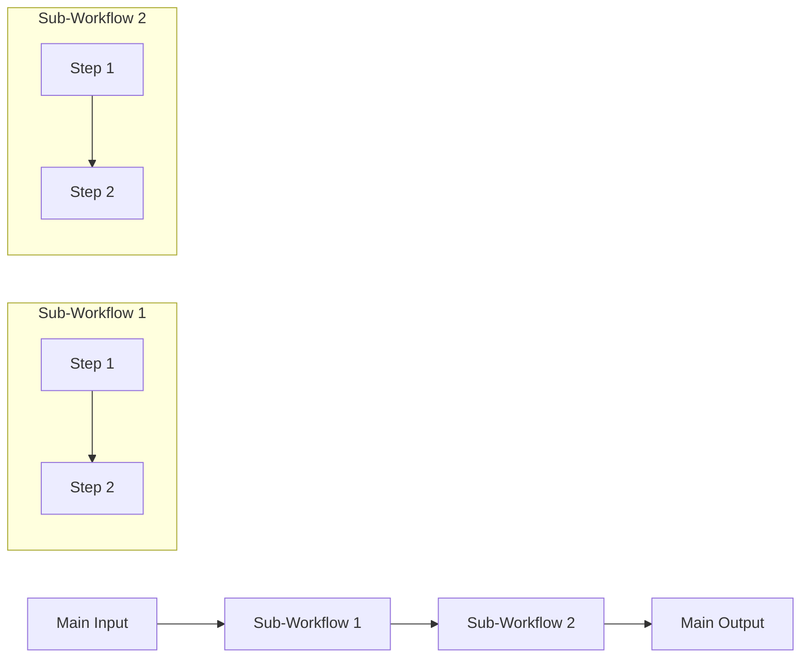

# Mermaid Integration

Complete guide to using Mermaid for workflow creation in Stitch.

## Overview

Mermaid is a text-based diagramming language that's perfect for AI-generated workflows. Stitch supports bidirectional Mermaid conversion:

- **Import**: Parse Mermaid flowcharts into visual graphs
- **Export**: Generate Mermaid from existing canvases
- **Hybrid**: Combine Mermaid structure with JSON configs

## Why Mermaid?

### For AI/LLMs

- **Natural format**: Easy for LLMs to generate and understand
- **Concise**: Describe complex workflows in a few lines
- **Structured**: Clear syntax that's easy to parse
- **Familiar**: Widely used in documentation and diagrams

### For Developers

- **Quick sketching**: Prototype workflows rapidly
- **Version control**: Text-based format works great with git
- **Documentation**: Workflows are self-documenting
- **Collaboration**: Easy to review and discuss changes

## Basic Syntax

### Simple Workflow



This creates a linear workflow with 4 nodes.

### Node Types

Stitch infers node types from labels:



**Inference rules:**

- Contains "input", "form", "user" → `ux` node
- Contains "split", "branch" → `splitter` node
- Contains "collect", "merge", "join" → `collector` node
- Contains worker name (claude, minimax, etc.) → `worker` node with inferred type
- Default → `worker` node

### Worker Type Inference

Worker types are inferred from labels:



**Inference rules:**

- Contains "claude", "gpt" → `claude` worker
- Contains "minimax", "video gen" → `minimax` worker
- Contains "elevenlabs", "voice", "audio" → `elevenlabs` worker
- Contains "shotstack", "assemble" → `shotstack` worker

## Hybrid Approach

Combine Mermaid structure with JSON configs for full control.

### Node Configs

Provide detailed configurations for specific nodes:

```typescript
const workflow = {
  mermaid: `
    flowchart LR
      A[Input] --> B[Claude]
      B --> C[MiniMax]
  `,
  nodeConfigs: {
    B: {
      workerType: 'claude',
      config: {
        model: 'claude-3-opus-20240229',
        temperature: 0.7,
        maxTokens: 2000
      }
    },
    C: {
      workerType: 'minimax',
      config: {
        duration: 10,
        resolution: '1080p'
      }
    }
  }
};
```

### Edge Mappings

Define how data flows between nodes:

```typescript
const workflow = {
  mermaid: `
    flowchart LR
      A[Input] --> B[Claude]
      B --> C[MiniMax]
  `,
  edgeMappings: {
    'A->B': {
      prompt: 'input.topic',
      context: 'input.additionalInfo'
    },
    'B->C': {
      prompt: 'output.script.visualDescription',
      duration: 'config.videoDuration'
    }
  }
};
```

### Complete Example

```typescript
const response = await fetch('/api/flows', {
  method: 'POST',
  headers: { 'Content-Type': 'application/json' },
  body: JSON.stringify({
    name: 'Video Factory',
    mermaid: `
      flowchart LR
        A[Topic Input] --> B[Claude Script Generator]
        B --> C[Split by Scene]
        C --> D[MiniMax Video]
        C --> E[ElevenLabs Voice]
        D --> F[Collect Media]
        E --> F
        F --> G[Shotstack Assembler]
        G --> H[Output]
    `,
    nodeConfigs: {
      B: {
        workerType: 'claude',
        config: {
          model: 'claude-3-sonnet-20240229',
          systemPrompt: 'You are a video script writer...'
        }
      },
      D: {
        workerType: 'minimax',
        config: { duration: 5 }
      },
      E: {
        workerType: 'elevenlabs',
        config: { voice_id: 'professional' }
      },
      G: {
        workerType: 'shotstack',
        config: { format: 'mp4', quality: 'high' }
      }
    },
    edgeMappings: {
      'A->B': {
        prompt: 'input.topic'
      },
      'B->C': {
        scenes: 'output.script.scenes'
      },
      'C->D': {
        prompt: 'item.visualDescription'
      },
      'C->E': {
        text: 'item.narration'
      },
      'D->F': {
        video: 'output.videoUrl'
      },
      'E->F': {
        audio: 'output.audioUrl'
      },
      'F->G': {
        clips: 'output.collected'
      }
    }
  })
});
```

## Import Workflow

### From UI

Use the MermaidImportExport component:

```tsx
import { MermaidImportExport } from '@/components/canvas/MermaidImportExport';

<MermaidImportExport
  flowId={flowId}
  onImport={(visualGraph) => {
    // Graph has been imported and validated
    setNodes(visualGraph.nodes);
    setEdges(visualGraph.edges);
  }}
/>
```

### From API

```typescript
const response = await fetch('/api/flows', {
  method: 'POST',
  body: JSON.stringify({
    name: 'My Workflow',
    mermaid: mermaidString,
    nodeConfigs: configs,
    edgeMappings: mappings
  })
});

const { flowId, versionId } = await response.json();
```

### Programmatically

```typescript
import { mermaidToCanvas } from '@/lib/canvas/mermaid-parser';

const visualGraph = mermaidToCanvas(
  mermaidString,
  nodeConfigs,
  edgeMappings
);

// Graph is ready to use
console.log('Nodes:', visualGraph.nodes.length);
console.log('Edges:', visualGraph.edges.length);
```

## Export Workflow

### From UI

```tsx
import { MermaidImportExport } from '@/components/canvas/MermaidImportExport';

<MermaidImportExport
  flowId={flowId}
  currentGraph={visualGraph}
  onExport={(mermaid) => {
    // Copy to clipboard or download
    navigator.clipboard.writeText(mermaid);
  }}
/>
```

### Programmatically

```typescript
import { canvasToMermaid } from '@/lib/canvas/mermaid-generator';

const mermaid = canvasToMermaid(visualGraph);

console.log(mermaid);
// Output:
// flowchart LR
//   A[Input] --> B[Claude]
//   B --> C[Output]
```

## Auto-Layout

When importing from Mermaid, nodes are automatically positioned:

```typescript
import { autoLayout } from '@/lib/canvas/auto-layout';

// Mermaid doesn't include positions
const nodesWithoutPositions = parseMermaid(mermaidString);

// Auto-layout assigns positions
const layoutedNodes = autoLayout(nodesWithoutPositions, edges);

// Nodes now have x, y coordinates
layoutedNodes.forEach(node => {
  console.log(`${node.id}: (${node.position.x}, ${node.position.y})`);
});
```

### Layout Algorithm

Uses **Kahn's Algorithm with Longest Path Layering** for hierarchical layout:

1. Calculate in-degree (number of incoming edges) for each node
2. Start with nodes having in-degree 0 (entry nodes) at level 0
3. Process each node: update children's levels and decrement their in-degrees
4. When a child's in-degree reaches 0, all parents processed - add to queue
5. Child level = max(parent_levels) + 1 (Longest Path Layering)
6. Position nodes with spacing:
   - Horizontal: 300px between levels
   - Vertical: 150px between nodes in same level

**Cycle Safety:** The layout engine is robust against cycles. If a cycle is detected during layout, nodes in the cycle will never reach in-degree 0 and won't be processed. The algorithm terminates safely rather than hanging, preventing infinite loops.

### Customizing Layout

```typescript
const layoutedNodes = autoLayout(nodes, edges, {
  horizontalSpacing: 400,  // More space between levels
  verticalSpacing: 200     // More space between nodes
});
```

## Round-Trip Conversion

Mermaid conversion preserves structure but may lose details:

```typescript
// Original graph with detailed configs
const original = {
  nodes: [
    {
      id: 'A',
      type: 'worker',
      data: {
        label: 'Claude',
        worker_type: 'claude',
        config: {
          model: 'claude-3-opus-20240229',
          temperature: 0.7,
          maxTokens: 2000
        }
      }
    }
  ]
};

// Convert to Mermaid
const mermaid = canvasToMermaid(original);
// flowchart LR
//   A[Claude]

// Convert back
const restored = mermaidToCanvas(mermaid);
// Node type and worker type are inferred
// But detailed config is lost
```

**To preserve configs, use hybrid approach:**

```typescript
const mermaid = canvasToMermaid(original);
const nodeConfigs = extractNodeConfigs(original);
const edgeMappings = extractEdgeMappings(original);

// Now you can restore with full fidelity
const restored = mermaidToCanvas(mermaid, nodeConfigs, edgeMappings);
```

## Advanced Patterns

### Parallel Processing



### Conditional Branching



### Nested Workflows



## Validation

Imported Mermaid is validated before creating a version:

```typescript
try {
  const visualGraph = mermaidToCanvas(mermaidString);
  const result = compileToOEG(visualGraph);
  
  if (!result.success) {
    console.error('Validation errors:', result.errors);
  }
} catch (error) {
  console.error('Parse error:', error.message);
}
```

### Common Validation Errors

1. **Cycles**: Mermaid allows cycles, but Stitch requires DAGs

```mermaid
# Invalid: Contains cycle
flowchart LR
  A --> B
  B --> C
  C --> A
```

2. **Missing Inputs**: Required inputs must have connections

```mermaid
# Invalid: B requires input but A has no output
flowchart LR
  A[Input] --> B[Worker]
```

3. **Invalid Worker Types**: Worker must exist in registry

```mermaid
# Invalid: "CustomWorker" not in registry
flowchart LR
  A[Input] --> B[CustomWorker]
```

## Best Practices

### 1. Use Descriptive Labels

```mermaid
# Good
flowchart LR
  A[User Topic Input] --> B[Claude Script Generator]
  B --> C[MiniMax Video Creator]

# Bad
flowchart LR
  A[Input] --> B[Process]
  B --> C[Output]
```

### 2. Include Worker Names in Labels

```mermaid
# Good: Worker type is clear
flowchart LR
  A[Input] --> B[Claude Script Writer]
  B --> C[MiniMax Video Generator]

# Bad: Worker type unclear
flowchart LR
  A[Input] --> B[Script Writer]
  B --> C[Video Generator]
```

### 3. Use Hybrid Approach for Production

```typescript
// Good: Structure in Mermaid, details in JSON
{
  mermaid: "flowchart LR\n  A --> B --> C",
  nodeConfigs: { /* detailed configs */ },
  edgeMappings: { /* data flow */ }
}

// Bad: Everything in Mermaid (loses details)
{
  mermaid: "flowchart LR\n  A --> B --> C"
}
```

### 4. Version Control Mermaid

```bash
# Store Mermaid in version control
git add workflows/video-factory.mmd
git commit -m "Updated video factory workflow"
```

### 5. Document Edge Mappings

```typescript
const edgeMappings = {
  // Map output.script.text to input.prompt
  'A->B': {
    prompt: 'output.script.text'  // Clear comment
  }
};
```

## Troubleshooting

### Import Fails

**Problem**: Mermaid import returns parse error

**Solution**: Check Mermaid syntax

```typescript
// Test Mermaid syntax
try {
  const graph = mermaidToCanvas(mermaidString);
  console.log('Valid Mermaid');
} catch (error) {
  console.error('Parse error:', error.message);
  // Fix syntax and try again
}
```

### Worker Type Not Inferred

**Problem**: Worker type not detected from label

**Solution**: Use explicit nodeConfigs

```typescript
{
  mermaid: "flowchart LR\n  A[Input] --> B[Custom Worker]",
  nodeConfigs: {
    B: {
      workerType: 'claude'  // Explicit type
    }
  }
}
```

### Layout Looks Wrong

**Problem**: Auto-layout produces overlapping nodes

**Solution**: Adjust spacing or manually position

```typescript
// Option 1: Adjust spacing
const layouted = autoLayout(nodes, edges, {
  horizontalSpacing: 400,
  verticalSpacing: 200
});

// Option 2: Manual positioning
const positioned = nodes.map((node, i) => ({
  ...node,
  position: { x: i * 300, y: 0 }
}));
```

## Examples

See [Workflow Examples](./EXAMPLES.md) for complete Mermaid examples.

## API Reference

See [API Reference](./API.md) for endpoint documentation.
