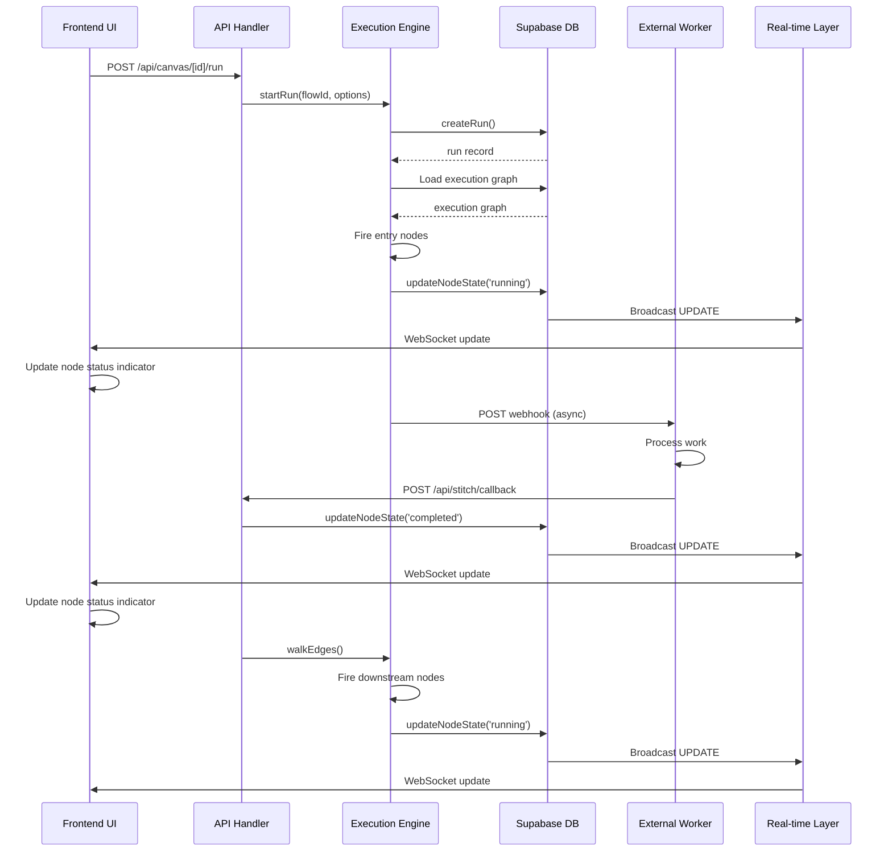
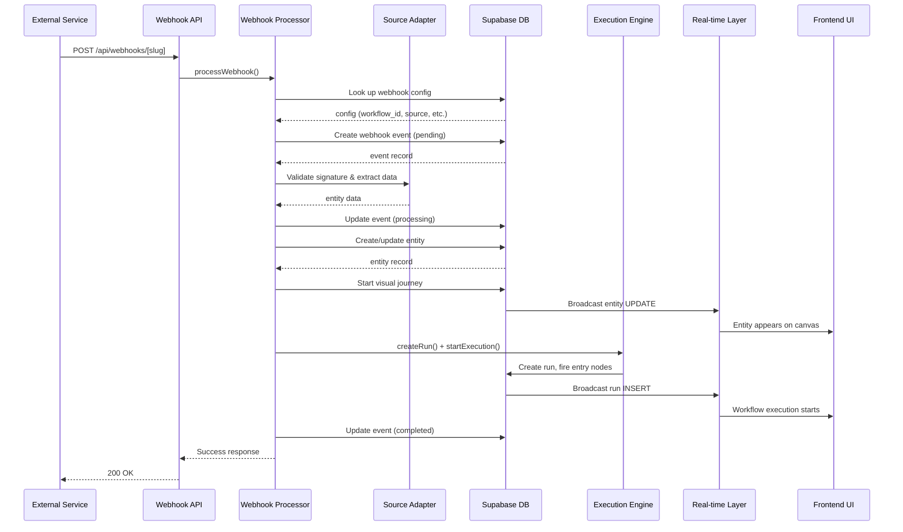
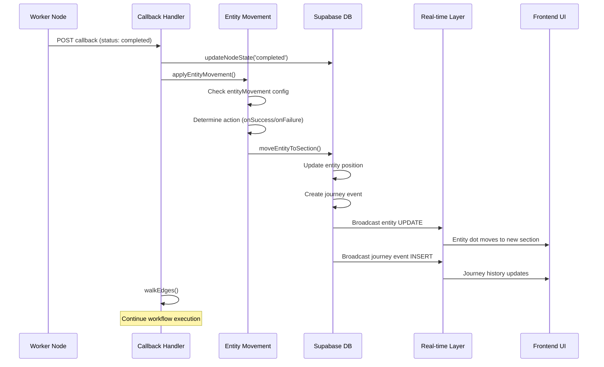
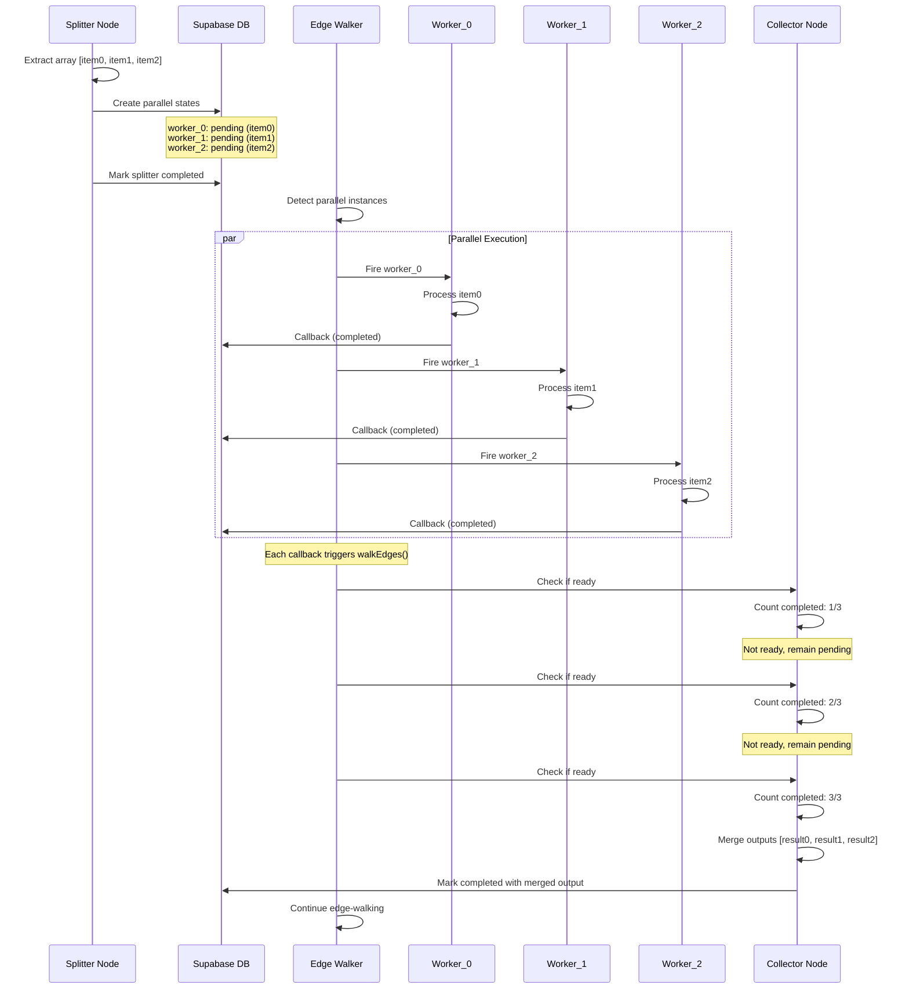

# Data Flow

## Overview

This document describes how data flows through the Stitch platform, from initial requests through execution to database persistence and real-time UI updates. Understanding these flows is critical for debugging, extending functionality, and maintaining system integrity.

Stitch follows a strict **database-as-source-of-truth** architecture where all state changes are immediately persisted to Supabase PostgreSQL. There is no in-memory state management, ensuring workflows can resume after server restarts and multiple instances can coordinate execution.

## Core Data Flow Principles

### 1. Database as Source of Truth

Every state change is written to the database immediately:
- Node status transitions → `stitch_runs.node_states`
- Entity positions → `stitch_entities.current_node_id`, `current_edge_id`
- Journey history → `stitch_journey_events`
- Webhook events → `stitch_webhook_events`

**No in-memory caching**: If the server restarts, execution resumes from database state.

### 2. Event-Driven Architecture

Data flows through the system via events:
- Node completion → Database update → Edge-walking trigger
- Webhook received → Entity creation → Workflow execution
- Database change → Supabase real-time → UI update

### 3. Atomic Updates

Critical operations use database-level atomicity:
- Node state updates use RPC function `update_node_state` to prevent race conditions
- Parallel path initialization uses single transaction
- Entity movement uses atomic position updates

## Primary Data Flows

### Flow 1: Manual Workflow Execution

**Trigger**: User clicks "Run" button in UI

**Path**: UI → API → Database → Execution Engine → Workers → Callbacks → Database → UI


#### Step-by-Step Flow

```
1. User Action
   └─> Click "Run" button in WorkflowCanvas
       └─> POST /api/canvas/[id]/run

2. API Handler (src/app/api/canvas/[id]/run/route.ts)
   └─> Parse request body (optional entity_id, input)
   └─> Call startRun(flowId, options)

3. Start Run (src/lib/engine/edge-walker.ts)
   └─> createRun(flowId, options)
       ├─> Load execution graph from current version
       ├─> Initialize all nodes to 'pending' status
       ├─> Store in stitch_runs table
       └─> Return run record
   └─> Fire entry nodes
       ├─> For each entry node in execution graph
       ├─> Call fireNodeWithGraph(nodeId, executionGraph, run)
       └─> Node handlers execute based on type

4. Node Execution (Worker Example)
   └─> fireWorkerNode(runId, nodeId, config, input)
       ├─> Update node status to 'running'
       │   └─> updateNodeState(runId, nodeId, { status: 'running' })
       │       └─> Database RPC: update_node_state()
       │           └─> Atomic JSONB update in stitch_runs
       ├─> Build worker payload
       │   ├─> runId, nodeId, config, input
       │   └─> callbackUrl: ${BASE_URL}/api/stitch/callback/${runId}/${nodeId}
       └─> Send HTTP POST to worker webhook
           └─> Worker processes asynchronously

5. Worker Processing (External Service)
   └─> Receive webhook payload
   └─> Execute work (AI generation, video processing, etc.)
   └─> POST callback to Stitch
       └─> POST /api/stitch/callback/[runId]/[nodeId]
           └─> Body: { status: 'completed', output: {...} }

6. Callback Handler (src/app/api/stitch/callback/[runId]/[nodeId]/route.ts)
   └─> Validate callback payload
   └─> Update node state
       └─> updateNodeState(runId, nodeId, { status: 'completed', output })
           └─> Database RPC: update_node_state()
               └─> Atomic JSONB update in stitch_runs
   └─> Apply entity movement (if configured)
   └─> Trigger edge-walking
       └─> walkEdges(nodeId, run)

7. Edge-Walking (src/lib/engine/edge-walker.ts)
   └─> Load execution graph from run.flow_version_id
   └─> Use adjacency map for O(1) edge lookup
   └─> For each downstream node:
       ├─> Check if all upstream dependencies completed
       ├─> If ready: fireNodeWithGraph(targetNodeId, executionGraph, run)
       └─> Repeat recursively until terminal nodes

8. Real-Time UI Update
   └─> Database change in stitch_runs
   └─> Supabase broadcasts via WebSocket
   └─> Frontend subscription receives update
       └─> useRealtimeSubscription hook
           └─> React state updates
               └─> UI re-renders with new node status

```

#### Data Transformations

**Request → Run Creation**:
```typescript
// Input
{
  flowId: "uuid",
  entityId: "uuid" (optional),
  input: { key: "value" } (optional)
}

// Database Record (stitch_runs)
{
  id: "generated-uuid",
  flow_id: "uuid",
  flow_version_id: "uuid",
  entity_id: "uuid" | null,
  node_states: {
    "node-1": { status: "pending" },
    "node-2": { status: "pending" },
    ...
  },
  trigger: {
    type: "manual",
    source: null,
    event_id: null,
    timestamp: "2024-12-05T10:30:00Z"
  },
  created_at: "2024-12-05T10:30:00Z"
}
```

**Node Execution → State Update**:
```typescript
// Before (node pending)
node_states: {
  "worker-1": { status: "pending" }
}

// After firing (node running)
node_states: {
  "worker-1": { 
    status: "running",
    started_at: "2024-12-05T10:30:01Z"
  }
}

// After callback (node completed)
node_states: {
  "worker-1": { 
    status: "completed",
    started_at: "2024-12-05T10:30:01Z",
    completed_at: "2024-12-05T10:30:15Z",
    output: {
      script: "Generated video script...",
      duration: 60
    }
  }
}
```

**Upstream Outputs → Downstream Input**:
```typescript
// Upstream node outputs
node_states: {
  "node-1": { 
    status: "completed",
    output: { text: "Hello", count: 5 }
  },
  "node-2": { 
    status: "completed",
    output: { url: "https://example.com" }
  }
}

// Merged input for downstream node-3
input = {
  text: "Hello",
  count: 5,
  url: "https://example.com"
}
```


### Flow 2: Webhook-Triggered Execution

**Trigger**: External service sends webhook (Stripe payment, Typeform submission, etc.)

**Path**: Webhook → API → Adapter → Entity Creation → Workflow Execution → Database → UI

#### Step-by-Step Flow

```
1. External Service
   └─> POST /api/webhooks/[endpoint_slug]
       ├─> Headers: X-Webhook-Signature (for validation)
       └─> Body: Service-specific payload

2. Webhook API Handler (src/app/api/webhooks/[endpoint_slug]/route.ts)
   └─> Extract endpoint_slug from URL
   └─> Read raw body (for signature validation)
   └─> Parse JSON payload
   └─> Extract signature header
   └─> Call processWebhook(slug, rawBody, payload, signature)

3. Webhook Processor (src/lib/webhooks/processor.ts)
   └─> Look up webhook configuration
       └─> getWebhookConfigBySlugAdmin(endpoint_slug)
           └─> Query stitch_webhook_configs table
               └─> Returns: workflow_id, canvas_id, source, entry_edge_id, etc.
   
   └─> Create webhook event record (status: 'pending')
       └─> createWebhookEvent({ webhook_config_id, payload, status: 'pending' })
           └─> Insert into stitch_webhook_events table
   
   └─> Validate webhook is active
       └─> Check webhook_config.is_active
   
   └─> Process with adapter
       └─> processAdapterLogic(webhookConfig, rawBody, payload, headers)
           ├─> Select adapter based on source (stripe, typeform, calendly, n8n)
           ├─> Validate signature using source-specific method
           └─> Extract entity data from payload
               └─> Returns: { name, email, entity_type, avatar_url, metadata }
   
   └─> Update webhook event (status: 'processing')
   
   └─> Create or update entity
       ├─> Check if entity exists by email
       ├─> If exists: Update entity record
       └─> If not: Create new entity record
           └─> Insert into stitch_entities table
               └─> Returns: entity with id
   
   └─> Start visual journey
       └─> startJourney(entity.id, entry_edge_id)
           ├─> Update entity.current_edge_id
           └─> Create journey event (type: 'started')
   
   └─> Create workflow run
       └─> createRunAdmin(workflow_id, { entity_id, trigger })
           ├─> trigger: { type: 'webhook', source, event_id, timestamp }
           └─> Initialize all nodes to 'pending'
   
   └─> Start execution
       └─> Find entry edge target node
       └─> fireNode(targetNodeId, flow, run)
           └─> Begin edge-walking execution
   
   └─> Update webhook event (status: 'completed')
       └─> Link entity_id and workflow_run_id

4. Execution Continues
   └─> Same as Flow 1 (edge-walking, callbacks, etc.)

5. Real-Time UI Update
   └─> Entity appears on canvas at entry edge
   └─> Entity moves through workflow as nodes complete
   └─> Journey history updates in real-time
```


#### Data Transformations

**Webhook Payload → Entity Data**:
```typescript
// Stripe Payment Webhook
{
  type: "payment_intent.succeeded",
  data: {
    object: {
      customer_email: "user@example.com",
      amount: 5000,
      metadata: { plan: "pro" }
    }
  }
}

// Extracted Entity Data
{
  name: "user@example.com",
  email: "user@example.com",
  entity_type: "customer",
  avatar_url: null,
  metadata: {
    source: "stripe",
    plan: "pro",
    amount: 5000
  }
}
```

**Entity Creation → Database Record**:
```typescript
// stitch_entities table
{
  id: "generated-uuid",
  canvas_id: "uuid",
  name: "user@example.com",
  email: "user@example.com",
  entity_type: "customer",
  avatar_url: null,
  current_node_id: null,
  current_edge_id: "entry-edge-uuid",
  metadata: {
    source: "stripe",
    plan: "pro",
    amount: 5000
  },
  created_at: "2024-12-05T10:30:00Z"
}
```

**Webhook Event Lifecycle**:
```typescript
// 1. Initial creation (pending)
{
  id: "event-uuid",
  webhook_config_id: "config-uuid",
  payload: { /* raw webhook payload */ },
  entity_id: null,
  workflow_run_id: null,
  status: "pending",
  error: null
}

// 2. During processing
{
  status: "processing",
  // ... other fields unchanged
}

// 3. After successful processing
{
  status: "completed",
  entity_id: "entity-uuid",
  workflow_run_id: "run-uuid",
  error: null
}

// 4. If processing fails
{
  status: "failed",
  entity_id: null,
  workflow_run_id: null,
  error: "Signature validation failed"
}
```


### Flow 3: Real-Time UI Updates

**Trigger**: Database change in Supabase

**Path**: Database → Supabase Real-time → WebSocket → Frontend → React State → UI

#### Step-by-Step Flow

```
1. Database Change
   └─> Any INSERT, UPDATE, or DELETE in Supabase tables
       ├─> stitch_runs (node status changes)
       ├─> stitch_entities (position updates)
       ├─> stitch_journey_events (movement history)
       └─> stitch_webhook_events (webhook processing)

2. Supabase Real-time Layer
   └─> PostgreSQL triggers detect change
   └─> Change is broadcast via WebSocket
       └─> Channel: postgres_changes
           ├─> Schema: public
           ├─> Table: stitch_runs (or other table)
           └─> Filter: id=eq.{runId} (optional)

3. Frontend Subscription (src/hooks/useRealtimeSubscription.ts)
   └─> useRealtimeSubscription hook manages channel lifecycle
       ├─> Creates Supabase channel with unique key
       ├─> Subscribes to postgres_changes event
       ├─> Registers callback function
       └─> Handles reference counting for shared subscriptions
   
   └─> On change received:
       └─> Callback invoked with payload
           ├─> payload.eventType: 'INSERT' | 'UPDATE' | 'DELETE'
           ├─> payload.new: New record data
           └─> payload.old: Old record data (for UPDATE/DELETE)

4. React State Update
   └─> Callback updates React state
       ├─> useState setter called
       ├─> Component re-renders
       └─> UI reflects new data

5. UI Re-render
   └─> Canvas components update
       ├─> Node status indicators change color
       ├─> Entity dots move to new positions
       ├─> Journey history panel updates
       └─> Run status overlay updates
```

#### Subscription Patterns

**Run Status Subscription**:
```typescript
// src/hooks/useRunStatus.ts
useRealtimeSubscription(
  {
    table: 'stitch_runs',
    filter: `id=eq.${runId}`,
    event: 'UPDATE'
  },
  (payload) => {
    const updatedRun = payload.new as StitchRun;
    setRun(updatedRun);
    
    // Update node states in UI
    setNodeStates(updatedRun.node_states);
  }
);
```

**Entity Position Subscription**:
```typescript
// src/hooks/useEntities.ts
useRealtimeSubscription(
  {
    table: 'stitch_entities',
    filter: `canvas_id=eq.${canvasId}`,
    event: '*'  // All events (INSERT, UPDATE, DELETE)
  },
  (payload) => {
    if (payload.eventType === 'UPDATE') {
      const updatedEntity = payload.new as StitchEntity;
      
      // Update entity position in state
      setEntities(prev => 
        prev.map(e => e.id === updatedEntity.id ? updatedEntity : e)
      );
    }
  }
);
```

**Journey Events Subscription**:
```typescript
// src/hooks/useJourneyHistory.ts
useRealtimeSubscription(
  {
    table: 'stitch_journey_events',
    filter: `entity_id=eq.${entityId}`,
    event: 'INSERT'
  },
  (payload) => {
    const newEvent = payload.new as JourneyEvent;
    
    // Append to journey history
    setJourneyEvents(prev => [...prev, newEvent]);
  }
);
```


#### Subscription Lifecycle Management

The `useRealtimeSubscription` hook implements reference counting to prevent duplicate subscriptions:

```typescript
// Global registry tracks active subscriptions
const subscriptionRegistry = new Map<string, {
  channel: RealtimeChannel,
  refCount: number,
  callbacks: Set<Function>
}>();

// When component mounts
1. Generate unique key: `${table}:${filter}:${event}`
2. Check if subscription exists
   - If yes: Increment refCount, add callback
   - If no: Create new channel, subscribe, register
3. Return status and error state

// When component unmounts
1. Decrement refCount
2. Remove callback from set
3. If refCount === 0:
   - Unsubscribe from channel
   - Remove from registry
```

**Benefits**:
- Multiple components can share same subscription
- Automatic cleanup when no longer needed
- Prevents memory leaks
- Reduces WebSocket connections


### Flow 4: Entity Movement Through Workflow

**Trigger**: Node completion with entity movement configuration

**Path**: Node Completion → Entity Movement Handler → Database Update → Journey Event → UI Update

#### Step-by-Step Flow

```
1. Node Completes Successfully
   └─> Worker callback received with status: 'completed'
   └─> updateNodeState(runId, nodeId, { status: 'completed', output })

2. Check for Entity Movement Configuration
   └─> Node has entityMovement config in data
       {
         onSuccess: {
           targetSectionId: "customers-section",
           completeAs: "success",
           setEntityType: "customer"
         },
         onFailure: {
           targetSectionId: "nurture-section",
           completeAs: "neutral"
         }
       }

3. Apply Entity Movement (src/lib/engine/handlers/worker.ts)
   └─> applyEntityMovement(runId, nodeId, config, status)
       ├─> Get run and check for entity_id
       ├─> Determine movement action based on status
       │   └─> status === 'completed' ? onSuccess : onFailure
       └─> Call moveEntityToSection()

4. Move Entity to Section (src/lib/db/entities.ts)
   └─> moveEntityToSection(entityId, targetSectionId, completeAs, metadata, newType)
       ├─> Update entity record
       │   ├─> current_node_id = targetSectionId
       │   ├─> current_edge_id = null
       │   └─> entity_type = newType (if provided)
       │
       ├─> Create journey event
       │   └─> Insert into stitch_journey_events
       │       {
       │         entity_id,
       │         event_type: 'moved_to_section',
       │         from_node_id: previousNodeId,
       │         to_node_id: targetSectionId,
       │         completion_type: completeAs,
       │         metadata: { run_id, node_id }
       │       }
       │
       └─> Return updated entity

5. Database Triggers Real-Time Update
   └─> stitch_entities UPDATE
       └─> Supabase broadcasts change
   └─> stitch_journey_events INSERT
       └─> Supabase broadcasts change

6. Frontend Receives Updates
   └─> Entity position subscription
       └─> Entity dot moves to new section
   └─> Journey events subscription
       └─> Journey history panel updates
   └─> Entity type may change (lead → customer)
       └─> Visual indicator updates
```


#### Entity Type Conversion

Entities can change type as they move through workflows:

```typescript
// Initial state (from webhook)
{
  entity_type: "lead",
  current_edge_id: "entry-edge",
  current_node_id: null
}

// After qualification workflow completes
{
  entity_type: "customer",  // Converted!
  current_edge_id: null,
  current_node_id: "customers-section"
}

// Journey event records the conversion
{
  event_type: "moved_to_section",
  from_node_id: "qualify-lead-worker",
  to_node_id: "customers-section",
  completion_type: "success",
  metadata: {
    run_id: "uuid",
    node_id: "qualify-lead-worker",
    type_changed: true,
    old_type: "lead",
    new_type: "customer"
  }
}
```


### Flow 5: Parallel Execution (Splitter → Collector)

**Trigger**: Splitter node receives array input

**Path**: Splitter → Parallel Instances → Collector → Merged Output

#### Step-by-Step Flow

```
1. Splitter Node Fires
   └─> fireSplitterNode(runId, nodeId, config, input, downstreamNodeIds)
       ├─> Extract array from input using config.arrayPath
       │   └─> Example: input.scenes = [scene1, scene2, scene3]
       │
       ├─> Create parallel path states
       │   └─> For each array element (index i):
       │       └─> For each downstream node:
       │           ├─> Augment node ID: "worker" → "worker_0", "worker_1", "worker_2"
       │           └─> Create node state:
       │               {
       │                 status: "pending",
       │                 output: arrayElement  // Seed with array element
       │               }
       │
       └─> Update all states atomically
           └─> updateNodeStates(runId, parallelStates)

2. Edge-Walking Detects Parallel Instances
   └─> walkEdges(completedNodeId, run)
       └─> For downstream node "worker":
           ├─> Check for parallel instances in run.node_states
           │   └─> Find: "worker_0", "worker_1", "worker_2"
           │
           └─> Fire ALL parallel instances concurrently
               └─> Promise.all([
                     fireWorkerNode(runId, "worker_0", config, scene1),
                     fireWorkerNode(runId, "worker_1", config, scene2),
                     fireWorkerNode(runId, "worker_2", config, scene3)
                   ])

3. Parallel Workers Execute
   └─> Each worker processes independently
       ├─> worker_0: Generate video for scene1
       ├─> worker_1: Generate video for scene2
       └─> worker_2: Generate video for scene3
   
   └─> Callbacks arrive independently
       ├─> POST /api/stitch/callback/{runId}/worker_0
       ├─> POST /api/stitch/callback/{runId}/worker_1
       └─> POST /api/stitch/callback/{runId}/worker_2
   
   └─> Each callback triggers edge-walking
       └─> walkEdges("worker_0", run)
       └─> walkEdges("worker_1", run)
       └─> walkEdges("worker_2", run)

4. Collector Node Waits
   └─> fireCollectorNode(runId, nodeId, config, upstreamNodeIds)
       ├─> Identify all upstream parallel paths
       │   └─> Find: "worker_0", "worker_1", "worker_2"
       │
       ├─> Count completed paths
       │   └─> Check each: node_states[parallelId].status === 'completed'
       │
       ├─> If not all completed: Return early (remain pending)
       │
       └─> If all completed:
           ├─> Merge outputs in order
           │   └─> Sort by index: worker_0, worker_1, worker_2
           │   └─> Extract outputs: [video1, video2, video3]
           │
           └─> Mark collector as completed
               └─> updateNodeState(runId, nodeId, {
                     status: 'completed',
                     output: [video1, video2, video3]
                   })

5. Execution Continues
   └─> Collector completion triggers edge-walking
   └─> Downstream nodes receive merged array
       └─> Example: Video assembly node receives all videos
```


#### Parallel Execution State Transitions

```typescript
// Initial state (before splitter)
node_states: {
  "splitter": { status: "pending" },
  "worker": { status: "pending" },
  "collector": { status: "pending" }
}

// After splitter fires (array of 3 elements)
node_states: {
  "splitter": { 
    status: "completed",
    output: [scene1, scene2, scene3]
  },
  "worker_0": { status: "pending", output: scene1 },
  "worker_1": { status: "pending", output: scene2 },
  "worker_2": { status: "pending", output: scene3 },
  "collector": { status: "pending" }
}

// After worker_0 completes
node_states: {
  "splitter": { status: "completed", output: [...] },
  "worker_0": { status: "completed", output: video1 },
  "worker_1": { status: "running", output: scene2 },
  "worker_2": { status: "running", output: scene3 },
  "collector": { status: "pending" }  // Still waiting
}

// After all workers complete
node_states: {
  "splitter": { status: "completed", output: [...] },
  "worker_0": { status: "completed", output: video1 },
  "worker_1": { status: "completed", output: video2 },
  "worker_2": { status: "completed", output: video3 },
  "collector": { status: "pending" }  // About to fire
}

// After collector merges
node_states: {
  "splitter": { status: "completed", output: [...] },
  "worker_0": { status: "completed", output: video1 },
  "worker_1": { status: "completed", output: video2 },
  "worker_2": { status: "completed", output: video3 },
  "collector": { 
    status: "completed",
    output: [video1, video2, video3]  // Merged in order
  }
}
```


## Database Persistence Patterns

### Pattern 1: Atomic Node State Updates

**Problem**: Multiple workers completing simultaneously could cause race conditions when updating `node_states` JSONB field.

**Solution**: Database-level RPC function with atomic JSONB updates.

```sql
-- Database function: update_node_state
CREATE OR REPLACE FUNCTION update_node_state(
  p_run_id UUID,
  p_node_id TEXT,
  p_status TEXT,
  p_output JSONB DEFAULT NULL,
  p_error TEXT DEFAULT NULL
)
RETURNS TABLE (
  id UUID,
  flow_id UUID,
  node_states JSONB,
  created_at TIMESTAMPTZ
)
LANGUAGE plpgsql
AS $$
BEGIN
  RETURN QUERY
  UPDATE stitch_runs
  SET node_states = jsonb_set(
    jsonb_set(
      jsonb_set(
        COALESCE(node_states, '{}'::jsonb),
        ARRAY[p_node_id, 'status'],
        to_jsonb(p_status)
      ),
      ARRAY[p_node_id, 'output'],
      COALESCE(p_output, 'null'::jsonb)
    ),
    ARRAY[p_node_id, 'error'],
    COALESCE(to_jsonb(p_error), 'null'::jsonb)
  )
  WHERE stitch_runs.id = p_run_id
  RETURNING *;
END;
$$;
```

**Usage**:
```typescript
// src/lib/db/runs.ts
export async function updateNodeState(
  runId: string,
  nodeId: string,
  state: NodeState
): Promise<StitchRun> {
  const supabase = getAdminClient();
  
  const { data, error } = await supabase.rpc('update_node_state', {
    p_run_id: runId,
    p_node_id: nodeId,
    p_status: state.status,
    p_output: state.output || null,
    p_error: state.error || null,
  });
  
  return data[0] as StitchRun;
}
```

**Benefits**:
- Prevents lost updates from concurrent callbacks
- Single database round-trip
- Atomic at database level
- No application-level locking needed


### Pattern 2: Versioned Graph Storage

**Problem**: Editing a workflow while it's running could corrupt execution state.

**Solution**: Immutable versions with execution graph compilation.

```typescript
// Flow record (metadata container)
stitch_flows: {
  id: "flow-uuid",
  name: "Video Factory",
  current_version_id: "version-3-uuid",  // Points to latest
  canvas_type: "workflow",
  created_at: "2024-12-01T00:00:00Z"
}

// Version records (immutable snapshots)
stitch_flow_versions: [
  {
    id: "version-1-uuid",
    flow_id: "flow-uuid",
    visual_graph: { nodes: [...], edges: [...] },  // UI representation
    execution_graph: { nodes: {...}, adjacency: {...} },  // Runtime optimized
    commit_message: "Initial version",
    created_at: "2024-12-01T00:00:00Z"
  },
  {
    id: "version-2-uuid",
    flow_id: "flow-uuid",
    visual_graph: { nodes: [...], edges: [...] },
    execution_graph: { nodes: {...}, adjacency: {...} },
    commit_message: "Added parallel processing",
    created_at: "2024-12-02T00:00:00Z"
  },
  {
    id: "version-3-uuid",
    flow_id: "flow-uuid",
    visual_graph: { nodes: [...], edges: [...] },
    execution_graph: { nodes: {...}, adjacency: {...} },
    commit_message: "Fixed worker configuration",
    created_at: "2024-12-03T00:00:00Z"
  }
]

// Run record (execution instance)
stitch_runs: {
  id: "run-uuid",
  flow_id: "flow-uuid",
  flow_version_id: "version-2-uuid",  // Locked to specific version
  node_states: { ... },
  created_at: "2024-12-02T10:00:00Z"
}
```

**Workflow**:
1. User edits workflow in UI
2. On save: `createVersion(flowId, visualGraph, commitMessage)`
   - Compiles visual graph → execution graph
   - Stores both in new version record
   - Updates `flow.current_version_id`
3. On run: `startRun(flowId)`
   - Uses `flow.current_version_id` for execution
   - Run is locked to that version
4. Execution loads execution graph from `run.flow_version_id`
   - Even if flow is edited again, run continues with original version

**Benefits**:
- Running workflows are isolated from edits
- Complete version history
- Can rollback to previous versions
- Execution graph optimized for runtime (no UI overhead)


### Pattern 3: Entity Position Tracking

**Problem**: Track entity position on nodes or edges for visual journey.

**Solution**: Dual position fields with journey event audit log.

```typescript
// Entity record
stitch_entities: {
  id: "entity-uuid",
  canvas_id: "canvas-uuid",
  name: "Monica",
  email: "monica@example.com",
  entity_type: "lead",
  
  // Position tracking (mutually exclusive)
  current_node_id: null,           // On a node (section)
  current_edge_id: "edge-uuid",    // On an edge (travelling)
  
  metadata: { source: "linkedin" },
  created_at: "2024-12-05T10:00:00Z"
}

// Journey event log (immutable audit trail)
stitch_journey_events: [
  {
    id: "event-1",
    entity_id: "entity-uuid",
    event_type: "started",
    from_node_id: null,
    to_node_id: null,
    to_edge_id: "entry-edge-uuid",
    completion_type: "neutral",
    metadata: { source: "webhook" },
    created_at: "2024-12-05T10:00:00Z"
  },
  {
    id: "event-2",
    entity_id: "entity-uuid",
    event_type: "moved_to_node",
    from_edge_id: "entry-edge-uuid",
    to_node_id: "qualify-worker",
    completion_type: "neutral",
    metadata: { run_id: "run-uuid" },
    created_at: "2024-12-05T10:00:15Z"
  },
  {
    id: "event-3",
    entity_id: "entity-uuid",
    event_type: "moved_to_section",
    from_node_id: "qualify-worker",
    to_node_id: "customers-section",
    completion_type: "success",
    metadata: { 
      run_id: "run-uuid",
      type_changed: true,
      old_type: "lead",
      new_type: "customer"
    },
    created_at: "2024-12-05T10:00:45Z"
  }
]
```

**Position Rules**:
- Entity on edge: `current_edge_id` set, `current_node_id` null
- Entity on node: `current_node_id` set, `current_edge_id` null
- Never both set simultaneously

**Journey Event Types**:
- `started`: Entity enters canvas on entry edge
- `moved_to_node`: Entity moves from edge to node
- `moved_to_edge`: Entity moves from node to edge
- `moved_to_section`: Entity moves to BMC section (conversion)


### Pattern 4: Webhook Event Logging

**Problem**: Track all webhook attempts for debugging and audit.

**Solution**: Create event record immediately, update status as processing progresses.

```typescript
// Webhook event lifecycle
stitch_webhook_events: {
  id: "event-uuid",
  webhook_config_id: "config-uuid",
  payload: { /* raw webhook payload */ },
  
  // Linked records (populated during processing)
  entity_id: null,           // Set after entity creation
  workflow_run_id: null,     // Set after run creation
  
  // Status tracking
  status: "pending",         // pending → processing → completed/failed
  error: null,               // Error message if failed
  
  created_at: "2024-12-05T10:00:00Z",
  updated_at: "2024-12-05T10:00:00Z"
}
```

**Status Flow**:
```
1. Webhook received
   └─> Create event (status: 'pending')

2. Start processing
   └─> Update event (status: 'processing')

3. Success path
   └─> Update event (status: 'completed', entity_id, workflow_run_id)

4. Failure path
   └─> Update event (status: 'failed', error: "message")
```

**Benefits**:
- All webhook attempts logged (even failures)
- Can trace entity back to originating webhook
- Can trace workflow run back to webhook trigger
- Audit trail for debugging


## Real-Time Update Patterns

### Pattern 1: Optimistic UI Updates

**Problem**: Waiting for database round-trip creates laggy UI.

**Solution**: Update local state immediately, then sync with database.

```typescript
// Example: Updating node position in canvas
const handleNodeDragStop = async (nodeId: string, position: { x: number, y: number }) => {
  // 1. Optimistic update (immediate UI feedback)
  setNodes(prev => 
    prev.map(node => 
      node.id === nodeId 
        ? { ...node, position } 
        : node
    )
  );
  
  // 2. Persist to database (async)
  try {
    await updateNodePosition(nodeId, position);
  } catch (error) {
    // 3. Rollback on error
    setNodes(prev => 
      prev.map(node => 
        node.id === nodeId 
          ? { ...node, position: originalPosition } 
          : node
      )
    );
    toast.error('Failed to save position');
  }
};
```

**When to Use**:
- User-initiated actions (drag, click, input)
- Actions that rarely fail
- Actions where immediate feedback is important

**When NOT to Use**:
- Workflow execution state (use real-time subscriptions)
- Entity positions (controlled by backend)
- Critical data that must be consistent


### Pattern 2: Subscription Deduplication

**Problem**: Multiple components subscribing to same data creates duplicate WebSocket connections.

**Solution**: Global subscription registry with reference counting.

```typescript
// Global registry (src/hooks/useRealtimeSubscription.ts)
const subscriptionRegistry = new Map<string, {
  channel: RealtimeChannel,
  refCount: number,
  callbacks: Set<Function>
}>();

// Component A mounts
useRealtimeSubscription({
  table: 'stitch_runs',
  filter: 'id=eq.run-123'
}, callbackA);
// → Creates channel, refCount = 1

// Component B mounts (same subscription)
useRealtimeSubscription({
  table: 'stitch_runs',
  filter: 'id=eq.run-123'
}, callbackB);
// → Reuses channel, refCount = 2

// Component A unmounts
// → Removes callbackA, refCount = 1

// Component B unmounts
// → Removes callbackB, refCount = 0
// → Unsubscribes channel, removes from registry
```

**Benefits**:
- Single WebSocket connection per unique subscription
- Automatic cleanup when no longer needed
- Multiple callbacks can share same subscription
- Prevents memory leaks


### Pattern 3: Selective Re-rendering

**Problem**: Database updates trigger re-renders of entire component tree.

**Solution**: Fine-grained subscriptions with memoization.

```typescript
// Bad: Subscribe to entire run, re-render on any change
const { run } = useRun(runId);
// Every node status change re-renders entire canvas

// Good: Subscribe to specific node states
const { nodeStates } = useNodeStates(runId);
// Only node status indicators re-render

// Better: Subscribe to individual node
const { status } = useNodeStatus(runId, nodeId);
// Only this specific node re-renders
```

**Implementation**:
```typescript
// src/hooks/useNodeStatus.ts
export function useNodeStatus(runId: string, nodeId: string) {
  const [status, setStatus] = useState<NodeStatus>('pending');
  
  useRealtimeSubscription(
    {
      table: 'stitch_runs',
      filter: `id=eq.${runId}`,
      event: 'UPDATE'
    },
    (payload) => {
      const updatedRun = payload.new as StitchRun;
      const nodeState = updatedRun.node_states[nodeId];
      
      // Only update if this specific node changed
      if (nodeState && nodeState.status !== status) {
        setStatus(nodeState.status);
      }
    }
  );
  
  return { status };
}
```

**Benefits**:
- Minimal re-renders
- Better performance with large workflows
- Easier to reason about component updates


## Data Flow Diagrams

### Request-to-Response Flow (Manual Execution)




### Webhook Processing Flow




### Entity Movement Flow




### Parallel Execution Flow




## Critical Implementation Details

### Callback URL Construction

Always prepend `process.env.NEXT_PUBLIC_BASE_URL` when generating callback URLs:

```typescript
// ✅ Correct
const callbackUrl = `${process.env.NEXT_PUBLIC_BASE_URL}/api/stitch/callback/${runId}/${nodeId}`;

// ❌ Wrong - hardcoded domain
const callbackUrl = `https://stitch.example.com/api/stitch/callback/${runId}/${nodeId}`;

// ❌ Wrong - assumes localhost
const callbackUrl = `http://localhost:3000/api/stitch/callback/${runId}/${nodeId}`;
```

**Why**: Workers need to callback to the correct domain (production, staging, or local development).

### Admin Client for Webhooks

Webhook endpoints must use admin client because they have no user session:

```typescript
// ✅ Correct - webhook endpoint
import { getAdminClient } from '@/lib/supabase/client';
const supabase = getAdminClient();

// ❌ Wrong - requires user session
import { createServerClient } from '@/lib/supabase/server';
const supabase = createServerClient();
```

**Why**: Webhooks come from external services with no cookies or authentication.

### Node ID Consistency

ExecutionNode.id MUST exactly match VisualNode.id:

```typescript
// ✅ Correct - IDs match exactly
visualGraph.nodes = [
  { id: 'generate-script', type: 'Worker', ... }
];

executionGraph.nodes = {
  'generate-script': { id: 'generate-script', type: 'Worker', ... }
};

// ❌ Wrong - IDs don't match
visualGraph.nodes = [
  { id: 'Generate Script', type: 'Worker', ... }
];

executionGraph.nodes = {
  'generate-script': { id: 'generate-script', type: 'Worker', ... }
};
```

**Why**: 
- Runner logs status updates against these IDs
- Frontend uses these IDs to highlight nodes
- Edge-walking uses these IDs to traverse graph

### Status Transition Validation

All status updates must follow valid state machine transitions:

```typescript
// Valid transitions
'pending' → 'running'
'running' → 'completed'
'running' → 'failed'
'running' → 'waiting_for_user'
'failed' → 'running' (retry)
'waiting_for_user' → 'running' (user input)

// Invalid transitions (will throw error)
'pending' → 'completed'  // Must go through 'running'
'completed' → 'running'  // Completed is terminal
'completed' → 'failed'   // Completed is terminal
```

**Implementation**:
```typescript
// src/lib/engine/status-transitions.ts
export function validateTransition(from: NodeStatus, to: NodeStatus): void {
  const validTargets = VALID_TRANSITIONS[from];
  
  if (!validTargets || !validTargets.includes(to)) {
    throw new StatusTransitionError(
      `Invalid transition: ${from} → ${to}`
    );
  }
}
```


## Performance Considerations

### Database Query Optimization

**Use Execution Graph for O(1) Lookups**:
```typescript
// ✅ Fast - O(1) adjacency map lookup
const targetNodeIds = executionGraph.adjacency[nodeId] || [];

// ❌ Slow - O(n) array filter
const targetNodeIds = flow.graph.edges
  .filter(e => e.source === nodeId)
  .map(e => e.target);
```

**Use RPC for Atomic Updates**:
```typescript
// ✅ Fast - single database round-trip
await supabase.rpc('update_node_state', { ... });

// ❌ Slow - read-modify-write pattern
const run = await getRun(runId);
run.node_states[nodeId] = newState;
await updateRun(runId, run);
```

### Real-Time Subscription Optimization

**Use Specific Filters**:
```typescript
// ✅ Efficient - only receives relevant updates
useRealtimeSubscription({
  table: 'stitch_runs',
  filter: `id=eq.${runId}`,
  event: 'UPDATE'
}, callback);

// ❌ Inefficient - receives all run updates
useRealtimeSubscription({
  table: 'stitch_runs',
  event: 'UPDATE'
}, callback);
```

**Debounce Rapid Updates**:
```typescript
// For high-frequency updates (entity positions)
const debouncedCallback = useMemo(
  () => debounce((payload) => {
    // Update UI
  }, 100),
  []
);

useRealtimeSubscription(config, debouncedCallback);
```

### Parallel Execution Optimization

**Fire Workers Concurrently**:
```typescript
// ✅ Fast - parallel execution
await Promise.all(
  parallelIds.map(id => fireWorkerNode(runId, id, config, input))
);

// ❌ Slow - sequential execution
for (const id of parallelIds) {
  await fireWorkerNode(runId, id, config, input);
}
```


## Debugging Data Flows

### Tracing Workflow Execution

**1. Check Run Record**:
```sql
SELECT * FROM stitch_runs WHERE id = 'run-uuid';
```

Look for:
- `node_states`: Current status of all nodes
- `flow_version_id`: Which version is executing
- `entity_id`: Attached entity (if any)
- `trigger`: How the run was initiated

**2. Check Node States**:
```typescript
// In browser console
const run = await fetch('/api/runs/run-uuid').then(r => r.json());
console.table(
  Object.entries(run.node_states).map(([id, state]) => ({
    nodeId: id,
    status: state.status,
    hasOutput: !!state.output,
    error: state.error
  }))
);
```

**3. Check Execution Graph**:
```sql
SELECT execution_graph FROM stitch_flow_versions WHERE id = 'version-uuid';
```

Verify:
- Entry nodes are correct
- Adjacency map has all edges
- Node IDs match visual graph

### Tracing Webhook Processing

**1. Check Webhook Event**:
```sql
SELECT * FROM stitch_webhook_events 
WHERE id = 'event-uuid' 
OR webhook_config_id = 'config-uuid'
ORDER BY created_at DESC;
```

Look for:
- `status`: pending, processing, completed, or failed
- `error`: Error message if failed
- `entity_id`: Created entity
- `workflow_run_id`: Created run

**2. Check Entity Creation**:
```sql
SELECT * FROM stitch_entities WHERE id = 'entity-uuid';
```

Verify:
- `current_edge_id` or `current_node_id` is set
- `metadata` contains webhook data

**3. Check Journey Events**:
```sql
SELECT * FROM stitch_journey_events 
WHERE entity_id = 'entity-uuid'
ORDER BY created_at ASC;
```

Trace entity movement through workflow.

### Tracing Real-Time Updates

**1. Check Subscription Status**:
```typescript
// In browser console
import { getActiveSubscriptionCount } from '@/hooks/useRealtimeSubscription';
console.log('Active subscriptions:', getActiveSubscriptionCount());
```

**2. Monitor WebSocket Traffic**:
- Open browser DevTools → Network tab
- Filter by "WS" (WebSocket)
- Look for Supabase real-time connection
- Monitor messages for table changes

**3. Check Subscription Filters**:
```typescript
// In browser console
import { getSubscriptionDetails } from '@/hooks/useRealtimeSubscription';
const details = getSubscriptionDetails('stitch_runs', 'id=eq.run-123');
console.log('Subscription details:', details);
```


## Common Data Flow Issues

### Issue 1: Node Stuck in 'running' Status

**Symptoms**: Node never transitions to 'completed' or 'failed'.

**Possible Causes**:
1. Worker never sent callback
2. Callback URL is incorrect
3. Worker failed silently
4. Network issue between worker and Stitch

**Debugging**:
```sql
-- Check node state
SELECT node_states->'node-id' FROM stitch_runs WHERE id = 'run-uuid';

-- Check if callback was received (look for logs)
-- Check worker logs for errors
```

**Solutions**:
- Verify callback URL includes correct base URL
- Check worker logs for errors
- Implement timeout mechanism to mark stale nodes as failed
- Add retry logic for failed workers

### Issue 2: Entity Not Appearing on Canvas

**Symptoms**: Entity created but not visible in UI.

**Possible Causes**:
1. Entity position not set (`current_edge_id` and `current_node_id` both null)
2. Real-time subscription not active
3. Canvas ID mismatch
4. Entity filtered out by UI logic

**Debugging**:
```sql
-- Check entity record
SELECT * FROM stitch_entities WHERE id = 'entity-uuid';

-- Check if position is set
SELECT current_edge_id, current_node_id FROM stitch_entities WHERE id = 'entity-uuid';

-- Check canvas ID matches
SELECT canvas_id FROM stitch_entities WHERE id = 'entity-uuid';
```

**Solutions**:
- Ensure `startJourney()` is called after entity creation
- Verify real-time subscription is active for correct canvas
- Check entity type filter in UI

### Issue 3: Parallel Paths Not Merging

**Symptoms**: Collector node never fires despite all upstream paths completing.

**Possible Causes**:
1. Parallel instance IDs don't match expected pattern
2. One path failed but collector doesn't check for failures
3. Collector dependency check logic incorrect

**Debugging**:
```typescript
// Check parallel instance states
const run = await getRun(runId);
const parallelStates = Object.entries(run.node_states)
  .filter(([id]) => id.startsWith('worker_'))
  .map(([id, state]) => ({ id, status: state.status }));
console.table(parallelStates);
```

**Solutions**:
- Verify parallel instance naming: `nodeId_0`, `nodeId_1`, etc.
- Add failure handling in collector
- Check collector's upstream dependency logic

### Issue 4: Race Condition in Node Updates

**Symptoms**: Node state updates are lost or overwritten.

**Possible Causes**:
1. Multiple callbacks updating same node simultaneously
2. Using read-modify-write pattern instead of atomic RPC
3. Optimistic updates conflicting with database updates

**Debugging**:
```sql
-- Check for rapid updates (timestamps very close)
SELECT created_at, updated_at FROM stitch_runs WHERE id = 'run-uuid';
```

**Solutions**:
- Always use `update_node_state` RPC function
- Never use read-modify-write for node states
- Avoid optimistic updates for execution state


## Related Documentation

- [Architecture Overview](./overview.md) - High-level system architecture
- [Execution Model](./execution-model.md) - Detailed edge-walking execution
- [Type System](./type-system.md) - TypeScript interfaces and types
- [Execution Engine](../backend/execution-engine.md) - Node handlers and orchestration
- [Database Layer](../backend/database-layer.md) - Database operations and schema
- [Webhook System](../backend/webhook-system.md) - Webhook processing details
- [Real-Time Features](../frontend/real-time.md) - Supabase subscriptions
- [Execution Flow Diagram](../diagrams/execution-flow.mmd) - Visual sequence diagram
- [Entity Movement Diagram](../diagrams/entity-movement.mmd) - Entity journey flow

## Summary

Stitch's data flow architecture is built on three core principles:

1. **Database as Source of Truth**: All state is immediately persisted to Supabase, enabling workflow resumption and multi-instance coordination.

2. **Event-Driven Execution**: Data flows through the system via events (node completion, webhook received, database change), not polling or scheduled jobs.

3. **Real-Time Updates**: Database changes are broadcast via WebSocket to frontend, providing instant UI feedback without manual refreshing.

Understanding these flows is essential for:
- Debugging execution issues
- Adding new node types or workers
- Implementing entity tracking features
- Optimizing performance
- Maintaining system integrity

The combination of atomic database updates, versioned graphs, and real-time subscriptions creates a robust, scalable orchestration platform that can handle complex workflows with parallel execution, entity tracking, and webhook integration.
