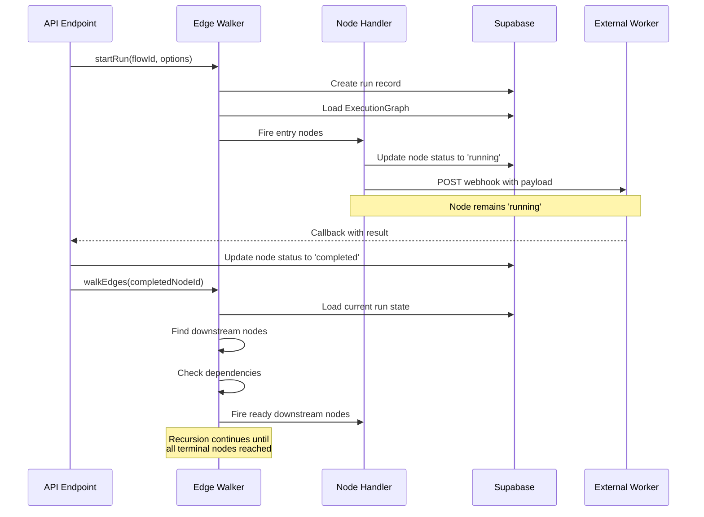
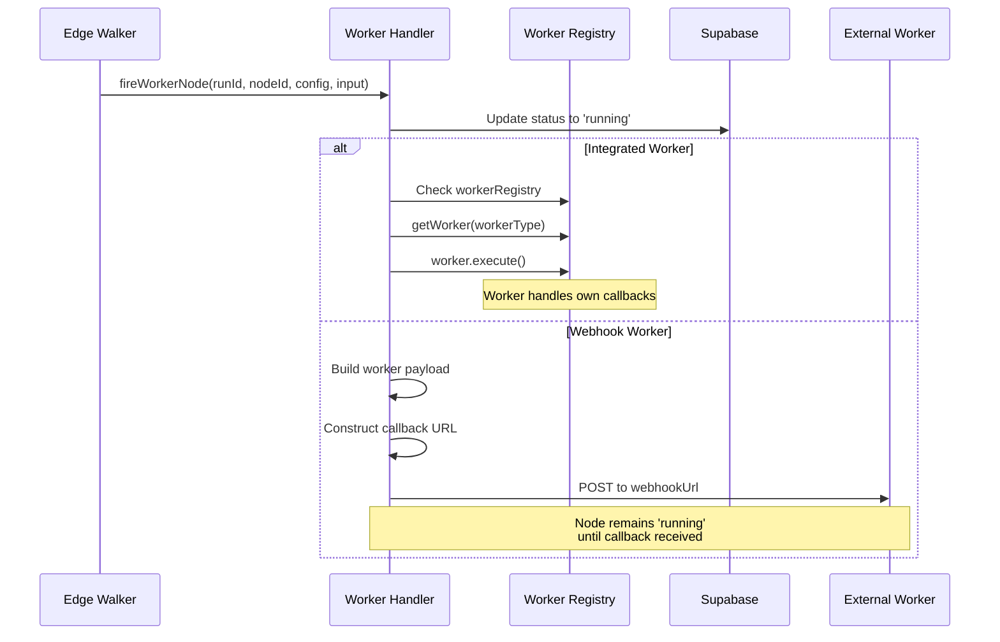
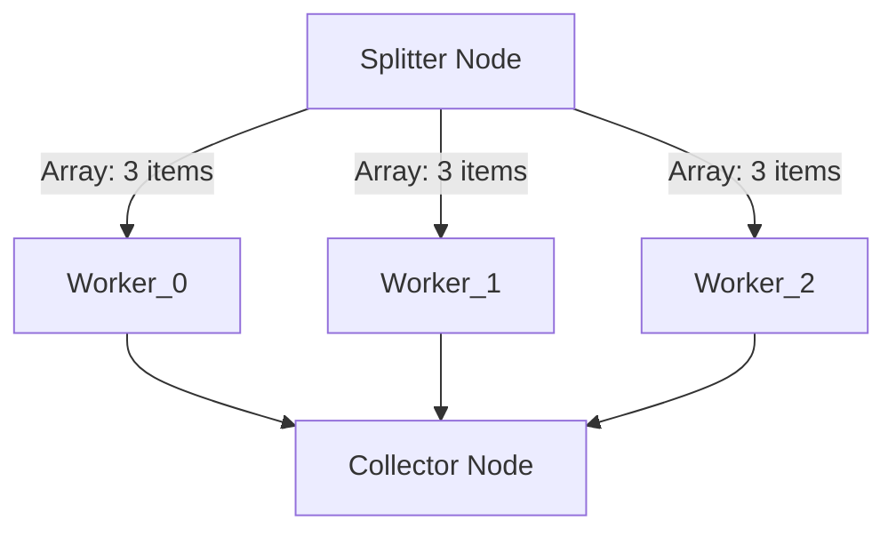
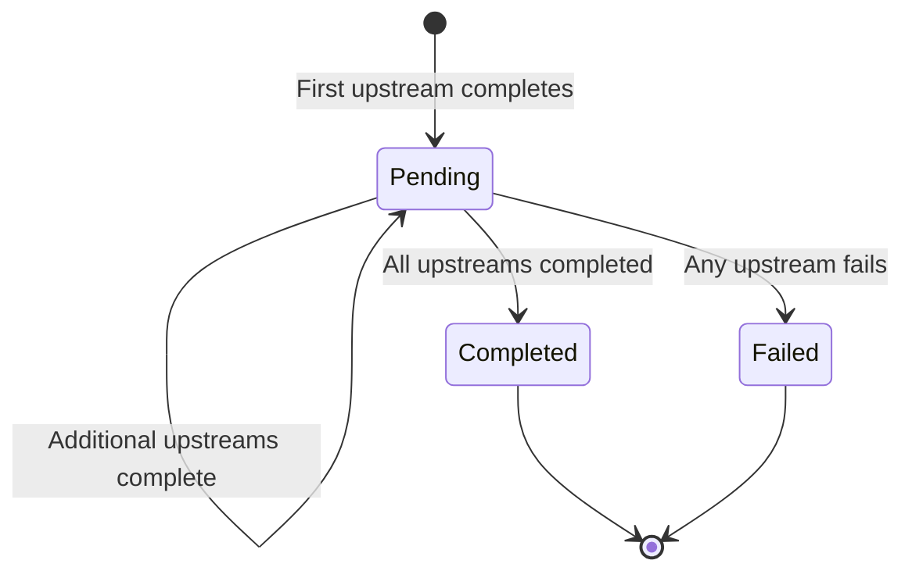
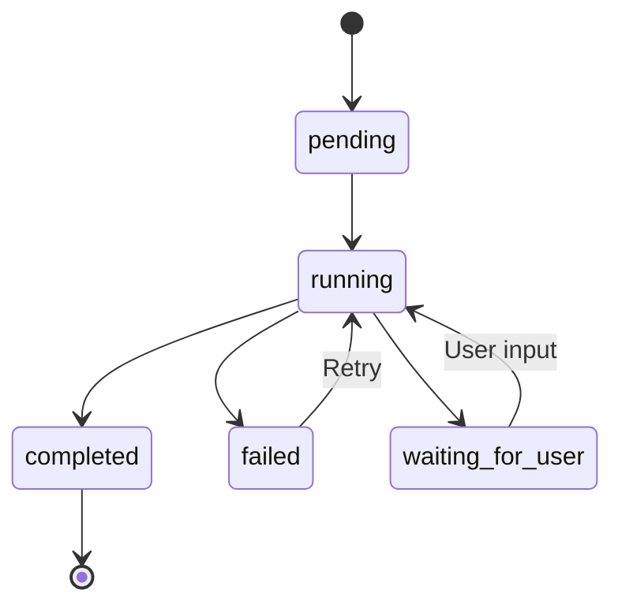

# Execution Engine

## Overview

The Execution Engine is the core orchestration system of Stitch, implementing an **edge-walking execution model** that drives workflow execution. When a node completes, the engine walks the graph edges to identify and fire downstream nodes, creating a recursive, event-driven execution flow.

**Key Principles:**
- **Event-Driven**: Node completion triggers edge-walking
- **Database as Source of Truth**: All state persisted immediately to Supabase
- **Async Worker Pattern**: Workers fire and callback asynchronously
- **Parallel Execution**: Splitter/Collector pattern enables fan-out/fan-in
- **Stateless Execution**: Server can restart mid-execution without data loss

**Location:** `src/lib/engine/`

## Architecture

### Core Components

```
src/lib/engine/
├── index.ts              # Core edge-walking utilities
├── edge-walker.ts        # Main orchestration logic
├── status-transitions.ts # State machine validation
├── logger.ts            # Structured execution logging
└── handlers/
    ├── worker.ts        # Worker node handler
    ├── ux.ts           # UX node handler
    ├── splitter.ts     # Splitter node handler
    └── collector.ts    # Collector node handler
```

### Execution Flow



## Edge-Walking Orchestration

### Starting a Run

The `startRun()` function initializes workflow execution:

```typescript
export async function startRun(
  flowId: string,
  options: {
    entityId?: string | null;
    trigger?: TriggerMetadata;
    input?: any;
    flow_version_id?: string;
  } = {}
): Promise<StitchRun>
```

**Process:**
1. **Create Run Record**: Persists run to database with entity_id and trigger metadata
2. **Load Execution Graph**: Retrieves pre-compiled ExecutionGraph from flow version
3. **Identify Entry Nodes**: Uses `executionGraph.entryNodes` (pre-computed nodes with no inbound edges)
4. **Fire Entry Nodes**: Calls appropriate handler for each entry node type
5. **Entity Movement**: If entity_id provided, moves entity to first UX node

**Entry Node Handling:**
- **UX Nodes**: Start in `waiting_for_user` status, entity moved immediately
- **Other Nodes**: Fire normally (Worker, Splitter, etc.)

### Walking Edges

The `walkEdges()` function implements the recursive edge-walking pattern:

```typescript
export async function walkEdges(
  completedNodeId: string,
  run: StitchRun
): Promise<void>
```

**Process:**
1. **Load Execution Graph**: Retrieves ExecutionGraph from run's flow_version_id
2. **Handle Entity Movement**: If entity attached, process visual movement
3. **Check Terminal Node**: If node has no outbound edges, stop recursion
4. **Find Downstream Nodes**: Uses O(1) adjacency map lookup
5. **Check Dependencies**: For each downstream node, verify all upstream nodes completed
6. **Fire Ready Nodes**: Calls `fireNodeWithGraph()` for nodes with satisfied dependencies

**Parallel Instance Handling:**
- Strips parallel suffixes (`_0`, `_1`) to match static graph IDs
- Checks if parallel instances exist in run state
- Fires parallel instances instead of static nodes when present

### Firing Nodes

The `fireNodeWithGraph()` function dispatches to appropriate node handlers:

```typescript
export async function fireNodeWithGraph(
  nodeId: string,
  executionGraph: ExecutionGraph,
  run: StitchRun
): Promise<void>
```

**Process:**
1. **Lookup Node**: O(1) lookup in `executionGraph.nodes`
2. **Check Parallel Instances**: Searches run state for parallel paths (e.g., `worker_0`, `worker_1`)
3. **Fire Parallel Instances**: If found, fires all parallel instances concurrently
4. **Merge Upstream Outputs**: Combines outputs from all upstream nodes
5. **Dispatch to Handler**: Calls appropriate handler based on node type

**Node Type Dispatch:**
- `Worker` → `fireWorkerNode()`
- `UX` → `fireUXNode()`
- `Splitter` → `fireSplitterNode()`
- `Collector` → `fireCollectorNode()`

## Node Handlers

### Worker Node Handler

**Purpose:** Delegates work to external services (Claude, MiniMax, ElevenLabs, etc.)

**Location:** `src/lib/engine/handlers/worker.ts`

**Execution Flow:**



**Key Functions:**

**`constructCallbackUrl(runId, nodeId)`**
- Builds callback URL using `NEXT_PUBLIC_BASE_URL` environment variable
- Format: `{baseUrl}/api/stitch/callback/{runId}/{nodeId}`
- **Critical**: Never hardcodes domains

**`buildWorkerPayload(runId, nodeId, config, input)`**
- Creates standardized worker payload following Stitch Protocol:
```json
{
  "runId": "uuid",
  "nodeId": "string",
  "config": { ...staticNodeSettings },
  "input": { ...dataFromUpstream },
  "callbackUrl": "https://{base_url}/api/stitch/callback/{runId}/{nodeId}"
}
```

**`fireWorkerNode(runId, nodeId, config, input)`**
- Marks node as `running`
- Checks for integrated worker in registry
- Falls back to webhook POST if not integrated
- Handles errors by marking node as `failed`
- Implements 30-second timeout for webhook calls

**Worker Types:**
1. **Integrated Workers**: Registered in `workerRegistry`, execute directly in-process
2. **Webhook Workers**: External services called via HTTP POST

**Error Handling:**
- Invalid webhook URL → Mark node `failed`
- Network timeout → Mark node `failed` with timeout error
- Worker execution error → Mark node `failed` with error message
- HTTP error response → Mark node `failed` with status code

### UX Node Handler

**Purpose:** Pauses execution for human input

**Location:** `src/lib/engine/handlers/ux.ts`

**Execution Flow:**

```typescript
export async function fireUXNode(
  runId: string,
  nodeId: string,
  config: NodeConfig,
  input: any
): Promise<void>
```

**Process:**
1. **Mark as Waiting**: Updates node status to `waiting_for_user`
2. **Store Input**: Saves input as output for when user completes
3. **Pause Execution**: Prevents downstream edge-walking

**Resumption:**
- User provides input via `/api/stitch/complete/{runId}/{nodeId}`
- API endpoint updates status to `completed` with user output
- Edge-walking resumes from this node

**Use Cases:**
- Human approval gates
- Data collection forms
- Manual review steps
- User decision points

### Splitter Node Handler

**Purpose:** Fans out array elements into parallel execution paths

**Location:** `src/lib/engine/handlers/splitter.ts`

**Execution Flow:**



**Key Functions:**

**`extractArray(input, arrayPath)`**
- Extracts array from input using dot notation path
- Supports nested paths: `"data.items"`, `"results"`
- Validates that value is actually an array
- Throws error if path not found or value not array

**`createParallelPathStates(downstreamNodeIds, arrayElements)`**
- Creates parallel node states for each array element
- Augments node IDs with index suffixes: `nodeId_0`, `nodeId_1`, etc.
- Seeds each parallel node's output with its array element
- Returns record mapping augmented IDs to initial states

**`fireSplitterNode(runId, nodeId, config, input, downstreamNodeIds)`**
- Extracts array using configured `arrayPath`
- Creates parallel path states for all downstream nodes
- Updates database with all parallel states atomically
- Marks splitter as `completed`

**Configuration:**
```typescript
{
  arrayPath: "items" // Path to array in input
}
```

**Example:**
```typescript
// Input
{ items: [{ id: 1 }, { id: 2 }, { id: 3 }] }

// Splitter config
{ arrayPath: "items" }

// Downstream nodes: ["worker"]

// Created parallel states:
{
  "worker_0": { status: "pending", output: { id: 1 } },
  "worker_1": { status: "pending", output: { id: 2 } },
  "worker_2": { status: "pending", output: { id: 3 } }
}
```

**Edge Cases:**
- **Empty Array**: Marks splitter as `completed` with empty array, collectors handle gracefully
- **Missing arrayPath**: Marks splitter as `failed`
- **Invalid path**: Marks splitter as `failed` with error message

### Collector Node Handler

**Purpose:** Fans in parallel execution paths, waits for all to complete

**Location:** `src/lib/engine/handlers/collector.ts`

**Execution Flow:**



**Key Functions:**

**`identifyUpstreamPaths(nodeStates, upstreamNodeIds)`**
- Finds all parallel path instances using regex pattern matching
- Pattern: `{baseNodeId}_\d+` (e.g., `worker_0`, `worker_1`)
- Returns array of augmented node IDs

**`areAllPathsCompleted(nodeStates, parallelPaths)`**
- Checks if all parallel paths have `completed` status
- Returns `false` if any path still `pending` or `running`

**`hasAnyPathFailed(nodeStates, parallelPaths)`**
- Checks if any parallel path has `failed` status
- Used to fail collector early if upstream fails

**`mergeParallelOutputs(nodeStates, parallelPaths)`**
- Extracts outputs from all parallel paths
- Sorts by index suffix to preserve order
- Returns ordered array of outputs

**`fireCollectorNode(runId, nodeId, config, upstreamNodeIds)`**
- Identifies all upstream parallel paths
- Tracks completion progress in collector state
- Waits until all upstream paths completed
- Merges outputs preserving order
- Marks collector as `completed`

**State Tracking:**
```typescript
interface CollectorNodeState {
  status: NodeStatus;
  upstream_completed_count: number;
  expected_upstream_count: number;
  upstream_outputs: Record<string, any>;
  output?: any; // Final merged output
}
```

**Behavior:**
- **First Call**: Initializes tracking state, remains `pending`
- **Subsequent Calls**: Updates completion count, checks if ready
- **All Complete**: Merges outputs, marks `completed`, triggers edge-walking
- **Any Failed**: Marks collector as `failed` immediately

**Example:**
```typescript
// Upstream parallel paths complete:
{
  "worker_0": { status: "completed", output: { result: "A" } },
  "worker_1": { status: "completed", output: { result: "B" } },
  "worker_2": { status: "completed", output: { result: "C" } }
}

// Collector merges to:
{
  status: "completed",
  output: [
    { result: "A" },
    { result: "B" },
    { result: "C" }
  ]
}
```

## Status Transitions

### State Machine

**Location:** `src/lib/engine/status-transitions.ts`

The execution engine enforces a strict state machine for node status transitions:



**Valid Transitions:**
```typescript
{
  'pending': ['running'],
  'running': ['completed', 'failed', 'waiting_for_user'],
  'completed': [], // Terminal state
  'failed': ['running'], // Allow retry
  'waiting_for_user': ['running'] // Resume after user input
}
```

**Validation:**

**`validateTransition(from, to)`**
- Throws `StatusTransitionError` if transition invalid
- Used by database layer to prevent invalid state changes
- Ensures workflow integrity

**`isValidTransition(from, to)`**
- Returns boolean without throwing
- Used for conditional logic

**Terminal States:**
- `completed`: Node successfully finished, no further transitions
- Terminal nodes (no outbound edges) stop edge-walking

**Retry Logic:**
- Failed nodes can transition back to `running`
- Enables manual or automatic retry mechanisms

## Execution Graph Integration

### ExecutionGraph Structure

The engine uses pre-compiled ExecutionGraphs for O(1) lookups:

```typescript
interface ExecutionGraph {
  nodes: Record<string, ExecutionNode>;      // O(1) node lookup
  adjacency: Record<string, string[]>;       // O(1) downstream lookup
  entryNodes: string[];                      // Pre-computed entry points
  terminalNodes: string[];                   // Pre-computed terminal nodes
  edgeData: Record<string, Record<string, string>>; // Edge data mappings
}
```

**Benefits:**
- **Performance**: O(1) lookups vs O(n) array searches
- **Pre-computation**: Entry/terminal nodes computed once at compile time
- **Data Mapping**: Edge-level input/output mappings for complex flows

**Usage in Engine:**
- `startRun()`: Uses `entryNodes` to identify starting points
- `walkEdges()`: Uses `adjacency` for downstream lookup
- `fireNodeWithGraph()`: Uses `nodes` for node details
- `mergeUpstreamOutputs()`: Uses `edgeData` for input mapping

### Dependency Resolution

**`areUpstreamDependenciesCompletedWithGraph()`**
- Finds upstream nodes by checking adjacency map
- Handles parallel instances by checking for `_\d+` suffixes
- Returns `true` only if ALL upstream nodes/instances completed

**Parallel Instance Logic:**
- If parallel instances exist (e.g., `worker_0`, `worker_1`), ALL must complete
- If no parallel instances, checks static node status
- Supports nested parallel paths (Splitter → Worker → Collector)

### Output Merging

**`mergeUpstreamOutputsWithGraph()`**
- Finds all upstream nodes
- Checks for edge data mappings in `executionGraph.edgeData`
- Applies path-based data mapping if configured
- Falls back to direct output merging

**Edge Data Mapping:**
```typescript
// Edge key format: "sourceId->targetId"
edgeData: {
  "worker1->worker2": {
    "prompt": "output.text",  // Map worker1.output.text to worker2.input.prompt
    "context": "output.data"  // Map worker1.output.data to worker2.input.context
  }
}
```

## Logging and Observability

### Structured Logging

**Location:** `src/lib/engine/logger.ts`

All execution events logged as structured JSON:

```typescript
{
  timestamp: "2024-12-05T10:30:00.000Z",
  level: "info",
  message: "Node execution started",
  runId: "uuid",
  nodeId: "worker-1",
  nodeType: "Worker",
  input: "{...}"
}
```

**Log Functions:**

**`logNodeExecution(runId, nodeId, nodeType, input)`**
- Logs when node starts execution
- Includes node type and input data

**`logWorkerCall(runId, nodeId, workerType, endpoint, payload)`**
- Logs worker invocation
- Includes worker type, endpoint, and full payload

**`logCallbackReceived(runId, nodeId, status, output, error)`**
- Logs worker callback
- Includes status, output, and error if failed

**`logEdgeWalking(runId, completedNodeId, downstreamNodeIds)`**
- Logs edge-walking trigger
- Includes completed node and downstream targets

**`logExecutionError(message, error, context)`**
- Logs execution errors with stack traces
- Includes full context for debugging

**`logParallelInstanceCreation(runId, splitterNodeId, parallelInstanceIds)`**
- Logs when splitter creates parallel paths
- Includes all parallel instance IDs

**`logCollectorWaiting(runId, collectorNodeId, completedCount, expectedCount)`**
- Logs collector waiting state
- Shows progress toward completion

**`logCollectorFiring(runId, collectorNodeId, mergedOutput)`**
- Logs when collector fires downstream
- Includes merged output

### Debugging Workflows

**Tracing Execution:**
1. Search logs by `runId` to see full execution trace
2. Follow edge-walking logs to see node firing sequence
3. Check worker calls and callbacks for async operations
4. Identify failed nodes and error messages

**Common Issues:**
- **Node Stuck in Running**: Check for missing callback
- **Collector Never Fires**: Check upstream completion status
- **Invalid Transition**: Check status-transitions.ts for valid paths
- **Worker Timeout**: Check network connectivity and worker health

## Error Handling

### Error Categories

**1. Configuration Errors**
- Missing `webhookUrl` in worker config
- Missing `arrayPath` in splitter config
- Invalid callback URL format

**Action:** Mark node as `failed` with descriptive error

**2. Network Errors**
- Worker webhook unreachable
- Timeout exceeded (30s)
- HTTP error responses

**Action:** Mark node as `failed`, log error details

**3. Execution Errors**
- Node not found in execution graph
- Invalid status transition
- Upstream dependency failure

**Action:** Mark node as `failed`, log error with context

**4. Data Errors**
- Array extraction failure in splitter
- Invalid input data
- Missing required fields

**Action:** Mark node as `failed` with validation error

### Error Recovery

**Retry Mechanism:**
- Failed nodes can transition back to `running`
- Implemented via `/api/stitch/retry/{runId}/{nodeId}`
- Preserves original input for retry

**Graceful Degradation:**
- Entity movement failures don't stop workflow
- Logging errors don't stop execution
- Individual node failures don't crash entire run

**Error Propagation:**
- Collector fails if any upstream path fails
- Downstream nodes don't fire if dependencies failed
- Run continues on other branches (if parallel)

## Performance Considerations

### O(1) Lookups

**ExecutionGraph Design:**
- Node lookup: `executionGraph.nodes[nodeId]` - O(1)
- Downstream lookup: `executionGraph.adjacency[nodeId]` - O(1)
- Entry nodes: Pre-computed array - O(1)
- Terminal nodes: Pre-computed array - O(1)

**vs. Legacy Flow-Based:**
- Node lookup: `flow.graph.nodes.find()` - O(n)
- Edge lookup: `flow.graph.edges.filter()` - O(n)

### Database Optimization

**Atomic Updates:**
- `updateNodeStates()` updates multiple nodes in single transaction
- Prevents race conditions in parallel execution
- Reduces database round-trips

**Batch Operations:**
- Splitter creates all parallel states in one update
- Collector tracks progress without multiple queries

### Parallel Execution

**Concurrent Firing:**
- Parallel instances fired with `Promise.all()`
- Multiple downstream nodes fired concurrently
- No artificial serialization

**Scalability:**
- Stateless execution enables horizontal scaling
- Database handles concurrency control
- Workers execute independently

## Integration Points

### Database Layer

**Functions Used:**
- `createRun()`: Initialize run record
- `getRun()`: Load current run state
- `updateNodeState()`: Update single node
- `updateNodeStates()`: Atomic multi-node update
- `getVersion()`: Load execution graph

**Location:** `src/lib/db/runs.ts`

### Worker System

**Functions Used:**
- `workerRegistry.hasWorker()`: Check for integrated worker
- `workerRegistry.getWorker()`: Get worker instance
- `worker.execute()`: Execute integrated worker

**Location:** `src/lib/workers/`

### Canvas System

**Functions Used:**
- `getVersion()`: Load flow version with execution graph
- `compileOEG()`: Compile visual graph to execution graph

**Location:** `src/lib/canvas/version-manager.ts`

### Entity System

**Functions Used:**
- `moveEntityToSection()`: Move entity on node completion
- `handleNodeCompletion()`: Process entity movement logic

**Location:** `src/lib/db/entities.ts`, `src/stitch/engine/entity-movement.ts`

## Testing

### Unit Tests

**Location:** `src/lib/engine/__tests__/`

**Test Coverage:**
- Edge-walking logic
- Dependency resolution
- Output merging
- Status transitions
- Parallel instance handling

### Integration Tests

**Location:** `src/app/api/__tests__/`

**Test Scenarios:**
- End-to-end workflow execution
- Worker callback handling
- Parallel execution (Splitter/Collector)
- Error handling and recovery
- Entity movement integration

### Testing Patterns

**Mocking:**
- Mock Supabase client for database operations
- Mock worker registry for integrated workers
- Mock fetch for webhook calls

**Assertions:**
- Verify node status transitions
- Check output merging correctness
- Validate parallel path creation
- Confirm edge-walking triggers

## Best Practices

### Adding New Node Types

1. Create handler in `src/lib/engine/handlers/`
2. Implement handler function following pattern:
   ```typescript
   export async function fireXNode(
     runId: string,
     nodeId: string,
     config: NodeConfig,
     input: any
   ): Promise<void>
   ```
3. Add case to `fireNodeWithGraph()` switch statement
4. Update ExecutionNode type in `src/types/execution-graph.ts`
5. Add logging calls for observability
6. Handle errors gracefully

### Debugging Execution

1. **Enable Verbose Logging**: Check console for structured JSON logs
2. **Trace by Run ID**: Filter logs by `runId` to see execution flow
3. **Check Node States**: Query database for current node statuses
4. **Verify Dependencies**: Ensure upstream nodes completed before downstream fires
5. **Test Callbacks**: Use `/api/stitch/callback` endpoint to simulate worker responses

### Performance Optimization

1. **Use ExecutionGraph**: Always use graph-based functions for O(1) lookups
2. **Batch Updates**: Use `updateNodeStates()` for multiple node updates
3. **Minimize Database Queries**: Load run state once, pass to functions
4. **Concurrent Execution**: Fire independent nodes concurrently
5. **Avoid Blocking**: Never block edge-walking on external calls

## Related Documentation

- [Architecture Overview](../architecture/overview.md) - System architecture
- [Execution Model](../architecture/execution-model.md) - Edge-walking pattern
- [Data Flow](../architecture/data-flow.md) - Data flow through system
- [Worker System](./worker-system.md) - Worker integration
- [Database Layer](./database-layer.md) - Database operations
- [Workflow API](../api/workflow-api.md) - API endpoints
