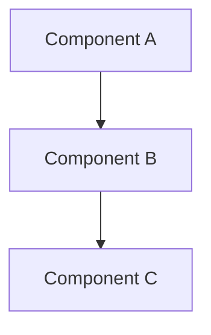
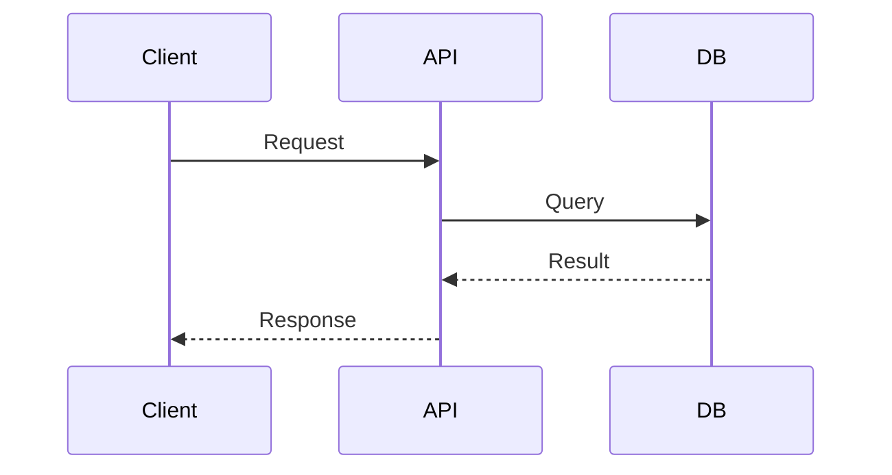
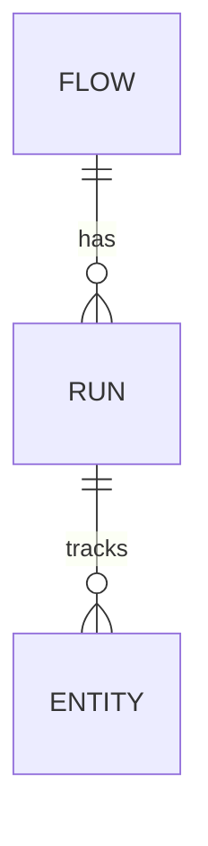
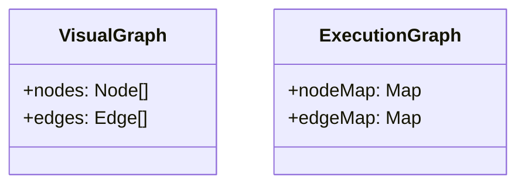
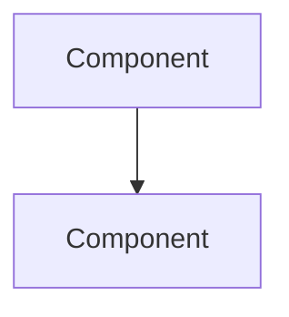
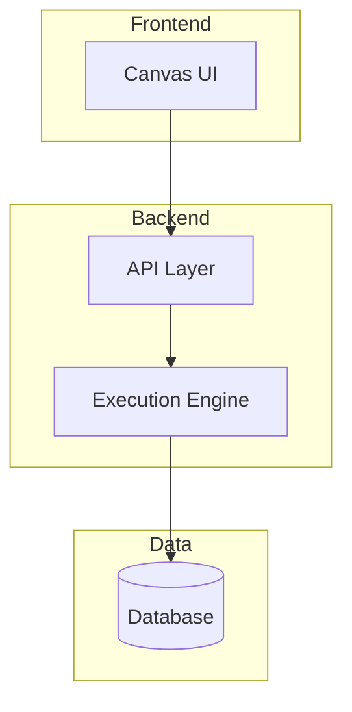

# Documentation Maintenance Guide

**Last Updated:** December 5, 2024

## Overview

This guide provides standards and procedures for maintaining the Stitch implementation documentation. Following these conventions ensures consistency, discoverability, and maintainability across all documentation files.

## File Organization

### Directory Structure

All implementation documentation lives under `/docs/implementation/`:

```
/docs/implementation/
├── 00-index.md                    # Master index (always numbered 00)
├── architecture/                  # System architecture docs
├── backend/                       # Backend component docs
├── frontend/                      # Frontend component docs
├── api/                          # API documentation
├── diagrams/                     # Mermaid diagram files
└── guides/                       # Developer guides
```

### File Naming Conventions

**General Rules:**
- Use lowercase with hyphens (kebab-case): `entity-movement.md`
- Be descriptive but concise: `adding-workers.md` not `how-to-add-new-workers.md`
- Use `.md` extension for Markdown files
- Use `.mmd` extension for Mermaid diagram files

**Specific Patterns:**

| File Type | Pattern | Example |
|-----------|---------|---------|
| Component docs | `{component-name}.md` | `execution-engine.md` |
| Guide docs | `{action}-{subject}.md` | `adding-workers.md` |
| API docs | `{resource}-api.md` | `canvas-api.md` |
| Diagram files | `{subject}-{type}.mmd` | `architecture-overview.mmd` |
| Gap analysis | `{area}-gaps.md` | `frontend-gaps.md` |
| Index files | `00-index.md` or `README.md` | `00-index.md` |

**Special Cases:**
- Master index: Always `00-index.md` (numbered for sorting)
- Verification reports: `{SUBJECT}_REPORT.md` (uppercase for visibility)
- Implementation notes: `{FEATURE}_IMPLEMENTATION.md`

## Document Structure

### Standard Document Template

Every documentation file should follow this structure:

```markdown
# {Document Title}

**Last Updated:** {Date}

## Overview

{Brief description of what this document covers}

## {Main Section 1}

{Content}

### {Subsection}

{Content}

## {Main Section 2}

{Content}

## Related Documentation

- [{Related Doc 1}](../path/to/doc.md)
- [{Related Doc 2}](../path/to/doc.md)

## See Also

- [{External Resource}](https://example.com)
```

### Required Sections

**All documents must include:**
1. **Title** (H1 heading)
2. **Last Updated** date
3. **Overview** section
4. **Related Documentation** section (if applicable)

**Component documentation should include:**
- Overview
- Purpose/Responsibility
- Key Functions/Methods
- Usage Examples
- Related Components
- File Location

**Guide documentation should include:**
- Overview
- Prerequisites
- Step-by-Step Instructions
- Code Examples
- Common Pitfalls
- Related Guides

## Updating Documentation

### When to Update

Update documentation when:
- Adding new features or components
- Modifying existing functionality
- Fixing bugs that affect documented behavior
- Identifying gaps or inaccuracies
- Refactoring code structure

### Update Checklist

When updating documentation:

- [ ] Update the "Last Updated" date
- [ ] Verify all code references are accurate
- [ ] Check all internal links work
- [ ] Update related diagrams if needed
- [ ] Update the master index if adding new files
- [ ] Review cross-references in related docs
- [ ] Test any code examples provided

### Update Process

1. **Identify affected documents**
   - Search for references to the changed component
   - Check the master index for related docs

2. **Make updates**
   - Update content to reflect changes
   - Add new sections if needed
   - Update code examples

3. **Update metadata**
   - Change "Last Updated" date
   - Add notes about significant changes

4. **Verify links**
   - Test all internal links
   - Verify external links still work

5. **Update index**
   - Add new documents to master index
   - Update descriptions if needed

## Diagram Creation and Maintenance

### Mermaid Diagram Standards

All diagrams use Mermaid syntax and are stored as separate `.mmd` files in `/docs/implementation/diagrams/`.

### Diagram Types

**Architecture Diagrams (graph/flowchart):**


**Sequence Diagrams:**


**Entity Relationship Diagrams:**


**Class Diagrams:**


### Creating New Diagrams

**Step 1: Choose diagram type**
- Architecture overview → `graph TB` (top-bottom flowchart)
- Process flow → `sequenceDiagram`
- Data model → `erDiagram`
- Type relationships → `classDiagram`

**Step 2: Create diagram file**
```bash
# Create file in diagrams directory
touch docs/implementation/diagrams/{name}-{type}.mmd
```

**Step 3: Write diagram content**
- Use clear, descriptive labels
- Keep diagrams focused (one concept per diagram)
- Use consistent styling

**Step 4: Embed in documentation**
```markdown
## Architecture Overview


```

Or reference external file:
```markdown
See [Architecture Diagram](../diagrams/architecture-overview.mmd)
```

### Diagram Naming Conventions

| Diagram Purpose | Naming Pattern | Example |
|----------------|----------------|---------|
| System architecture | `architecture-{aspect}.mmd` | `architecture-overview.mmd` |
| Process flow | `{process}-flow.mmd` | `execution-flow.mmd` |
| Data movement | `{subject}-movement.mmd` | `entity-movement.mmd` |
| Type relationships | `{subject}-relationships.mmd` | `type-relationships.mmd` |
| Database schema | `database-schema.mmd` | `database-schema.mmd` |

### Diagram Style Guidelines

**Consistency:**
- Use consistent node shapes for similar concepts
- Use consistent arrow styles for similar relationships
- Use consistent colors (if using)

**Clarity:**
- Limit to 10-15 nodes per diagram
- Use clear, concise labels
- Group related components with subgraphs

**Example - Good Diagram:**


### Verifying Diagrams

Run the diagram verification script:
```bash
npm run verify:diagrams
# or
tsx scripts/verify-mermaid-diagrams.ts
```

This checks:
- All `.mmd` files have valid Mermaid syntax
- Diagrams are referenced in documentation
- No broken diagram references

## Cross-Referencing

### Internal Links

Use relative paths for internal documentation links:

```markdown
See [Execution Engine](../backend/execution-engine.md) for details.
```

**Link patterns:**
- Same directory: `[Text](file.md)`
- Parent directory: `[Text](../file.md)`
- Sibling directory: `[Text](../sibling/file.md)`
- Diagrams: `[Text](../diagrams/diagram.mmd)`

### Linking to Code

Reference code files with relative paths from repo root:

```markdown
Implementation: `src/lib/engine/edge-walker.ts`
```

Or with links to specific lines (if using GitHub):
```markdown
See [edge-walker.ts:45-60](../../src/lib/engine/edge-walker.ts#L45-L60)
```

### External Links

Use full URLs for external resources:
```markdown
- [React Flow Documentation](https://reactflow.dev/docs)
- [Supabase Realtime](https://supabase.com/docs/guides/realtime)
```

## Code Examples

### Formatting Code Blocks

Always specify the language for syntax highlighting:

````markdown
```typescript
const example = "code";
```
````

### Example Standards

**Good code examples:**
- Are complete and runnable
- Include necessary imports
- Use realistic variable names
- Include comments for clarity
- Follow project coding standards

**Example:**
````markdown
```typescript
// src/lib/workers/my-worker.ts
import { IWorker } from './base';

export class MyWorker implements IWorker {
  async execute(input: any): Promise<any> {
    // Implementation
    return { result: 'success' };
  }
}
```
````

## Master Index Maintenance

### Adding New Documents

When creating new documentation:

1. **Add to appropriate section** in `00-index.md`
2. **Use consistent formatting**:
   ```markdown
   - **[Document Title](path/to/doc.md)** - Brief description
   ```

3. **Maintain alphabetical order** within sections
4. **Update section descriptions** if needed

### Index Structure

The master index should have:
- Quick navigation links at top
- Sections matching directory structure
- Brief descriptions for each document
- Clear visual hierarchy

## Common Maintenance Tasks

### Adding a New Component

1. Create component documentation file
2. Add entry to master index
3. Create diagram if needed
4. Update related documentation
5. Add cross-references

### Deprecating Features

1. Add deprecation notice to relevant docs
2. Update diagrams to show deprecated status
3. Add migration guide if applicable
4. Update master index with deprecation note

### Reorganizing Documentation

1. Move files to new locations
2. Update all internal links
3. Update master index
4. Add redirects or notes in old locations
5. Verify all links work

## Quality Checklist

Before committing documentation changes:

- [ ] All code references are accurate
- [ ] All internal links work
- [ ] All diagrams render correctly
- [ ] "Last Updated" dates are current
- [ ] Master index is updated
- [ ] Cross-references are bidirectional
- [ ] Code examples are tested
- [ ] Spelling and grammar are correct
- [ ] Formatting is consistent

## Tools and Scripts

### Verification Scripts

**Verify all diagrams:**
```bash
tsx scripts/verify-mermaid-diagrams.ts
```

**Check for broken links:**
```bash
# Add script to check markdown links
tsx scripts/verify-doc-links.ts
```

### Helpful Commands

**Find all documentation files:**
```bash
find docs/implementation -name "*.md" -type f
```

**Find all diagrams:**
```bash
find docs/implementation/diagrams -name "*.mmd" -type f
```

**Search documentation:**
```bash
grep -r "search term" docs/implementation/
```

## Best Practices

### Writing Style

- **Be concise**: Get to the point quickly
- **Be specific**: Use concrete examples
- **Be consistent**: Follow established patterns
- **Be helpful**: Anticipate reader questions

### Documentation Debt

Avoid documentation debt by:
- Updating docs in the same PR as code changes
- Reviewing docs during code review
- Scheduling regular documentation audits
- Tracking documentation TODOs

### Version Control

- Commit documentation with related code changes
- Use descriptive commit messages
- Review documentation changes carefully
- Keep documentation in sync with code

## Getting Help

### Questions About Documentation

- Check existing documentation first
- Review this maintenance guide
- Ask in team channels
- Create documentation issues

### Reporting Issues

When reporting documentation issues:
- Specify the file and section
- Describe the problem clearly
- Suggest improvements if possible
- Link to related code if applicable

## Related Documentation

- [Onboarding Guide](onboarding.md) - Getting started with Stitch
- [Master Index](../00-index.md) - Complete documentation index
- [Architecture Overview](../architecture/overview.md) - System architecture

## Appendix: Quick Reference

### File Naming Cheat Sheet

```
Component:     execution-engine.md
Guide:         adding-workers.md
API:           canvas-api.md
Diagram:       architecture-overview.mmd
Gap Analysis:  frontend-gaps.md
Index:         00-index.md
```

### Diagram Type Cheat Sheet

```
Architecture:  graph TB
Sequence:      sequenceDiagram
Data Model:    erDiagram
Types:         classDiagram
```

### Link Format Cheat Sheet

```
Same dir:      [Text](file.md)
Parent:        [Text](../file.md)
Sibling:       [Text](../sibling/file.md)
Code:          `src/path/to/file.ts`
External:      [Text](https://example.com)
```
