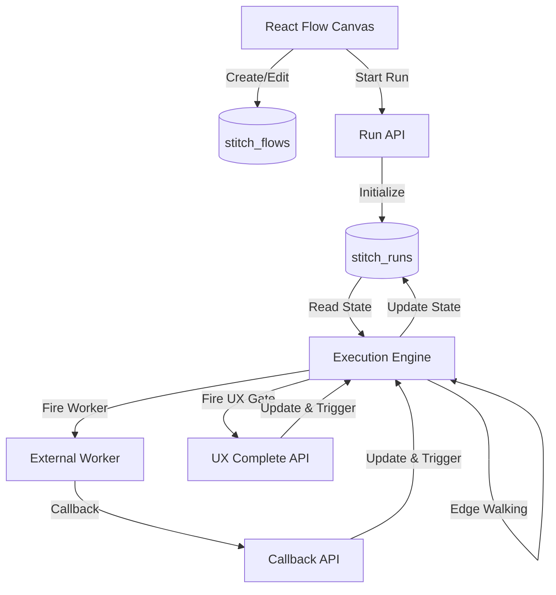
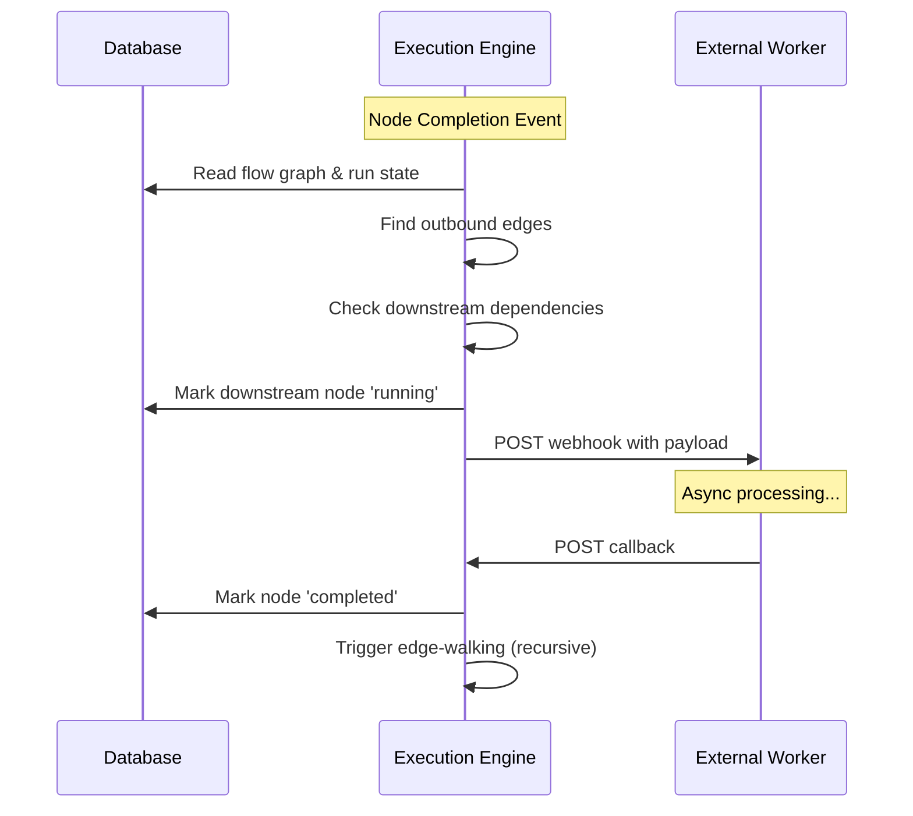

# Design Document

## Overview

Stitch Core Architecture is a stateless, database-driven orchestration engine that executes visual workflow graphs. The system follows an event-driven, edge-walking execution model where node completions trigger downstream execution by traversing graph edges. All state is persisted in Supabase (PostgreSQL), enabling recovery from server restarts and horizontal scaling through Next.js serverless functions.

The architecture supports four node types:
- **Worker nodes**: Delegate work to external services via webhooks
- **UX nodes**: Pause execution for human input (gates)
- **Splitter nodes**: Fan out array elements into parallel execution paths
- **Collector nodes**: Fan in parallel paths and merge outputs

The system communicates with external workers through a strict JSON protocol, treating all workers as asynchronous services that report completion via callbacks.

## Architecture

### High-Level Architecture



### Component Layers

1. **Data Layer**: Supabase PostgreSQL database with two core tables (`stitch_flows`, `stitch_runs`)
2. **API Layer**: Next.js App Router API routes for callbacks, completion, and retry
3. **Execution Layer**: Stateless execution engine that reads from DB, processes logic, writes to DB
4. **Integration Layer**: HTTP client for firing webhooks to external workers

### Execution Flow



## Components and Interfaces

### Database Schema

#### stitch_flows Table

```sql
CREATE TABLE stitch_flows (
  id UUID PRIMARY KEY DEFAULT gen_random_uuid(),
  name TEXT NOT NULL,
  graph JSONB NOT NULL,
  created_at TIMESTAMPTZ DEFAULT NOW(),
  updated_at TIMESTAMPTZ DEFAULT NOW()
);

-- graph JSONB structure:
-- {
--   "nodes": [
--     {
--       "id": "node-1",
--       "type": "Worker" | "UX" | "Splitter" | "Collector",
--       "position": { "x": 100, "y": 200 },
--       "data": { ...config }
--     }
--   ],
--   "edges": [
--     {
--       "id": "edge-1",
--       "source": "node-1",
--       "target": "node-2",
--       "sourceHandle": "optional",
--       "targetHandle": "optional"
--     }
--   ]
-- }
```

#### stitch_runs Table

```sql
CREATE TABLE stitch_runs (
  id UUID PRIMARY KEY DEFAULT gen_random_uuid(),
  flow_id UUID NOT NULL REFERENCES stitch_flows(id),
  node_states JSONB NOT NULL,
  created_at TIMESTAMPTZ DEFAULT NOW(),
  updated_at TIMESTAMPTZ DEFAULT NOW()
);

-- node_states JSONB structure:
-- {
--   "node-1": {
--     "status": "pending" | "running" | "completed" | "failed" | "waiting_for_user",
--     "output": { ...any JSON },
--     "error": "optional error message"
--   },
--   "node-2_0": { ...parallel path state },
--   "node-2_1": { ...parallel path state }
-- }
```

### TypeScript Interfaces

```typescript
// Core node types
export type NodeType = 'Worker' | 'UX' | 'Splitter' | 'Collector';

export type NodeStatus = 
  | 'pending' 
  | 'running' 
  | 'completed' 
  | 'failed' 
  | 'waiting_for_user';

// Node definition
export interface StitchNode {
  id: string;
  type: NodeType;
  position: { x: number; y: number };
  data: NodeConfig;
}

// Node configuration (stored in node.data)
export interface NodeConfig {
  // Worker node config
  webhookUrl?: string;
  
  // Splitter node config
  arrayPath?: string; // JSON path to extract array (e.g., "items" or "data.results")
  
  // UX node config
  prompt?: string;
  
  // Common config
  label?: string;
  [key: string]: any; // Allow additional custom config
}

// Edge definition
export interface StitchEdge {
  id: string;
  source: string;
  target: string;
  sourceHandle?: string;
  targetHandle?: string;
}

// Flow definition
export interface StitchFlow {
  id: string;
  name: string;
  graph: {
    nodes: StitchNode[];
    edges: StitchEdge[];
  };
  created_at: string;
  updated_at: string;
}

// Node execution state
export interface NodeState {
  status: NodeStatus;
  output?: any;
  error?: string;
}

// Run definition
export interface StitchRun {
  id: string;
  flow_id: string;
  node_states: Record<string, NodeState>;
  created_at: string;
  updated_at: string;
}
```

### Worker Protocol

#### Outbound Payload (Stitch → Worker)

```typescript
export interface WorkerPayload {
  runId: string;
  nodeId: string;
  config: NodeConfig;
  input: any;
  callbackUrl: string;
}

// Example:
// {
//   "runId": "550e8400-e29b-41d4-a716-446655440000",
//   "nodeId": "worker-1",
//   "config": { "model": "claude-3", "temperature": 0.7 },
//   "input": { "prompt": "Hello world" },
//   "callbackUrl": "https://app.stitch.run/api/stitch/callback/550e8400-e29b-41d4-a716-446655440000/worker-1"
// }
```

#### Inbound Callback (Worker → Stitch)

```typescript
export interface WorkerCallback {
  status: 'completed' | 'failed';
  output?: any;
  error?: string;
}

// Example (success):
// {
//   "status": "completed",
//   "output": { "result": "Generated text..." }
// }

// Example (failure):
// {
//   "status": "failed",
//   "error": "API rate limit exceeded"
// }
```

### API Endpoints

#### POST /api/stitch/callback/:runId/:nodeId

Receives completion callbacks from external workers.

**Request Body**: `WorkerCallback`

**Response**:
- 200: Success
- 404: Run or node not found
- 400: Invalid payload

**Behavior**:
1. Validate runId and nodeId exist
2. Update node state in database
3. If status is 'completed', trigger edge-walking
4. Return success response

#### POST /api/stitch/complete/:runId/:nodeId

Receives human input for UX gate nodes.

**Request Body**: 
```typescript
{ input: any }
```

**Response**:
- 200: Success
- 404: Run or node not found
- 400: Node is not a UX node or not waiting for user

**Behavior**:
1. Validate node is UX type and status is 'waiting_for_user'
2. Update node state to 'completed' with provided input
3. Trigger edge-walking
4. Return success response

#### POST /api/stitch/retry/:runId/:nodeId

Manually retries a failed node.

**Request Body**: Empty

**Response**:
- 200: Success
- 404: Run or node not found
- 400: Node status is not 'failed'

**Behavior**:
1. Validate node status is 'failed'
2. Reset node state to 'pending'
3. Check if upstream dependencies are satisfied
4. If satisfied, fire the node
5. Return success response

## Data Models

### Node State Tracking

The `node_states` JSONB column is the core memory of a run. It maps nodeId to execution state:

```typescript
{
  "start-node": {
    "status": "completed",
    "output": { "data": "initial" }
  },
  "worker-1": {
    "status": "running"
  },
  "splitter-1": {
    "status": "completed",
    "output": { "items": ["A", "B", "C"] }
  },
  "worker-2_0": {
    "status": "completed",
    "output": { "result": "Processed A" }
  },
  "worker-2_1": {
    "status": "running"
  },
  "worker-2_2": {
    "status": "pending"
  },
  "collector-1": {
    "status": "pending"
  }
}
```

### Parallel Execution Tracking

When a Splitter creates parallel paths, the system augments downstream nodeIds with index suffixes:

**Original Graph**:
```
Splitter (id: "split-1") → Worker (id: "worker-1") → Collector (id: "collect-1")
```

**Runtime State** (after splitting `[A, B, C]`):
```
node_states: {
  "split-1": { status: "completed", output: ["A", "B", "C"] },
  "worker-1_0": { status: "completed", output: "Result A" },
  "worker-1_1": { status: "completed", output: "Result B" },
  "worker-1_2": { status: "running" },
  "collect-1": { status: "pending" }
}
```

The Collector identifies parallel paths by finding all nodeIds matching the pattern `{originalNodeId}_\d+`.

### Input Merging Strategy

When a node has multiple upstream nodes, their outputs are merged into a single input object:

**Scenario**: Node C has two upstream nodes (A and B)

```typescript
// Node A output
{ "userInput": "Hello" }

// Node B output
{ "context": "World" }

// Node C input (merged)
{
  "userInput": "Hello",
  "context": "World"
}
```

If keys conflict, later nodes (based on edge order) override earlier ones.


## Correctness Properties

*A property is a characteristic or behavior that should hold true across all valid executions of a system-essentially, a formal statement about what the system should do. Properties serve as the bridge between human-readable specifications and machine-verifiable correctness guarantees.*

### Property 1: Flow graph structure validation

*For any* flow stored in the database, the graph JSONB column SHALL contain a valid nodes array (each with id, type, position, data) and edges array (each with id, source, target)
**Validates: Requirements 1.3, 1.4**

### Property 2: Run initialization with pending nodes

*For any* flow, when a run is created, all nodes in the flow SHALL be initialized in the node_states with status 'pending'
**Validates: Requirements 2.6**

### Property 3: Node state structure conformance

*For any* run in the database, every entry in node_states SHALL contain a valid status enum and optional output/error fields
**Validates: Requirements 2.4**

### Property 4: Worker webhook firing

*For any* Worker node with a valid webhook URL, when the node is fired, the system SHALL send an HTTP POST request to that URL
**Validates: Requirements 4.1**

### Property 5: Worker payload structure

*For any* Worker node being fired, the outbound payload SHALL contain all required fields: runId, nodeId, config, input, and callbackUrl
**Validates: Requirements 4.2**

### Property 6: Callback URL construction pattern

*For any* Worker node, the callbackUrl SHALL follow the pattern `${BASE_URL}/api/stitch/callback/${runId}/${nodeId}` using the environment variable
**Validates: Requirements 4.3**

### Property 7: Worker error handling

*For any* Worker node with an invalid or unreachable webhook URL, the system SHALL mark the node state as 'failed' with an error message
**Validates: Requirements 4.5**

### Property 8: Callback payload acceptance

*For any* valid callback payload with status 'completed' or 'failed', the callback endpoint SHALL accept and process it
**Validates: Requirements 5.2**

### Property 9: Completed callback state update

*For any* callback received with status 'completed', the corresponding node state SHALL be updated to 'completed' with the provided output stored
**Validates: Requirements 5.3**

### Property 10: Failed callback state update

*For any* callback received with status 'failed', the corresponding node state SHALL be updated to 'failed' with the error message stored
**Validates: Requirements 5.4**

### Property 11: Callback triggers edge-walking

*For any* node that transitions to 'completed' status, the system SHALL trigger edge-walking to evaluate and fire downstream nodes
**Validates: Requirements 5.5**

### Property 12: Callback validation

*For any* callback with invalid runId or nodeId, the endpoint SHALL reject the request and return appropriate error response
**Validates: Requirements 5.6**

### Property 13: Callback success response

*For any* valid callback that is successfully processed, the endpoint SHALL return HTTP 200
**Validates: Requirements 5.8**

### Property 14: Splitter creates parallel paths

*For any* Splitter node receiving an array input of length N, the system SHALL create N parallel execution paths with augmented nodeIds
**Validates: Requirements 6.1**

### Property 15: Splitter array extraction

*For any* Splitter node with a configured arrayPath, the system SHALL correctly extract the array from the input using that path
**Validates: Requirements 6.2**

### Property 16: Splitter path tracking with suffixes

*For any* Splitter creating N parallel paths, the node_states SHALL contain N entries with nodeIds following the pattern `{nodeId}_{index}`
**Validates: Requirements 6.4**

### Property 17: Collector identifies upstream paths

*For any* Collector node, the system SHALL correctly identify all upstream parallel execution paths by matching the nodeId pattern
**Validates: Requirements 7.1**

### Property 18: Collector waits for all paths

*For any* Collector node, it SHALL NOT transition to 'running' until ALL upstream parallel paths have status 'completed'
**Validates: Requirements 7.2**

### Property 19: Collector merges outputs into array

*For any* Collector node with all upstream paths completed, the output SHALL be an array containing all upstream outputs
**Validates: Requirements 7.3**

### Property 20: Collector preserves order

*For any* Collector node, the merged output array SHALL preserve the order corresponding to the original Splitter's input array indices
**Validates: Requirements 7.4**

### Property 21: Collector fails on upstream failure

*For any* Collector node with at least one upstream path in 'failed' status, the Collector SHALL mark itself as 'failed' and SHALL NOT fire downstream nodes
**Validates: Requirements 7.6**

### Property 22: UX node enters waiting state

*For any* UX node that is fired, the system SHALL mark its state as 'waiting_for_user'
**Validates: Requirements 8.1**

### Property 23: UX node blocks downstream execution

*For any* UX node with status 'waiting_for_user', downstream nodes SHALL remain in 'pending' status and SHALL NOT be fired
**Validates: Requirements 8.2**

### Property 24: UX completion updates state

*For any* UX node receiving completion input via the API, the node state SHALL be updated to 'completed' with the provided input as output
**Validates: Requirements 8.4**

### Property 25: UX completion triggers edge-walking

*For any* UX node that transitions to 'completed', the system SHALL trigger edge-walking to fire downstream nodes
**Validates: Requirements 8.5**

### Property 26: Edge-walking identifies outbound edges

*For any* completed node, the system SHALL read all edges from the flow graph where that node is the source
**Validates: Requirements 9.1**

### Property 27: Dependency checking before firing

*For any* target node identified during edge-walking, the system SHALL verify all upstream dependencies are 'completed' before firing
**Validates: Requirements 9.3**

### Property 28: Node fires when dependencies satisfied

*For any* node with all upstream dependencies in 'completed' status, the system SHALL fire that node
**Validates: Requirements 9.4**

### Property 29: Input merging from upstream nodes

*For any* node being fired, the input SHALL be constructed by merging outputs from all upstream nodes
**Validates: Requirements 9.5**

### Property 30: Running state before firing

*For any* node being fired, the system SHALL mark its state as 'running' before executing the node logic
**Validates: Requirements 9.6**

### Property 31: Terminal node stops edge-walking

*For any* node with no outbound edges, the system SHALL NOT attempt further edge-walking after that node completes
**Validates: Requirements 9.7**

### Property 32: Retry resets failed nodes

*For any* node with status 'failed', calling the retry endpoint SHALL reset the node state to 'pending'
**Validates: Requirements 10.2**

### Property 33: Retry re-evaluates dependencies

*For any* node reset to 'pending' via retry, the system SHALL re-evaluate upstream dependencies and fire the node if satisfied
**Validates: Requirements 10.3**

### Property 34: State changes persist immediately

*For any* node state change, the updated state SHALL be immediately persisted to the stitch_runs table in the database
**Validates: Requirements 11.2**

### Property 35: System recovers from restart

*For any* run in progress, if the server restarts, the system SHALL be able to resume execution by reading state from the database
**Validates: Requirements 11.3**

## Error Handling

### Worker Communication Errors

- **Unreachable webhook**: Mark node as 'failed' with error message "Worker webhook unreachable"
- **Invalid webhook URL**: Mark node as 'failed' with error message "Invalid webhook URL"
- **Worker timeout**: Mark node as 'failed' with error message "Worker timeout exceeded"

### Callback Validation Errors

- **Invalid runId**: Return HTTP 404 with message "Run not found"
- **Invalid nodeId**: Return HTTP 404 with message "Node not found in run"
- **Malformed payload**: Return HTTP 400 with message "Invalid callback payload"

### UX Node Errors

- **Complete non-UX node**: Return HTTP 400 with message "Node is not a UX node"
- **Complete non-waiting node**: Return HTTP 400 with message "Node is not waiting for user input"

### Retry Errors

- **Retry non-failed node**: Return HTTP 400 with message "Node is not in failed state"
- **Retry non-existent node**: Return HTTP 404 with message "Node not found"

### Splitter/Collector Errors

- **Splitter missing array**: Mark node as 'failed' with error message "Array not found at configured path"
- **Splitter invalid array**: Mark node as 'failed' with error message "Value at path is not an array"
- **Collector upstream failure**: Mark node as 'failed' with error message "Upstream parallel path failed"

### Configuration Errors

- **Missing BASE_URL**: Throw error at startup: "NEXT_PUBLIC_BASE_URL environment variable not set"
- **Invalid flow graph**: Throw error when loading: "Flow graph structure is invalid"

## Testing Strategy

### Unit Testing

Unit tests will verify specific behaviors and edge cases:

**Database Operations**:
- Test flow creation with valid graph structure
- Test run initialization with correct node_states
- Test state updates persist correctly
- Test foreign key constraints work

**API Endpoints**:
- Test callback endpoint with valid/invalid payloads
- Test complete endpoint with UX nodes
- Test retry endpoint with failed nodes
- Test error responses (404, 400)

**Node Type Handlers**:
- Test Worker node fires webhook with correct payload
- Test UX node enters waiting state
- Test Splitter with empty array edge case
- Test Collector with single upstream path edge case

**Edge Cases**:
- Empty array to Splitter
- Single element array to Splitter
- Collector with one upstream path
- Terminal nodes (no outbound edges)
- Circular graph detection (if implemented)

### Property-Based Testing

Property-based tests will verify universal properties across many randomly generated inputs using **fast-check** (JavaScript/TypeScript property testing library). Each test will run a minimum of 100 iterations.

**Test Configuration**:
```typescript
import fc from 'fast-check';

// Configure all property tests to run 100+ iterations
const testConfig = { numRuns: 100 };
```

**Generators**:

We'll create smart generators that produce valid test data:

```typescript
// Generate valid node types
const nodeTypeArb = fc.constantFrom('Worker', 'UX', 'Splitter', 'Collector');

// Generate valid node status
const nodeStatusArb = fc.constantFrom('pending', 'running', 'completed', 'failed', 'waiting_for_user');

// Generate valid nodes
const nodeArb = fc.record({
  id: fc.uuid(),
  type: nodeTypeArb,
  position: fc.record({ x: fc.integer(), y: fc.integer() }),
  data: fc.object()
});

// Generate valid edges
const edgeArb = (nodeIds: string[]) => fc.record({
  id: fc.uuid(),
  source: fc.constantFrom(...nodeIds),
  target: fc.constantFrom(...nodeIds)
});

// Generate valid flows
const flowArb = fc.array(nodeArb, { minLength: 1, maxLength: 10 })
  .chain(nodes => {
    const nodeIds = nodes.map(n => n.id);
    return fc.record({
      nodes: fc.constant(nodes),
      edges: fc.array(edgeArb(nodeIds))
    });
  });
```

**Property Test Organization**:

Each correctness property will be implemented as a separate property-based test, tagged with the property number and requirement reference.

Example structure:
```typescript
describe('Core Architecture Properties', () => {
  it('Property 2: Run initialization with pending nodes', () => {
    // **Feature: core-architecture, Property 2: Run initialization with pending nodes**
    fc.assert(
      fc.property(flowArb, async (flow) => {
        const run = await createRun(flow.id);
        const allPending = Object.values(run.node_states)
          .every(state => state.status === 'pending');
        expect(allPending).toBe(true);
      }),
      testConfig
    );
  });
});
```

**Key Property Tests**:

- **Flow/Run Structure**: Properties 1-3 (graph validation, initialization, state structure)
- **Worker Protocol**: Properties 4-7 (webhook firing, payload structure, URL construction, error handling)
- **Callback Handling**: Properties 8-13 (state updates, edge-walking triggers, validation)
- **Splitter Logic**: Properties 14-16 (parallel path creation, array extraction, tracking)
- **Collector Logic**: Properties 17-21 (path identification, synchronization, merging, ordering, failure propagation)
- **UX Gates**: Properties 22-25 (waiting state, blocking, completion, resumption)
- **Edge-Walking**: Properties 26-31 (edge traversal, dependency checking, input merging, state transitions, termination)
- **Retry Logic**: Properties 32-33 (state reset, re-evaluation)
- **Persistence**: Properties 34-35 (immediate persistence, recovery)

**Integration Testing**:

While not property-based, we'll also create integration tests for complete workflows:

- Simple linear flow (A → B → C)
- Parallel flow with Splitter/Collector (A → Split → [B, C, D] → Collect → E)
- Human-in-the-loop flow (A → UX Gate → B)
- Mixed flow with all node types
- Error recovery scenarios (worker failure, retry)

These integration tests ensure the system works end-to-end with realistic scenarios.
