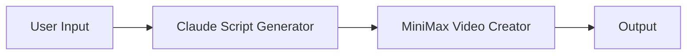
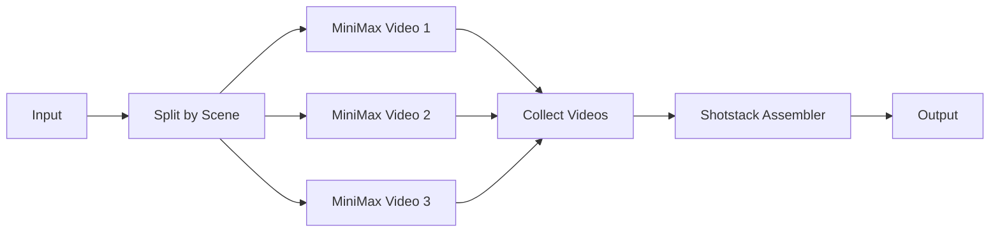
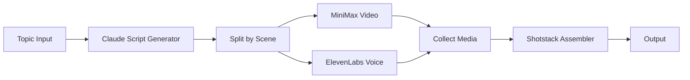
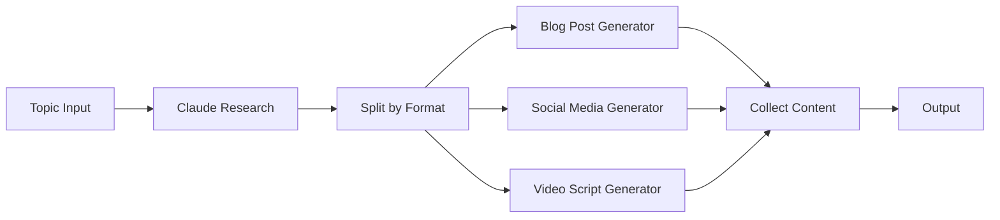
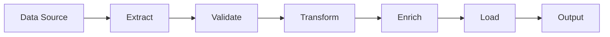
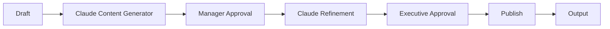
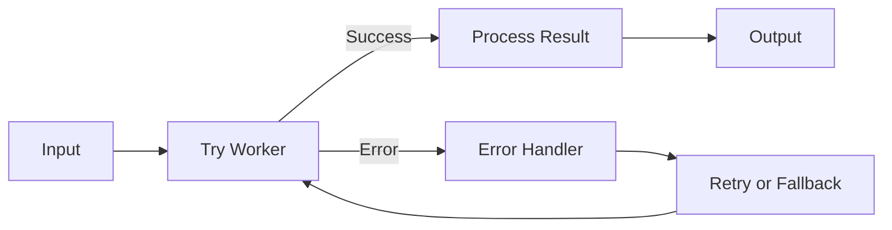
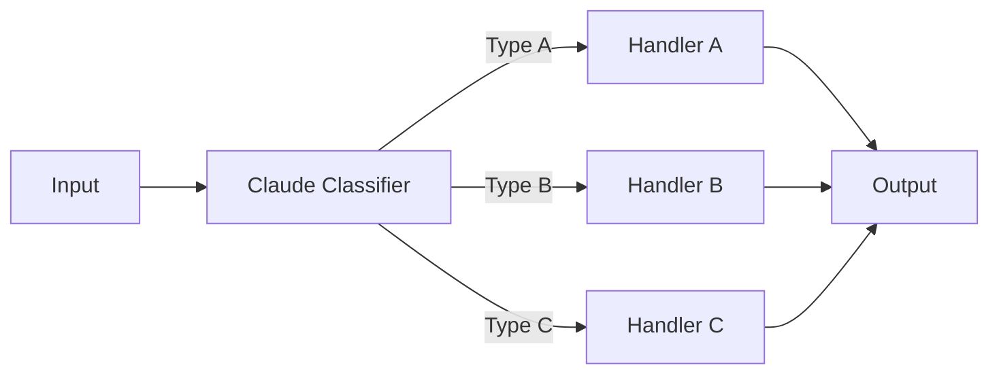

# Workflow Examples

Common workflow patterns using Canvas as Data.

## Table of Contents

1. [Simple Linear Workflow](#simple-linear-workflow)
2. [Parallel Processing (Fan-Out/Fan-In)](#parallel-processing)
3. [Video Factory](#video-factory)
4. [Content Pipeline](#content-pipeline)
5. [Data Processing Pipeline](#data-processing-pipeline)
6. [Multi-Stage Approval](#multi-stage-approval)
7. [Error Handling Pattern](#error-handling-pattern)
8. [Conditional Routing](#conditional-routing)

## Simple Linear Workflow

Basic sequential workflow with three steps.

### Mermaid



### Full Implementation

```typescript
const workflow = {
  name: 'Simple Video Generator',
  mermaid: `
    flowchart LR
      A[User Input] --> B[Claude Script Generator]
      B --> C[MiniMax Video Creator]
      C --> D[Output]
  `,
  nodeConfigs: {
    A: {
      config: {
        fields: [
          { name: 'topic', type: 'text', required: true }
        ]
      }
    },
    B: {
      workerType: 'claude',
      config: {
        model: 'claude-3-sonnet-20240229',
        systemPrompt: 'Generate a video script based on the topic.'
      }
    },
    C: {
      workerType: 'minimax',
      config: {
        duration: 10,
        resolution: '1080p'
      }
    }
  },
  edgeMappings: {
    'A->B': {
      prompt: 'input.topic'
    },
    'B->C': {
      prompt: 'output.script.visualDescription'
    }
  }
};

// Create flow
const response = await fetch('/api/flows', {
  method: 'POST',
  headers: { 'Content-Type': 'application/json' },
  body: JSON.stringify(workflow)
});

const { flowId } = await response.json();

// Run flow
await fetch(`/api/flows/${flowId}/run`, {
  method: 'POST',
  body: JSON.stringify({
    input: { topic: 'The Future of AI' }
  })
});
```

## Parallel Processing

Fan-out to multiple workers, then fan-in to collect results.

### Mermaid



### Full Implementation

```typescript
const workflow = {
  name: 'Parallel Video Processing',
  mermaid: `
    flowchart LR
      A[Input] --> B[Split by Scene]
      B --> C[MiniMax Video 1]
      B --> D[MiniMax Video 2]
      B --> E[MiniMax Video 3]
      C --> F[Collect Videos]
      D --> F
      E --> F
      F --> G[Shotstack Assembler]
      G --> H[Output]
  `,
  nodeConfigs: {
    B: {
      type: 'splitter',
      config: {
        splitBy: 'scenes'
      }
    },
    C: {
      workerType: 'minimax',
      config: { duration: 5 }
    },
    D: {
      workerType: 'minimax',
      config: { duration: 5 }
    },
    E: {
      workerType: 'minimax',
      config: { duration: 5 }
    },
    F: {
      type: 'collector',
      config: {
        collectAs: 'array'
      }
    },
    G: {
      workerType: 'shotstack',
      config: {
        format: 'mp4',
        quality: 'high'
      }
    }
  },
  edgeMappings: {
    'A->B': {
      scenes: 'input.script.scenes'
    },
    'B->C': {
      prompt: 'item.visualDescription'
    },
    'B->D': {
      prompt: 'item.visualDescription'
    },
    'B->E': {
      prompt: 'item.visualDescription'
    },
    'C->F': {
      video: 'output.videoUrl'
    },
    'D->F': {
      video: 'output.videoUrl'
    },
    'E->F': {
      video: 'output.videoUrl'
    },
    'F->G': {
      clips: 'output.collected'
    }
  }
};
```

## Video Factory

Complete video production pipeline with script, video, voice, and assembly.

### Mermaid



### Full Implementation

```typescript
const workflow = {
  name: 'Video Factory',
  mermaid: `
    flowchart LR
      A[Topic Input] --> B[Claude Script Generator]
      B --> C[Split by Scene]
      C --> D[MiniMax Video]
      C --> E[ElevenLabs Voice]
      D --> F[Collect Media]
      E --> F
      F --> G[Shotstack Assembler]
      G --> H[Output]
  `,
  nodeConfigs: {
    A: {
      type: 'ux',
      config: {
        fields: [
          { name: 'topic', type: 'text', required: true },
          { name: 'duration', type: 'number', default: 30 }
        ]
      }
    },
    B: {
      workerType: 'claude',
      config: {
        model: 'claude-3-sonnet-20240229',
        systemPrompt: `Generate a video script with scenes.
          Each scene should have:
          - visualDescription: What to show
          - narration: What to say
          - duration: How long (seconds)`
      }
    },
    C: {
      type: 'splitter',
      config: {
        splitBy: 'scenes'
      }
    },
    D: {
      workerType: 'minimax',
      config: {
        resolution: '1080p'
      }
    },
    E: {
      workerType: 'elevenlabs',
      config: {
        voice_id: 'professional',
        model: 'eleven_multilingual_v2'
      }
    },
    F: {
      type: 'collector',
      config: {
        collectAs: 'object',
        keys: ['video', 'audio']
      }
    },
    G: {
      workerType: 'shotstack',
      config: {
        format: 'mp4',
        quality: 'high',
        fps: 30
      }
    }
  },
  edgeMappings: {
    'A->B': {
      prompt: 'input.topic',
      targetDuration: 'input.duration'
    },
    'B->C': {
      scenes: 'output.script.scenes'
    },
    'C->D': {
      prompt: 'item.visualDescription',
      duration: 'item.duration'
    },
    'C->E': {
      text: 'item.narration'
    },
    'D->F': {
      video: 'output.videoUrl'
    },
    'E->F': {
      audio: 'output.audioUrl'
    },
    'F->G': {
      timeline: 'output.collected'
    }
  }
};

// Create and run
const { flowId } = await (await fetch('/api/flows', {
  method: 'POST',
  body: JSON.stringify(workflow)
})).json();

const { runId } = await (await fetch(`/api/flows/${flowId}/run`, {
  method: 'POST',
  body: JSON.stringify({
    input: {
      topic: 'The Benefits of Exercise',
      duration: 60
    }
  })
})).json();

console.log('Run started:', runId);
```

## Content Pipeline

Multi-format content generation from a single topic.

### Mermaid



### Full Implementation

```typescript
const workflow = {
  name: 'Content Pipeline',
  mermaid: `
    flowchart LR
      A[Topic Input] --> B[Claude Research]
      B --> C[Split by Format]
      C --> D[Blog Post Generator]
      C --> E[Social Media Generator]
      C --> F[Video Script Generator]
      D --> G[Collect Content]
      E --> G
      F --> G
      G --> H[Output]
  `,
  nodeConfigs: {
    B: {
      workerType: 'claude',
      config: {
        systemPrompt: 'Research the topic and provide key points.'
      }
    },
    C: {
      type: 'splitter',
      config: {
        splitBy: 'formats',
        formats: ['blog', 'social', 'video']
      }
    },
    D: {
      workerType: 'claude',
      config: {
        systemPrompt: 'Write a comprehensive blog post.'
      }
    },
    E: {
      workerType: 'claude',
      config: {
        systemPrompt: 'Create engaging social media posts.'
      }
    },
    F: {
      workerType: 'claude',
      config: {
        systemPrompt: 'Write a video script.'
      }
    },
    G: {
      type: 'collector',
      config: {
        collectAs: 'object',
        keys: ['blog', 'social', 'video']
      }
    }
  },
  edgeMappings: {
    'A->B': {
      topic: 'input.topic'
    },
    'B->C': {
      research: 'output.keyPoints'
    },
    'C->D': {
      research: 'item.research',
      format: 'item.format'
    },
    'C->E': {
      research: 'item.research',
      format: 'item.format'
    },
    'C->F': {
      research: 'item.research',
      format: 'item.format'
    },
    'D->G': {
      blog: 'output.content'
    },
    'E->G': {
      social: 'output.posts'
    },
    'F->G': {
      video: 'output.script'
    }
  }
};
```

## Data Processing Pipeline

ETL (Extract, Transform, Load) workflow.

### Mermaid



### Full Implementation

```typescript
const workflow = {
  name: 'Data Processing Pipeline',
  mermaid: `
    flowchart LR
      A[Data Source] --> B[Extract]
      B --> C[Validate]
      C --> D[Transform]
      D --> E[Enrich]
      E --> F[Load]
      F --> G[Output]
  `,
  nodeConfigs: {
    B: {
      workerType: 'custom',
      config: {
        endpoint: 'https://api.example.com/extract',
        method: 'POST'
      }
    },
    C: {
      workerType: 'custom',
      config: {
        endpoint: 'https://api.example.com/validate',
        rules: ['required_fields', 'data_types', 'ranges']
      }
    },
    D: {
      workerType: 'custom',
      config: {
        endpoint: 'https://api.example.com/transform',
        transformations: ['normalize', 'deduplicate', 'format']
      }
    },
    E: {
      workerType: 'custom',
      config: {
        endpoint: 'https://api.example.com/enrich',
        sources: ['geocoding', 'demographics']
      }
    },
    F: {
      workerType: 'custom',
      config: {
        endpoint: 'https://api.example.com/load',
        destination: 'warehouse'
      }
    }
  },
  edgeMappings: {
    'A->B': {
      source: 'input.dataSource'
    },
    'B->C': {
      data: 'output.extracted'
    },
    'C->D': {
      data: 'output.validated'
    },
    'D->E': {
      data: 'output.transformed'
    },
    'E->F': {
      data: 'output.enriched'
    }
  }
};
```

## Multi-Stage Approval

Workflow with human approval steps.

### Mermaid



### Full Implementation

```typescript
const workflow = {
  name: 'Multi-Stage Approval',
  mermaid: `
    flowchart LR
      A[Draft] --> B[Claude Content Generator]
      B --> C[Manager Approval]
      C --> D[Claude Refinement]
      D --> E[Executive Approval]
      E --> F[Publish]
      F --> G[Output]
  `,
  nodeConfigs: {
    B: {
      workerType: 'claude',
      config: {
        systemPrompt: 'Generate initial content draft.'
      }
    },
    C: {
      type: 'ux',
      config: {
        approvalType: 'manager',
        fields: [
          { name: 'approved', type: 'boolean', required: true },
          { name: 'feedback', type: 'text' }
        ]
      }
    },
    D: {
      workerType: 'claude',
      config: {
        systemPrompt: 'Refine content based on feedback.'
      }
    },
    E: {
      type: 'ux',
      config: {
        approvalType: 'executive',
        fields: [
          { name: 'approved', type: 'boolean', required: true },
          { name: 'comments', type: 'text' }
        ]
      }
    },
    F: {
      workerType: 'custom',
      config: {
        endpoint: 'https://api.example.com/publish'
      }
    }
  },
  edgeMappings: {
    'A->B': {
      draft: 'input.initialDraft'
    },
    'B->C': {
      content: 'output.generatedContent'
    },
    'C->D': {
      content: 'input.content',
      feedback: 'input.feedback'
    },
    'D->E': {
      content: 'output.refinedContent'
    },
    'E->F': {
      content: 'input.content'
    }
  }
};
```

## Error Handling Pattern

Workflow with error handling and retry logic.

### Mermaid



### Full Implementation

```typescript
const workflow = {
  name: 'Error Handling Pattern',
  mermaid: `
    flowchart LR
      A[Input] --> B[Try Worker]
      B --> C[Check Status]
      C -->|Success| D[Process Result]
      C -->|Error| E[Error Handler]
      E --> F[Retry Logic]
      F --> B
      D --> G[Output]
  `,
  nodeConfigs: {
    B: {
      workerType: 'claude',
      config: {
        maxRetries: 3,
        timeout: 30000
      }
    },
    C: {
      type: 'splitter',
      config: {
        splitBy: 'status'
      }
    },
    E: {
      workerType: 'custom',
      config: {
        endpoint: 'https://api.example.com/log-error'
      }
    },
    F: {
      workerType: 'custom',
      config: {
        retryDelay: 5000,
        maxRetries: 3
      }
    }
  },
  edgeMappings: {
    'A->B': {
      input: 'input.data'
    },
    'B->C': {
      result: 'output',
      status: 'status'
    },
    'C->D': {
      result: 'item.result'
    },
    'C->E': {
      error: 'item.error'
    },
    'E->F': {
      retryData: 'output.retryInfo'
    },
    'F->B': {
      input: 'output.retryData'
    }
  }
};
```

## Conditional Routing

Route based on content classification.

### Mermaid



### Full Implementation

```typescript
const workflow = {
  name: 'Conditional Routing',
  mermaid: `
    flowchart LR
      A[Input] --> B[Claude Classifier]
      B --> C[Route by Type]
      C -->|Type A| D[Handler A]
      C -->|Type B| E[Handler B]
      C -->|Type C| F[Handler C]
      D --> G[Output]
      E --> G
      F --> G
  `,
  nodeConfigs: {
    B: {
      workerType: 'claude',
      config: {
        systemPrompt: 'Classify the input into Type A, B, or C.'
      }
    },
    C: {
      type: 'splitter',
      config: {
        splitBy: 'classification'
      }
    },
    D: {
      workerType: 'claude',
      config: {
        systemPrompt: 'Handle Type A content.'
      }
    },
    E: {
      workerType: 'claude',
      config: {
        systemPrompt: 'Handle Type B content.'
      }
    },
    F: {
      workerType: 'claude',
      config: {
        systemPrompt: 'Handle Type C content.'
      }
    },
    G: {
      type: 'collector',
      config: {
        collectAs: 'first'
      }
    }
  },
  edgeMappings: {
    'A->B': {
      content: 'input.content'
    },
    'B->C': {
      classification: 'output.type',
      content: 'input.content'
    },
    'C->D': {
      content: 'item.content'
    },
    'C->E': {
      content: 'item.content'
    },
    'C->F': {
      content: 'item.content'
    },
    'D->G': {
      result: 'output.processed'
    },
    'E->G': {
      result: 'output.processed'
    },
    'F->G': {
      result: 'output.processed'
    }
  }
};
```

## Running Examples

All examples can be created and run using the API:

```typescript
// 1. Create flow
const { flowId } = await (await fetch('/api/flows', {
  method: 'POST',
  body: JSON.stringify(workflow)
})).json();

// 2. Run flow
const { runId } = await (await fetch(`/api/flows/${flowId}/run`, {
  method: 'POST',
  body: JSON.stringify({
    input: { /* your input data */ }
  })
})).json();

// 3. Monitor run
const run = await (await fetch(`/api/runs/${runId}`)).json();
console.log('Status:', run.status);
```

## Next Steps

- See [API Reference](./API.md) for detailed endpoint documentation
- Read [Mermaid Integration](./MERMAID.md) for more Mermaid patterns
- Check [Version Management](./VERSION_MANAGEMENT.md) for versioning workflows
