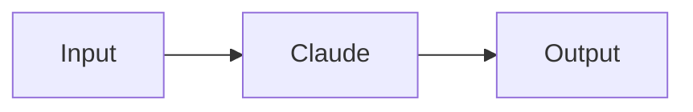

# Canvas as Data - Complete Documentation Index

## Getting Started

Start here if you're new to Canvas as Data:

1. **[README](./README.md)** - Overview and quick start guide
2. **[Architecture](./ARCHITECTURE.md)** - Understand the system design
3. **[Examples](./EXAMPLES.md)** - See common workflow patterns

## Core Concepts

### Visual Graph vs Execution Graph

The system uses two representations:

- **Visual Graph**: Complete React Flow JSON with UI properties (positions, styles)
- **Execution Graph (OEG)**: Optimized, stripped version for runtime (60% smaller, O(1) lookups)

See: [Architecture - Component Details](./ARCHITECTURE.md#component-details)

### Versioning

Every canvas save creates an immutable version:

- **Flow**: Container with metadata
- **Version**: Immutable snapshot with both graphs
- **Run**: Execution instance referencing a specific version

See: [Version Management](./VERSION_MANAGEMENT.md)

### Validation

All graphs are validated before saving:

- Cycle detection
- **Strict required input validation** - Explicit edge mappings or defaults required
- Worker type validation
- Edge mapping validation

**Important:** Implicit data passing is disabled for safety. Required inputs must have explicit `edge.data.mapping` or default values.

See: [Architecture - OEG Compiler](./ARCHITECTURE.md#oeg-compiler)

## User Guides

### For Developers

- **[API Reference](./API.md)** - Complete endpoint documentation
- **[Architecture](./ARCHITECTURE.md)** - System design and data flow
- **[Migration Guide](./MIGRATION.md)** - Migrate existing flows

### For AI/LLMs

- **[Mermaid Integration](./MERMAID.md)** - Use Mermaid for workflow creation
- **[Examples](./EXAMPLES.md)** - Common workflow patterns
- **[API Reference](./API.md)** - Programmatic access

### For Users

- **[Version Management](./VERSION_MANAGEMENT.md)** - Track changes and rollback
- **[Examples](./EXAMPLES.md)** - Learn from examples
- **[README](./README.md)** - Quick start guide

## API Documentation

### Endpoints

#### Flow Management
- `POST /api/flows` - Create flow
- `GET /api/flows/[id]` - Get flow
- `PATCH /api/flows/[id]` - Update flow
- `DELETE /api/flows/[id]` - Delete flow

See: [API - Flow Management](./API.md#flow-management)

#### Version Management
- `POST /api/flows/[id]/versions` - Create version
- `GET /api/flows/[id]/versions` - List versions (metadata only, no graph blobs)
- `GET /api/flows/[id]/versions/[vid]` - Get specific version (includes full graphs)

**Note:** List endpoint returns metadata only to avoid bandwidth issues.

See: [API - Version Management](./API.md#version-management)

#### Workflow Execution
- `POST /api/flows/[id]/run` - Run flow with auto-versioning

See: [API - Workflow Execution](./API.md#workflow-execution)

### Data Types

- **VisualGraph**: [API - VisualGraph](./API.md#visualgraph)
- **ExecutionGraph**: [API - ExecutionGraph](./API.md#executiongraph)
- **EdgeMapping**: [API - EdgeMapping](./API.md#edgemapping)
- **NodeConfig**: [API - NodeConfig](./API.md#nodeconfig)

## Workflow Patterns

### Basic Patterns

1. **[Simple Linear Workflow](./EXAMPLES.md#simple-linear-workflow)** - Sequential steps
2. **[Parallel Processing](./EXAMPLES.md#parallel-processing)** - Fan-out/fan-in
3. **[Video Factory](./EXAMPLES.md#video-factory)** - Complete video pipeline

### Advanced Patterns

4. **[Content Pipeline](./EXAMPLES.md#content-pipeline)** - Multi-format generation
5. **[Data Processing](./EXAMPLES.md#data-processing-pipeline)** - ETL workflow
6. **[Multi-Stage Approval](./EXAMPLES.md#multi-stage-approval)** - Human-in-the-loop
7. **[Error Handling](./EXAMPLES.md#error-handling-pattern)** - Retry logic
8. **[Conditional Routing](./EXAMPLES.md#conditional-routing)** - Dynamic branching

## Mermaid Integration

### Quick Start



See: [Mermaid - Basic Syntax](./MERMAID.md#basic-syntax)

### Hybrid Approach

Combine Mermaid structure with JSON configs:

```typescript
{
  mermaid: "flowchart LR\n  A --> B --> C",
  nodeConfigs: { /* detailed configs */ },
  edgeMappings: { /* data flow */ }
}
```

See: [Mermaid - Hybrid Approach](./MERMAID.md#hybrid-approach)

### Advanced Features

- **[Worker Type Inference](./MERMAID.md#worker-type-inference)** - Auto-detect worker types
- **[Auto-Layout](./MERMAID.md#auto-layout)** - Automatic node positioning using Kahn's Algorithm (cycle-safe)
- **[Round-Trip Conversion](./MERMAID.md#round-trip-conversion)** - Preserve structure

## Version Management

### Creating Versions

- **[Manual Save](./VERSION_MANAGEMENT.md#manual-save)** - Explicit version creation
- **[Auto-Versioning](./VERSION_MANAGEMENT.md#auto-versioning-on-run)** - Automatic on run
- **[First Version](./VERSION_MANAGEMENT.md#first-version)** - Initial version setup

### Working with Versions

- **[Version History](./VERSION_MANAGEMENT.md#version-history)** - List and retrieve
- **[Version Comparison](./VERSION_MANAGEMENT.md#version-comparison)** - See changes
- **[Rollback](./VERSION_MANAGEMENT.md#rollback)** - Revert to previous version

### Best Practices

- **[Commit Messages](./VERSION_MANAGEMENT.md#1-use-meaningful-commit-messages)** - Document changes
- **[Version Before Changes](./VERSION_MANAGEMENT.md#2-version-before-major-changes)** - Safety first
- **[Auto-Versioning](./VERSION_MANAGEMENT.md#3-let-auto-versioning-handle-runs)** - Let system handle it

## Migration

### Process

1. **[Backup Database](./MIGRATION.md#step-1-backup-database)** - Safety first
2. **[Apply Schema Migration](./MIGRATION.md#step-2-apply-schema-migration)** - New tables
3. **[Run Data Migration](./MIGRATION.md#step-3-run-data-migration)** - Migrate data

### Handling Issues

- **[Invalid Graphs](./MIGRATION.md#invalid-graphs)** - Fix validation errors
- **[Orphaned Runs](./MIGRATION.md#orphaned-runs)** - Link to versions
- **[Code Updates](./MIGRATION.md#code-updates)** - Update application code

### Testing

- **[Test Flow Loading](./MIGRATION.md#1-test-flow-loading)** - Verify flows
- **[Test Run Loading](./MIGRATION.md#2-test-run-loading)** - Verify runs
- **[Test Execution](./MIGRATION.md#3-test-execution)** - Verify execution

## Architecture

### System Components

- **[Visual Graph](./ARCHITECTURE.md#visual-graph)** - UI representation
- **[Execution Graph](./ARCHITECTURE.md#execution-graph-oeg)** - Runtime representation
- **[OEG Compiler](./ARCHITECTURE.md#oeg-compiler)** - Validation and optimization
- **[Version Manager](./ARCHITECTURE.md#version-manager)** - Version operations
- **[Mermaid Parser](./ARCHITECTURE.md#mermaid-parser)** - Mermaid conversion
- **[Auto-Layout](./ARCHITECTURE.md#auto-layout-algorithm)** - Node positioning

### Data Flow

- **[Save Flow](./ARCHITECTURE.md#save-flow)** - Version creation flow
- **[Run Flow](./ARCHITECTURE.md#run-flow)** - Execution flow
- **[View Historical Run](./ARCHITECTURE.md#view-historical-run)** - Historical view

### Database Schema

- **[stitch_flows](./ARCHITECTURE.md#stitch_flows)** - Flow metadata
- **[stitch_flow_versions](./ARCHITECTURE.md#stitch_flow_versions)** - Version snapshots
- **[stitch_runs](./ARCHITECTURE.md#stitch_runs)** - Execution instances

## Performance

### Characteristics

- **Visual Graph**: 100-500 KB, 50-200 ms render
- **Execution Graph**: 40-200 KB (60% smaller), O(1) lookups
- **Compilation**: O(V + E), 10-50 ms typical
- **Version Creation**: 50-100 ms typical

See: [Architecture - Performance Characteristics](./ARCHITECTURE.md#performance-characteristics)

### Optimization

- **Lazy Loading**: Load versions on demand
- **Caching**: Immutable versions, cache aggressively
- **Compression**: Compress large graphs
- **Indexes**: Optimize frequent queries

See: [Architecture - Scalability](./ARCHITECTURE.md#scalability)

## Security

### Row Level Security

All tables use Supabase RLS:
- Users can only access their own flows
- Versions inherit flow permissions
- Runs inherit flow permissions

See: [Architecture - Security](./ARCHITECTURE.md#security)

### Validation

Prevent malicious graphs:
- Cycle detection (DoS prevention)
- Size limits (DoS prevention)
- Worker type validation (injection prevention)
- Edge mapping validation (injection prevention)

## Troubleshooting

### Common Issues

#### Version Management
- **[Flow has no current_version_id](./VERSION_MANAGEMENT.md#issue-flow-has-no-current_version_id)** - Fix validation errors
- **[Run shows wrong version](./VERSION_MANAGEMENT.md#issue-run-shows-wrong-version)** - Load correct version
- **[Auto-versioning not working](./VERSION_MANAGEMENT.md#issue-auto-versioning-not-working)** - Pass visual graph

#### Mermaid
- **[Import fails](./MERMAID.md#import-fails)** - Check syntax
- **[Worker type not inferred](./MERMAID.md#worker-type-not-inferred)** - Use explicit configs
- **[Layout looks wrong](./MERMAID.md#layout-looks-wrong)** - Adjust spacing

#### Migration
- **[Flow has no current_version_id](./MIGRATION.md#issue-flow-has-no-current_version_id)** - Fix and save
- **[Run references null version](./MIGRATION.md#issue-run-references-null-version)** - Fix parent flow
- **[Execution fails](./MIGRATION.md#issue-execution-fails-after-migration)** - Verify OEG structure

## Reference

### Type Definitions

Located in `src/types/`:
- `canvas-schema.ts` - Visual graph types
- `execution-graph.ts` - Execution graph types
- `worker-definition.ts` - Worker types
- `workflow-creation.ts` - Workflow creation types

### Core Modules

Located in `src/lib/canvas/`:
- `compile-oeg.ts` - OEG compiler
- `validate-graph.ts` - Graph validation
- `version-manager.ts` - Version operations
- `mermaid-parser.ts` - Mermaid to canvas
- `mermaid-generator.ts` - Canvas to Mermaid
- `auto-layout.ts` - Node positioning

### Database Operations

Located in `src/lib/db/`:
- `flows.ts` - Flow CRUD operations
- `runs.ts` - Run operations

### API Routes

Located in `src/app/api/`:
- `flows/route.ts` - Flow endpoints
- `flows/[id]/versions/route.ts` - Version endpoints
- `flows/[id]/run/route.ts` - Run endpoint

### UI Components

Located in `src/components/canvas/`:
- `StitchCanvas.tsx` - Main canvas editor
- `VersionHistory.tsx` - Version history UI
- `MermaidImportExport.tsx` - Mermaid import/export

## Quick Reference

### Create Flow with Mermaid

```typescript
const { flowId } = await fetch('/api/flows', {
  method: 'POST',
  body: JSON.stringify({
    name: 'My Workflow',
    mermaid: 'flowchart LR\n  A --> B --> C'
  })
}).then(r => r.json());
```

### Run Flow with Auto-Versioning

```typescript
const { runId } = await fetch(`/api/flows/${flowId}/run`, {
  method: 'POST',
  body: JSON.stringify({
    visualGraph: currentGraph
  })
}).then(r => r.json());
```

### List Versions

```typescript
const { versions } = await fetch(`/api/flows/${flowId}/versions`)
  .then(r => r.json());
```

### Load Historical Run

```typescript
const run = await fetch(`/api/runs/${runId}`).then(r => r.json());
const version = await fetch(`/api/flows/${run.flow_id}/versions/${run.flow_version_id}`)
  .then(r => r.json());
```

## Support

For issues or questions:

1. Check [Troubleshooting](#troubleshooting) sections
2. Review [Examples](./EXAMPLES.md) for patterns
3. Consult [API Reference](./API.md) for details
4. See [Architecture](./ARCHITECTURE.md) for design

## Contributing

When contributing to Canvas as Data:

1. Read [Architecture](./ARCHITECTURE.md) to understand design
2. Follow existing patterns in [Examples](./EXAMPLES.md)
3. Add tests for new features
4. Update documentation

## License

See main project LICENSE file.
