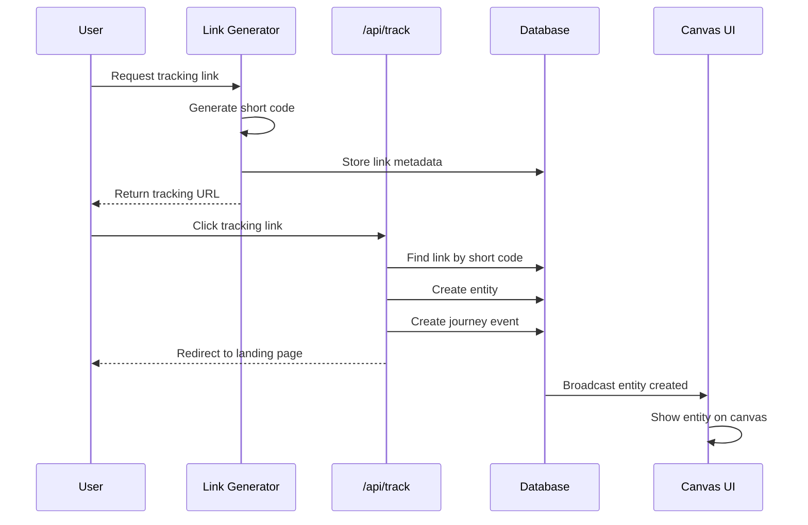
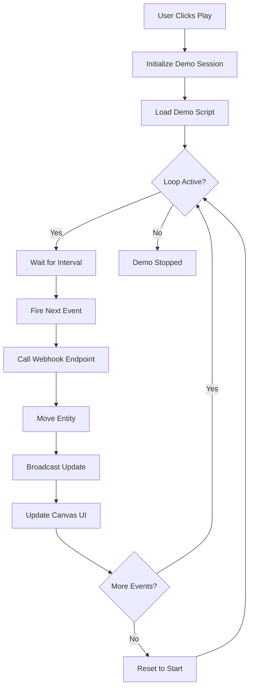

# Design Document

## Overview

This design outlines a systematic approach to updating Stitch's implementation documentation to reflect recent developments. The update will be performed in phases, with each phase focusing on a specific area of documentation. The design prioritizes accuracy, maintainability, and usability while minimizing disruption to existing documentation structure.

## Architecture

### Documentation Update Strategy

The update follows a **phased, incremental approach** rather than a complete rewrite:

1. **Audit Phase**: Identify what's outdated
2. **Core Updates Phase**: Update critical, frequently-accessed docs
3. **Feature Documentation Phase**: Document new features (Clockwork, Tracking Links)
4. **Gap Closure Phase**: Update gap analysis documents
5. **Polish Phase**: Fix cross-references, update index, verify diagrams

### Documentation Organization (Unchanged)

```
/docs/implementation/
├── 00-index.md                    # Master index (UPDATE)
├── CLOCKWORK_STATUS.md            # Current status (UPDATE)
├── architecture/                  # System architecture (UPDATE)
├── backend/                       # Backend components (UPDATE)
├── frontend/                      # Frontend components (UPDATE)
├── api/                          # API documentation (UPDATE)
├── diagrams/                     # Mermaid diagrams (VERIFY)
├── guides/                       # Developer guides (ADD NEW)
└── gaps/                         # Gap analysis (UPDATE)
```

## Components and Interfaces

### Phase 1: Documentation Audit

**Purpose**: Understand current state and identify update priorities

**Deliverables**:
- Audit report listing all documentation files
- List of outdated sections with severity (critical/important/minor)
- List of missing documentation for new features
- Broken link report

**Method**:
1. Compare documentation dates to recent commit history
2. Check for references to non-existent files
3. Verify code examples against actual codebase
4. Test all cross-reference links
5. Review roadmap implementation status

### Phase 2: Core Documentation Updates

**Files to Update**:

#### 00-index.md (Master Index)
**Changes**:
- Add "Recent Implementations (December 2024)" section
- Update Clockwork Canvas status
- Add tracking links to quick reference
- Add new components to component reference
- Add new API endpoints to endpoint reference
- Update troubleshooting section

**New Sections**:
```markdown
### Recent Implementations (December 2024)

**Clockwork Canvas Demo**
- ✅ 13 Halloween-themed entities with avatars
- ✅ Demo orchestrator with continuous loop
- ✅ Demo control panel UI
- ✅ Seed script with idempotent entity creation
- ⏳ Webhook endpoints (in progress)

**Tracking Links System**
- ✅ Link generator worker
- ✅ Tracking API endpoints
- ✅ MCP tool integration
- ✅ Entity creation from clicks
```

#### CLOCKWORK_STATUS.md
**Changes**:
- Update completion percentage (currently shows 75%)
- Mark completed items with ✅
- Update "What Works Right Now" section
- Revise timeline based on actual progress
- Add recent test results

**Accuracy Check**:
- Verify webhook endpoint status
- Confirm system edges implementation status
- Check financial updates implementation
- Validate drill-down workflow status

### Phase 3: Feature Documentation

#### New Guide: clockwork-webhooks.md
**Location**: `/docs/implementation/guides/clockwork-webhooks.md`

**Content**:
```markdown
# Implementing Clockwork Webhook Endpoints

## Overview
Step-by-step guide for creating webhook endpoints that move entities through the Clockwork Canvas demo.

## Webhook Endpoint Pattern
[Template code for webhook endpoints]

## Entity Movement Flow
[Diagram showing webhook → processor → entity movement]

## Testing Webhooks
[How to test webhook endpoints locally]

## Troubleshooting
[Common issues and solutions]
```

#### Update: worker-system.md
**Add Section**: "Link Generator Worker"

**Content**:
```markdown
### Link Generator Worker

**Purpose**: Generate tracking URLs with UTM parameters for marketing attribution

**Type**: Synchronous

**Input**:
- `campaign`: Campaign name
- `source`: Traffic source
- `medium`: Marketing medium
- `content`: Ad content identifier

**Output**:
- `trackingUrl`: Full URL with UTM parameters
- `shortCode`: Unique identifier for tracking

**Implementation**: `/src/lib/workers/link-generator.ts`

**Related**: See [Tracking Links Guide](../guides/tracking-links.md)
```

#### Update: rest-endpoints.md
**Add Endpoints**:

```markdown
### Demo Control Endpoints

#### Start Demo
`POST /api/demo/start`

Starts the Clockwork Canvas demo orchestrator.

**Request**: None
**Response**:
```json
{
  "success": true,
  "sessionId": "uuid",
  "message": "Demo started"
}
```

#### Stop Demo
`POST /api/demo/stop`

Stops the running demo orchestrator.

#### Reset Demo
`POST /api/demo/reset`

Resets all entities to initial positions.

### Tracking Endpoints

#### Generate Tracking Link
`POST /api/generate-link`

Generates a tracking URL with UTM parameters.

**Request**:
```json
{
  "campaign": "holiday-2024",
  "source": "linkedin",
  "medium": "cpc",
  "content": "ad-variant-a"
}
```

**Response**:
```json
{
  "trackingUrl": "https://app.stitch.com/track?c=abc123",
  "shortCode": "abc123",
  "fullUrl": "https://app.stitch.com/track?c=abc123&utm_campaign=holiday-2024&utm_source=linkedin&utm_medium=cpc&utm_content=ad-variant-a"
}
```

#### Track Visit
`GET /api/track?c={shortCode}`

Records a visit from a tracking link and creates an entity.

**Query Parameters**:
- `c`: Short code from tracking link

**Response**: Redirects to landing page
**Side Effect**: Creates entity in database
```

#### Update: canvas-components.md
**Add Components**:

```markdown
### DemoControlPanel

**Purpose**: UI controls for starting, stopping, and resetting the Clockwork Canvas demo

**Location**: `/src/components/canvas/DemoControlPanel.tsx`

**Props**:
```typescript
interface DemoControlPanelProps {
  canvasId: string;
}
```

**Features**:
- Play/Stop button with state management
- Reset button to restore initial state
- Session status indicator
- Event counter display

**Usage**:
```tsx
<DemoControlPanel canvasId={canvas.id} />
```

### RunStatusOverlay

**Purpose**: Displays execution status overlay on canvas during workflow runs

**Location**: `/src/components/canvas/RunStatusOverlay.tsx`

**Features**:
- Shows active run status
- Displays node execution progress
- Real-time updates via Supabase
- Dismissible overlay
```

#### Update: node-components.md
**Add Node Type**:

```markdown
### FinancialItemNode

**Purpose**: Displays financial metrics (MRR, costs) with dynamic values

**Location**: `/src/components/canvas/nodes/FinancialItemNode.tsx`

**Features**:
- Displays current value (e.g., "$12,450")
- Updates in real-time when subscriptions change
- Color-coded (green for revenue, red for costs)
- Trend indicators (up/down arrows)

**Data Structure**:
```typescript
interface FinancialItemData {
  label: string;
  value: number;
  currency: string;
  trend?: 'up' | 'down' | 'stable';
}
```
```

#### Update: hooks.md
**Add Hooks**:

```markdown
### useCanvasEvents

**Purpose**: Subscribe to canvas-level events (entity movement, node completion)

**Location**: `/src/hooks/useCanvasEvents.ts`

**Usage**:
```typescript
const { events, clearEvents } = useCanvasEvents(canvasId);
```

**Returns**:
- `events`: Array of recent canvas events
- `clearEvents`: Function to clear event history

### useNodeActivation

**Purpose**: Track and manage node activation state during execution

**Location**: `/src/hooks/useNodeActivation.ts`

**Usage**:
```typescript
const { activeNodes, activateNode, deactivateNode } = useNodeActivation(runId);
```

**Features**:
- Tracks which nodes are currently executing
- Provides activation/deactivation functions
- Syncs with database state
```

### Phase 4: Gap Analysis Updates

#### Update: clockwork-demo-gaps.md

**Method**:
1. Review each gap listed
2. Mark completed items with ✅ and move to "Completed" section
3. Update in-progress items with current status
4. Add newly discovered gaps
5. Revise effort estimates based on actual implementation time

**New Structure**:
```markdown
# Clockwork Demo Gaps

## Completed ✅
[Items that have been implemented]

## In Progress ⏳
[Items currently being worked on]

## Critical Gaps 🔴
[Blocking issues]

## Important Enhancements 🟡
[High-value additions]

## Nice to Have 🟢
[Future improvements]
```

#### Update: frontend-gaps.md

**Remove Completed**:
- Demo control panel (✅ implemented)
- Entity count badges (✅ implemented)
- Run status overlay (✅ implemented)

**Add New Gaps**:
- Entity clustering for large groups
- Advanced entity filtering
- Canvas zoom controls
- Node configuration panel

#### Update: backend-gaps.md

**Remove Completed**:
- Demo orchestrator (✅ implemented)
- Entity seeding system (✅ implemented)
- Tracking link generation (✅ implemented)

**Add New Gaps**:
- Clockwork webhook endpoints (⏳ in progress)
- System edge execution
- Financial metric calculations
- Webhook retry logic

### Phase 5: New Implementation Guides

#### Guide: tracking-links-implementation.md
**Location**: `/docs/implementation/guides/tracking-links-implementation.md`

**Content**:
```markdown
# Tracking Links Implementation Guide

## Overview
Complete guide to the tracking links system for marketing attribution.

## Architecture
[Diagram: Link Generation → Click → Entity Creation]

## Components
1. Link Generator Worker
2. Generate Link API
3. Track API
4. Entity Creation Logic

## Implementation Steps
[Step-by-step guide]

## Testing
[How to test tracking links]

## Integration Examples
[Code examples for common use cases]
```

#### Guide: demo-development.md
**Location**: `/docs/implementation/guides/demo-development.md`

**Content**:
```markdown
# Demo Development Guide

## Overview
Guide for extending and customizing the Clockwork Canvas demo.

## Demo Architecture
[Diagram showing demo components]

## Adding Demo Events
[How to add events to demo script]

## Creating Custom Entities
[How to add new entity types]

## Extending the Demo Script
[Code examples]

## Testing Demos Locally
[Setup and testing instructions]
```

### Phase 6: Diagram Updates

#### Verify Existing Diagrams

**Check Each Diagram**:
1. Render in Mermaid viewer
2. Verify syntax is valid
3. Check that referenced components exist
4. Update labels if component names changed
5. Add missing components

#### New Diagram: tracking-flow.mmd
**Location**: `/docs/implementation/diagrams/tracking-flow.mmd`

**Content**:


#### New Diagram: demo-orchestrator.mmd
**Location**: `/docs/implementation/diagrams/demo-orchestrator.mmd`

**Content**:


## Data Models

### Documentation Metadata

Each updated file should include:

```markdown
---
last_updated: "2024-12-07"
status: "current" | "in-progress" | "outdated"
related_files:
  - path/to/related/doc.md
  - path/to/another/doc.md
---
```

### Update Tracking

Maintain an update log:

```markdown
# Documentation Update Log

## December 7, 2024
- Updated CLOCKWORK_STATUS.md with current implementation state
- Added tracking links documentation
- Updated component documentation for new UI elements
- Revised gap analysis documents

## [Previous updates...]
```

## Error Handling

### Handling Outdated Information

When updating documentation:

1. **Don't delete outdated sections immediately** - mark them as deprecated:
   ```markdown
   > **⚠️ DEPRECATED**: This section describes the old pattern. See [new pattern](link) instead.
   ```

2. **Provide migration guidance** when patterns change:
   ```markdown
   ### Migration from Old Pattern
   
   If you're using the old pattern:
   ```typescript
   // Old way
   ```
   
   Update to:
   ```typescript
   // New way
   ```
   ```

3. **Keep historical context** for major changes:
   ```markdown
   ### Historical Note
   Prior to December 2024, entities were moved manually. The webhook-based system replaced this approach.
   ```

### Handling Missing Information

When information is incomplete:

```markdown
> **🚧 IN PROGRESS**: This feature is currently being implemented. Check [CLOCKWORK_STATUS.md](../CLOCKWORK_STATUS.md) for current status.
```

## Testing Strategy

### Documentation Quality Checks

**Automated Checks**:
1. Link validation - verify all internal links work
2. Code reference validation - verify file paths exist
3. Mermaid syntax validation - ensure diagrams render
4. Markdown linting - consistent formatting

**Manual Checks**:
1. Technical accuracy - verify against actual code
2. Completeness - ensure all features documented
3. Clarity - readable by target audience
4. Examples - code examples are runnable

### Review Process

**For Each Updated File**:
1. Compare against actual implementation
2. Test all code examples
3. Verify cross-references
4. Check for broken links
5. Validate diagrams render correctly

## Correctness Properties

*A property is a characteristic or behavior that should hold true across all valid executions of a system-essentially, a formal statement about what the system should do. Properties serve as the bridge between human-readable specifications and machine-verifiable correctness guarantees.*

### Property 1: Documentation Completeness
*For any* implemented feature in the codebase, there should exist corresponding documentation in the implementation docs that describes its purpose, usage, and integration points.
**Validates: Requirements 2.3, 3.1, 6.1**

### Property 2: Link Validity
*For any* cross-reference link in the documentation, the target file and section should exist and be accessible.
**Validates: Requirements 1.5, 9.2**

### Property 3: Code Example Accuracy
*For any* code example in the documentation, the referenced file paths should exist and the code should match the actual implementation patterns.
**Validates: Requirements 10.3**

### Property 4: Gap Analysis Accuracy
*For any* feature listed as a gap, it should not exist in the implemented codebase, and for any implemented feature, it should not appear in the gaps documentation.
**Validates: Requirements 5.1, 5.2, 5.3**

### Property 5: Diagram Validity
*For any* Mermaid diagram in the documentation, the syntax should be valid and the diagram should render without errors.
**Validates: Requirements 10.4**

### Property 6: Status Consistency
*For any* feature documented as "implemented" or "complete", the corresponding code should exist and be functional in the codebase.
**Validates: Requirements 2.1, 10.5**

### Property 7: Index Completeness
*For any* documentation file in the implementation directory, there should exist a corresponding entry in the master index (00-index.md).
**Validates: Requirements 9.1**

## Implementation Approach

### Incremental Updates

Rather than updating all documentation at once:

1. **Start with high-traffic docs** (00-index.md, CLOCKWORK_STATUS.md)
2. **Update feature-specific docs** as features are completed
3. **Batch update gap analysis** after major milestones
4. **Continuous maintenance** of guides and examples

### Version Control Strategy

- Create feature branch: `docs/update-december-2024`
- Commit updates by phase
- Use descriptive commit messages: "docs: update clockwork status with webhook implementation"
- Create PR for review before merging

### Collaboration

- Mark sections needing technical review: `<!-- TODO: Verify with backend team -->`
- Use GitHub issues for tracking documentation tasks
- Link documentation PRs to related feature PRs

## Future Considerations

### Documentation Automation

Potential future improvements:

1. **Auto-generate API docs** from OpenAPI specs
2. **Extract component props** from TypeScript interfaces
3. **Generate hook documentation** from JSDoc comments
4. **Automated link checking** in CI/CD
5. **Diagram generation** from code structure

### Documentation as Code

Consider:

1. **Versioned documentation** matching code versions
2. **Documentation tests** that fail if docs are outdated
3. **Automated changelog** generation
4. **Documentation coverage** metrics

### Maintenance Schedule

Establish regular documentation review:

- **Weekly**: Update CLOCKWORK_STATUS.md during active development
- **Sprint End**: Update gap analysis documents
- **Monthly**: Review and update guides
- **Quarterly**: Comprehensive documentation audit

## Success Criteria

Documentation update is successful when:

1. ✅ All links work (no 404s)
2. ✅ All code examples reference existing files
3. ✅ All diagrams render correctly
4. ✅ Gap analysis reflects current state
5. ✅ New features are documented
6. ✅ Master index is complete and accurate
7. ✅ Developers can find information quickly
8. ✅ Documentation matches implementation

## Rollout Plan

### Phase 1: Critical Updates (Week 1)
- Update 00-index.md
- Update CLOCKWORK_STATUS.md
- Update clockwork-demo-gaps.md
- Fix broken links

### Phase 2: Feature Documentation (Week 2)
- Document tracking links system
- Document demo orchestrator
- Update component documentation
- Update API documentation

### Phase 3: Guides and Examples (Week 3)
- Create clockwork-webhooks.md guide
- Create demo-development.md guide
- Create tracking-links-implementation.md guide
- Add code examples

### Phase 4: Polish and Verification (Week 4)
- Update all gap analysis documents
- Verify all diagrams
- Test all code examples
- Final review and corrections
