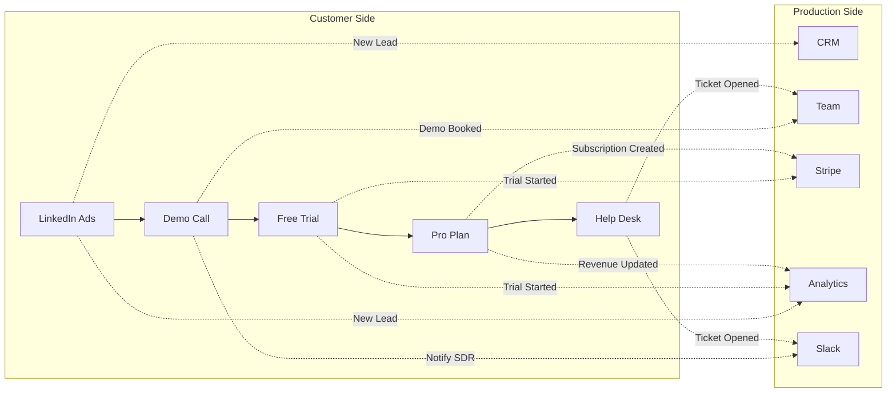

# The Clockwork Canvas: Implementation Plan

**Goal:** Create an awe-inspiring, fully functional demo of the Living Business Model Canvas. Leads enter from "Marketing", flow through "Sales" and "Offers", become customers, interact with "Support", and generate "Revenue". The canvas *works*.

**Theme:** Halloween / "It's Alive!" — Entities are famous monsters.

---

## Part 1: The Cast of Characters (Entities)

Replace the generic "Friends" characters with a monster-themed cast. Each entity represents a different stage of the customer journey. Total: **13 entities**.

| # | Entity Name | Avatar (DiceBear) | Type | Current Location | Journey Story |
|---|---|---|---|---|---|
| 1 | **Frankenstein** | `frankenstein` | `customer` | `item-active-subscribers` | The OG. Completed the full journey. A loyal Pro subscriber. |
| 2 | **Dracula** | `dracula` | `lead` | `item-demo-call` | Has booked a demo. Ancient, cautious, needs to be convinced. |
| 3 | **Witch** | `witch` | `lead` | `item-free-trial` | Signed up for a trial. Testing out the magic. |
| 4 | **Werewolf** | `werewolf` | `lead` | `item-linkedin-ads` | Just clicked the LinkedIn ad. Fresh meat. |
| 5 | **Mummy** | `mummy` | `churned` | `item-help-desk` | Was a customer, but left. Wrapped up in issues. |
| 6 | **Ghost** | `ghost` | `lead` (traveling) | `edge: e-demo-trial` | Currently traversing from Demo to Trial. A specter in motion. |
| 7 | **Zombie** | `zombie` | `customer` | `item-basic-plan` | Converted to Basic. Moves slow, but pays on time. |
| 8 | **Vampire** | `vampire` | `lead` | `item-youtube-channel` | Arrived from YouTube. Prefers to lurk in the shadows. |
| 9 | **Skeleton** | `skeleton` | `churned` | `item-referral-program` | Left, but still refers friends. Bare bones engagement. |
| 10 | **Banshee** | `banshee` | `lead` | `item-seo-content` | Found us through SEO. Screams for attention. |
| 11 | **Goblin** | `goblin` | `lead` (traveling) | `edge: e-linkedin-demo` | Traveling from LinkedIn Ads to Demo Call. Mischievous. |
| 12 | **Phantom** | `phantom` | `customer` | `item-pro-plan` | A Pro subscriber. Ethereal, high-value, mysterious. |
| 13 | **Kraken** | `kraken` | `customer` | `item-enterprise` | Enterprise deal. A legendary catch. Tentacles in every dept. |

---

## Part 2: The Sections (The Clockwork)

The existing 13 sections are good. Let's ensure each has meaningful, drillable items that connect to the demo narrative.

### 2.1 Customer Journey Sections (The "Flow")

These are where entities travel and interact.

| Section | Key Items (Nodes) | Purpose | Drill-Down Workflow |
|---|---|---|---|
| **Marketing** | `LinkedIn Ads`, `YouTube Channel`, `SEO Content` | Lead acquisition. Entry points. | "Lead Capture Logic" |
| **Sales** | `Demo Call`, `Email Sequence` | Lead nurturing. Qualification. | "Demo Scheduling" |
| **Offers** | `Free Trial`, `Lead Magnet` | Conversion offers. | "Trial Activation" |
| **Products** | `Basic Plan`, `Pro Plan`, `Enterprise` | Active subscriptions. | (None - endpoint) |
| **Support** | `Help Desk`, `Knowledge Base` | Customer service. Churn risk. | "Support Ticket Handler" |
| **Recommendations** | `Referral Program` | Advocacy. | "Referral Tracking" |
| **Paying Customers** | `Active Subscribers` | The goal! | (None - endpoint) |

### 2.2 Production Sections (The "Gears")

These sections don't have entities traveling through them, but they represent the internal systems that *power* the customer journey. They are connected to the Customer sections via **System Edges**.

| Section | Key Items (Nodes) | Purpose |
|---|---|---|
| **Data** | `CRM`, `Analytics` | Data stores. |
| **People** | `Team`, `Sales Reps`, `Support Agents` | The humans behind the machine. |
| **Integrations** | `Stripe`, `Supabase`, `Resend`, `Slack` | Third-party services. |
| **Code** | `Landing Page`, `API Server`, `Worker Functions` | The software. |

---

### 2.3 Cross-Section Relationships (Stitching Production to Customer)

This is the key innovation. The Production side is **not dead**. It is actively triggered by events on the Customer side. We model this with **System Edges** (dashed lines) that connect Customer nodes to Production nodes.

#### System Edge Types

| Edge Type | Visual Style | Meaning |
|---|---|---|
| **Journey Edge** | Solid line, colored, animated | Entity travels along this path. |
| **System Edge** | Dashed line, gray/cyan | Internal trigger, no entity travel. Fires a background workflow. |

#### The Relationships



#### Detailed Trigger Map

| Customer Event | Triggers (Production Side) | Workflow Action |
|---|---|---|
| **New Lead (Marketing)** | `CRM` | Create new contact record. |
| | `Analytics` | Increment "leads_today" metric. |
| **Demo Booked (Sales)** | `Team` (Sales Reps) | Assign lead to available SDR. |
| | `Slack` | Post notification to #sales channel. |
| **Trial Started (Offers)** | `Stripe` | Create trial subscription object. |
| | `Analytics` | Increment "trials_started" metric. |
| **Subscription Created (Products)** | `Stripe` | Record payment method, start billing. |
| | `Analytics` | Add to MRR, update cohort data. |
| | `CRM` | Update contact to "customer" status. |
| **Support Ticket (Support)** | `Team` (Support Agents) | Assign ticket to agent. |
| | `Slack` | Post to #support channel. |
| | `Analytics` | Track ticket volume and resolution time. |
| **Churn Event (Support)** | `Stripe` | Cancel subscription. |
| | `Analytics` | Subtract from MRR, mark as churned. |
| | `CRM` | Update contact to "churned" status. |
| **Referral Made (Recommendations)** | `CRM` | Link referrer to new lead. |
| | `Analytics` | Track referral source. |

#### Implementation Notes

1.  **System Edges are NOT for entity travel.** They represent background processes that fire *in parallel* to the main journey.
2.  **Parallel Execution:** When a node completes, it can trigger multiple downstream nodes: one on the Journey path (where the entity travels) and one or more on the System path (background actions).
3.  **Visualization:** System Edges should be visually distinct (dashed, different color) so the demo clearly shows the "invisible gears" turning.
4.  **Drill-Down:** Clicking on a System Edge (or a Production node) should show a mini-workflow with the steps involved (e.g., "CRM Sync" might expand to: `Validate Data → Transform → POST to HubSpot API → Log Result`).

---

### 2.4 Financial Sections (The "Fuel")

These sections update dynamically based on entity actions and system events.

| Section | Key Items (Nodes) | Purpose | Dynamic Updates |
|---|---|---|---|
| **Costs** | `Claude API`, `Infrastructure`, `Salaries`, `Stripe Fees` | Where the money goes. | + Increase when workers are invoked. |
| **Revenue** | `MRR`, `New ARR`, `Referral Bonus` | Where the money comes from. | + Increase when entity subscribes to a plan. |

#### Financial Triggers (Connected to System Edges)

| Event | Impact on Costs | Impact on Revenue |
|---|---|---|
| Worker invoked (Claude) | +$0.02 per call | - |
| Trial started | - | - |
| Subscription (Basic) | +$3 Stripe fee | +$29 MRR |
| Subscription (Pro) | +$8 Stripe fee | +$99 MRR |
| Subscription (Enterprise) | +$50 Stripe fee | +$499 MRR |
| Referral converted | - | +$20 Referral Bonus |
| Support ticket (AI) | +$0.05 per ticket | - |

---

## Part 3: The Mainspring (How the Demo Runs)

> **CRITICAL ARCHITECTURE PRINCIPLE:**  
> The canvas is a **MIRROR of reality**, not the source of truth.  
> Entities move because **external events** are received via webhook APIs.  
> The canvas **visualizes** what already happened in the real world.

### 3.1 The Data Flow

```
┌─────────────────┐
│   REAL WORLD    │  (LinkedIn, Calendly, Stripe, etc.)
└────────┬────────┘
         │ Webhook / API Call
         ▼
┌─────────────────────────────────────────────────────────────┐
│                    STITCH API LAYER                         │
│  POST /api/webhooks/{source}                                │
│  { "name": "Frankenstein", "email": "frank@monsters.io" }   │
└────────┬────────────────────────────────────────────────────┘
         │
         ▼
┌─────────────────────────────────────────────────────────────┐
│                  WEBHOOK PROCESSOR                          │
│  1. Find or create entity by email                          │
│  2. Determine which node this event represents              │
│  3. UPDATE entity.current_node_id                           │
│  4. CREATE journey_event { type: 'node_arrival' }           │
│  5. TRIGGER system edges (CRM sync, Slack notify, etc.)     │
│  6. UPDATE financial metrics                                │
└────────┬────────────────────────────────────────────────────┘
         │
         │ Supabase Realtime
         ▼
┌─────────────────────────────────────────────────────────────┐
│                    CANVAS UI                                │
│  • Entity appears at new node (or animates along edge)      │
│  • System edges pulse                                       │
│  • Financial nodes update values                            │
└─────────────────────────────────────────────────────────────┘
```

### 3.2 Webhook API Endpoints

Each external event source has a dedicated webhook endpoint:

| Source | Endpoint | Payload | Entity Action |
|---|---|---|---|
| LinkedIn Lead Gen | `POST /api/webhooks/linkedin-lead` | `{ name, email, campaign }` | Create entity at `item-linkedin-ads` |
| YouTube Signup | `POST /api/webhooks/youtube-signup` | `{ name, email, video_id }` | Create entity at `item-youtube-channel` |
| SEO Form Submit | `POST /api/webhooks/seo-form` | `{ name, email, search_term }` | Create entity at `item-seo-content` |
| Calendly Demo Booked | `POST /api/webhooks/calendly-demo` | `{ email, event_type }` | Move entity to `item-demo-call` |
| Trial Started | `POST /api/webhooks/stripe-trial` | `{ email, trial_end }` | Move entity to `item-free-trial` |
| Subscription Created | `POST /api/webhooks/stripe-subscription` | `{ email, plan, amount }` | Move to `item-basic-plan`, `item-pro-plan`, or `item-enterprise` |
| Support Ticket | `POST /api/webhooks/zendesk-ticket` | `{ email, subject, priority }` | Move entity to `item-help-desk` |
| Subscription Cancelled | `POST /api/webhooks/stripe-churn` | `{ email, reason }` | Change entity type to `churned` |
| Referral Made | `POST /api/webhooks/referral` | `{ referrer_email, new_lead_email }` | Move referrer to `item-referral-program` |

### 3.3 Webhook Processor Logic

**File:** `src/app/api/webhooks/[source]/route.ts`

```typescript
export async function POST(request: Request, { params }: { params: { source: string } }) {
  const payload = await request.json();
  const { source } = params;
  
  // 1. Determine target node based on webhook source
  const targetNodeId = WEBHOOK_NODE_MAP[source]; // e.g., 'linkedin-lead' -> 'item-linkedin-ads'
  
  // 2. Find or create entity
  let entity = await findEntityByEmail(payload.email);
  if (!entity) {
    entity = await createEntity({
      name: payload.name,
      email: payload.email,
      entity_type: 'lead',
      current_node_id: targetNodeId,
      metadata: { source, ...payload }
    });
  } else {
    // 3. Move entity to target node (if different)
    if (entity.current_node_id !== targetNodeId) {
      await moveEntityToNode(entity.id, targetNodeId);
    }
  }
  
  // 4. Create journey event (triggers UI animation via realtime)
  await createJourneyEvent({
    entity_id: entity.id,
    event_type: 'node_arrival',
    node_id: targetNodeId
  });
  
  // 5. Fire system edges (production side triggers)
  await triggerSystemEdges(targetNodeId, entity.id);
  
  // 6. Update financial metrics if applicable
  if (source === 'stripe-subscription') {
    await updateFinancials(payload.plan, payload.amount);
  }
  
  return Response.json({ success: true, entity_id: entity.id });
}
```

### 3.4 Demo Mode: The Orchestrator

For live demos, we simulate external events using a **Demo Orchestrator**:

**File:** [src/app/api/demo/start/route.ts](file:///Users/karitjaakson/Documents/Dev/Stitch/stitch-run/src/app/api/demo/start/route.ts)

```typescript
// The "Play" button triggers this endpoint
export async function POST() {
  const DEMO_SCRIPT = [
    { delay: 0, endpoint: '/api/webhooks/linkedin-lead', payload: { name: 'Igor', email: 'igor@monsters.io' } },
    { delay: 5000, endpoint: '/api/webhooks/calendly-demo', payload: { email: 'werewolf@monsters.io' } },
    { delay: 10000, endpoint: '/api/webhooks/stripe-trial', payload: { email: 'witch@monsters.io' } },
    { delay: 15000, endpoint: '/api/webhooks/stripe-subscription', payload: { email: 'ghost@monsters.io', plan: 'pro', amount: 99 } },
    { delay: 20000, endpoint: '/api/webhooks/zendesk-ticket', payload: { email: 'mummy@monsters.io', subject: 'Help needed' } },
  ];

  for (const event of DEMO_SCRIPT) {
    setTimeout(async () => {
      await fetch(getBaseUrl() + event.endpoint, {
        method: 'POST',
        headers: { 'Content-Type': 'application/json' },
        body: JSON.stringify(event.payload),
      });
    }, event.delay);
  }

  return Response.json({ success: true, message: 'Demo started', events: DEMO_SCRIPT.length });
}
```

### 3.5 Demo UI Controls

**File:** `src/components/canvas/DemoControlPanel.tsx`

```tsx
export function DemoControlPanel() {
  const [isRunning, setIsRunning] = useState(false);
  
  const startDemo = async () => {
    setIsRunning(true);
    await fetch('/api/demo/start', { method: 'POST' });
  };
  
  const resetDemo = async () => {
    await fetch('/api/demo/reset', { method: 'POST' });
    setIsRunning(false);
  };
  
  return (
    <div className="fixed bottom-4 left-4 bg-slate-900 p-4 rounded-lg shadow-xl z-50">
      <h3 className="text-white font-bold mb-2">Demo Controls</h3>
      <div className="flex gap-2">
        <Button onClick={startDemo} disabled={isRunning}>
          ▶ Start Demo
        </Button>
        <Button onClick={resetDemo} variant="outline">
          🔄 Reset
        </Button>
      </div>
      {isRunning && (
        <p className="text-green-400 text-sm mt-2">Demo running...</p>
      )}
    </div>
  );
}
```

### 3.6 Key Principle Summary

| Concept | Explanation |
|---|---|
| **Canvas is reactive** | It NEVER moves entities directly. It only visualizes state changes. |
| **Webhooks are the trigger** | External events (real or simulated) drive all entity movement. |
| **Same code path** | Demo mode and production mode use the SAME webhook endpoints. |
| **Real-time sync** | Supabase Realtime pushes changes to all connected clients. |
| **System edges fire automatically** | When an entity arrives at a node, connected system edges trigger. |

---

## Part 4: The Workflows (The "Logic")

Each drillable item node should link to a child workflow (`canvas_type: 'workflow'`, `parent_id: <bmc_item_node_id>`). These workflows are executed when the **webhook processor** handles incoming events.

### Workflow 1: "Lead Capture Logic" (Marketing -> Sales)

**Triggered By:** `POST /api/webhooks/linkedin-lead` (or youtube/seo variants).
**Entity Movement:** Webhook processor creates entity at Marketing node. On workflow completion, next webhook moves entity to Sales.

```
[Validate Lead] --> [Score Lead] --> [CRM Sync] --> [Assign SDR]
```

**Nodes:**
- `Validate Lead`: Worker. Checks email, company name.
- `Score Lead`: Worker. AI-based lead scoring.
- `CRM Sync`: Worker. Pushes to HubSpot/Pipedrive.
- `Assign SDR`: Worker. Notifies sales rep.

---

### Workflow 2: "Demo Scheduling" (Sales -> Offers)

**Triggered By:** `POST /api/webhooks/calendly-demo` when user books a demo.
**Entity Movement:** Webhook processor moves entity to `item-demo-call`. On demo completion (Calendly callback), next webhook moves to trial.

```
[Send Email] --> [Wait for Booking] --> [Pre-Demo Prep]
```

**Nodes:**
- `Send Email`: Worker (Resend). Sends booking link.
- `Wait for Booking`: UX (Suspended). Waits for Calendly callback.
- `Pre-Demo Prep`: Worker. Creates demo environment.

---

### Workflow 3: "Trial Activation" (Offers -> Products)

**Triggered By:** `POST /api/webhooks/stripe-trial` when Stripe creates trial subscription.
**Entity Movement:** Webhook processor moves entity to `item-free-trial`. On upgrade, `POST /api/webhooks/stripe-subscription` moves to product node.

```
[Provision Account] --> [Send Onboarding] --> [Wait for Upgrade]
```

**Nodes:**
- `Provision Account`: Worker. Creates trial account.
- `Send Onboarding`: Worker (Resend). Sends welcome email sequence.
- `Wait for Upgrade`: UX (Suspended). Waits for Stripe webhook (subscription created).

---

### Workflow 4: "Support Ticket Handler" (Products -> Support)

**Triggered By:** `POST /api/webhooks/zendesk-ticket` or `POST /api/webhooks/stripe-churn`.
**Entity Movement:** Webhook processor moves entity to `item-help-desk`. If resolved (via support resolution webhook), can return. If churn confirmed, `entity_type` changes to `churned`.

```
[Analyze Ticket] --> [AI Suggest] --> [Escalate if Needed]
```

**Nodes:**
- `Analyze Ticket`: Worker (Claude). Categorizes and summarizes.
- `AI Suggest`: Worker (Claude). Drafts response.
- `Escalate if Needed`: Logic (Router). If `priority > 8`, escalate.

---

## Part 5: The Implementation Checklist

This is the work to be done, prioritized.

### Phase 0: Foundation (Pre-requisites from [roadmap-4.md](file:///Users/karitjaakson/Documents/Dev/Stitch/stitch-run/docs/strategy/roadmap-4.md))

- [x] **Task 2.1:** Implement node status animations (`pulse-running`, `flash-completed`, `flash-failed`).
- [x] **Task 7.1:** Implement `DetailCanvas` for drill-down.
- [x] **Task 7.2:** Add "drill-down" visual cue to Section nodes.

### Phase 1: Seed Data Overhaul

- [ ] **Task:** Update [src/lib/seeds/default-bmc.ts](file:///Users/karitjaakson/Documents/Dev/Stitch/stitch-run/src/lib/seeds/default-bmc.ts) to include all items from Part 2.
- [ ] **Task:** Create `src/lib/seeds/clockwork-entities.ts` with Halloween entities (Part 1).
- [ ] **Task:** Update [seedDemoJourney](file:///Users/karitjaakson/Documents/Dev/Stitch/stitch-run/src/lib/seeds/demo-journey.ts#398-463) to use `clockwork-entities` instead of "Monica", "Ross", "Rachel".

### Phase 2: Create Drill-Down Workflows

- [ ] **Task:** Create `src/lib/seeds/workflows/lead-capture.ts` for "Lead Capture Logic".
- [ ] **Task:** Create `src/lib/seeds/workflows/demo-scheduling.ts` for "Demo Scheduling".
- [ ] **Task:** Create `src/lib/seeds/workflows/trial-activation.ts` for "Trial Activation".
- [ ] **Task:** Create `src/lib/seeds/workflows/support-handler.ts` for "Support Ticket Handler".
- [ ] **Task:** Link each workflow to its parent BMC item node via `parent_id`.

### Phase 3: System Edges (Stitching Production to Customer)

- [ ] **Task:** Define a new edge type `system` in the graph schema (visual: dashed, gray/cyan).
- [ ] **Task:** Add System Edges to [default-bmc.ts](file:///Users/karitjaakson/Documents/Dev/Stitch/stitch-run/src/lib/seeds/default-bmc.ts) connecting:
    - Marketing nodes → `CRM`, `Analytics`
    - Sales nodes → `Team`, `Slack`
    - Offers nodes → `Stripe`, `Analytics`
    - Products nodes → `Stripe`, `CRM`, `Analytics`
    - Support nodes → `Team`, `Slack`, `Analytics`
- [ ] **Task:** Create mini-workflows for each Production node:
    - `CRM` → `src/lib/seeds/workflows/crm-sync.ts` (Validate → Transform → API Call)
    - `Analytics` → `src/lib/seeds/workflows/analytics-update.ts` (Increment Metric)
    - `Slack` → `src/lib/seeds/workflows/slack-notify.ts` (Format → Post to Channel)
    - `Stripe` → `src/lib/seeds/workflows/stripe-sync.ts` (Create/Update Subscription)
- [ ] **Task:** Implement parallel execution: when a Customer node completes, fire:
    1. The Journey Edge (entity moves)
    2. All connected System Edges (background workflows)
- [ ] **Task:** Visual indicator: When a System Edge fires, show a brief "pulse" animation on the dashed line.

### Phase 4: Webhook API Layer (The Mainspring)

- [ ] **Task:** Create `src/app/api/webhooks/[source]/route.ts` dynamic route handler.
- [ ] **Task:** Create [src/lib/webhooks/processor.ts](file:///Users/karitjaakson/Documents/Dev/Stitch/stitch-run/src/lib/webhooks/processor.ts) with:
    - `findEntityByEmail()` - Find existing entity
    - `createEntity()` - Create new entity at entry node
    - `moveEntityToNode()` - Update entity position
    - `createJourneyEvent()` - Record movement event
    - `triggerSystemEdges()` - Fire connected system edge workflows
    - `updateFinancials()` - Update financial metrics
- [ ] **Task:** Create `src/lib/webhooks/node-map.ts` with:
    ```typescript
    export const WEBHOOK_NODE_MAP: Record<string, string> = {
      'linkedin-lead': 'item-linkedin-ads',
      'youtube-signup': 'item-youtube-channel',
      'seo-form': 'item-seo-content',
      'calendly-demo': 'item-demo-call',
      'stripe-trial': 'item-free-trial',
      'stripe-subscription': 'item-pro-plan', // or basic/enterprise based on plan
      'zendesk-ticket': 'item-help-desk',
      'stripe-churn': 'item-help-desk', // + change entity_type
      'referral': 'item-referral-program',
    };
    ```
- [ ] **Task:** Create individual webhook handlers (optional, can use dynamic route):
    - `src/app/api/webhooks/linkedin-lead/route.ts`
    - `src/app/api/webhooks/calendly-demo/route.ts`
    - etc.

### Phase 5: Demo Orchestrator

- [ ] **Task:** Create [src/app/api/demo/start/route.ts](file:///Users/karitjaakson/Documents/Dev/Stitch/stitch-run/src/app/api/demo/start/route.ts) that fires scripted events.
- [ ] **Task:** Create `src/app/api/demo/reset/route.ts` that resets entities to initial positions.
- [ ] **Task:** Create `src/components/canvas/DemoControlPanel.tsx` with Play/Reset buttons.
- [ ] **Task:** Add `DemoControlPanel` to `BMCCanvas.tsx`.
- [ ] **Task:** Define `DEMO_SCRIPT` array with timed events.

### Phase 6: Dynamic Financial Section

- [ ] **Task:** Create `item-mrr` and `item-new-arr` nodes in the Revenue section.
- [ ] **Task:** Create `item-claude-api-cost` and `item-infrastructure` nodes in the Costs section.
- [ ] **Task:** Implement a mechanism to update these nodes' `data.value` when:
    - A worker is invoked (increases cost).
    - An entity subscribes (increases MRR/ARR).
- [ ] **Task:** Display the value on the node (e.g., `MRR: $12,450`).

### Phase 7: Seed Data & Master Script

- [ ] **Task:** Create `scripts/reset-and-seed-clockwork.ts` that:
    1. Drops all existing demo data.
    2. Seeds the BMC with all items.
    3. Creates all drill-down workflows.
    4. Seeds the Halloween entities.
    5. Sets initial Revenue/Cost values.
- [ ] **Task:** Document a "Demo Script" in `docs/demo-script.md` with:
    - Talking points for each section.
    - Actions to trigger (e.g., "Click Play to see entity movement").
    - Expected visual results (e.g., "Werewolf moves from Marketing to Sales").

### Phase 8: Polish

- [ ] **Task:** Ensure all entity avatars use a consistent, Halloween-themed style.
- [ ] **Task:** (MOVED TO Phase 5) Demo Control Panel is now the main way to trigger events.
- [ ] **Task:** Add a "Inject Single Lead" button for manual testing.

---

## Part 6: The Demo Pitch (Summary)

> "This is not a static Business Model Canvas. It's a **living, breathing organism**.
>
> Watch. Frankenstein here was just like Werewolf once – a lead who clicked a LinkedIn ad. He went through our demo, started a trial, and is now a paying Pro subscriber. We can see his entire journey.
>
> *(Click on Frankenstein)*
>
> We can drill down into any section. Here's the 'Lead Capture Logic' workflow that runs every time a new lead enters. It validates, scores, and syncs to our CRM. All automated.
>
> *(Send a webhook)*
>
> And if a new lead comes in right now... there! We see a new entity appear in Marketing and travel towards Sales.
>
> The canvas isn't a picture. **It's the control panel for the entire business.**"

---

## Part 7: File Structure (New Files)

```
src/
├── app/
│   └── api/
│       ├── webhooks/
│       │   └── [source]/
│       │       └── route.ts          # NEW: Dynamic webhook handler
│       └── demo/
│           ├── start/
│           │   └── route.ts          # NEW: Demo orchestrator
│           └── reset/
│               └── route.ts          # NEW: Reset demo state
├── lib/
│   ├── webhooks/
│   │   ├── processor.ts              # NEW: Webhook processing logic
│   │   └── node-map.ts               # NEW: Source → Node mapping
│   └── seeds/
│       ├── default-bmc.ts            # UPDATED: All items and edges
│       ├── clockwork-entities.ts     # NEW: Halloween entities
│       └── workflows/
│           ├── lead-capture.ts       # NEW
│           ├── demo-scheduling.ts    # NEW
│           ├── trial-activation.ts   # NEW
│           └── support-handler.ts    # NEW
└── components/
    └── canvas/
        ├── DemoControlPanel.tsx      # NEW: Play/Reset buttons
        └── edges/
            └── SystemEdge.tsx        # NEW: Dashed edge component

scripts/
└── seed-clockwork.ts           # NEW: CLI entry point

docs/
└── demo-script.md              # NEW: The "how to demo" guide
```

---

## Part 8: Worker Ecosystem Analysis

This section documents all available workers in [src/lib/workers/](file:///Users/karitjaakson/Documents/Dev/Stitch/stitch-run/src/lib/workers) and their demo readiness.

### 8.1 Worker Summary Table

| Worker | Type | Purpose | Has Mock Fallback? | Env Var(s) Required |
|---|---|---|---|---|
| **claude** | Sync | Generate scene scripts | ✅ Yes | `ANTHROPIC_API_KEY` |
| **elevenlabs** | Pseudo-Async | Text-to-speech | ✅ Yes | `ELEVENLABS_API_KEY` |
| **minimax** | Async | Text-to-video | ✅ Yes | `MINIMAX_API_KEY`, `MINIMAX_GROUP_ID` |
| **shotstack** | Async | Video assembly | ✅ Yes | `SHOTSTACK_API_KEY` |
| **scene-parser** | Sync | Parse scripts into scenes | ✅ Yes | `ANTHROPIC_API_KEY` |
| **wireframe-generator** | Sync | Generate images from prompts | ✅ Yes | `IDEOGRAM_API_KEY` or `OPENAI_API_KEY` |
| **image-to-video** | Sync (Polling) | Animate static images | ✅ Yes | `RUNWAY_API_KEY`, `PIKA_API_KEY`, or `KLING_API_KEY` |
| **media-library** | Sync | Fetch media from DB | N/A (DB-only) | None |

### 8.2 Detailed Worker Analysis

---

#### `claude` Worker

| | |
|---|---|
| **File** | [src/lib/workers/claude.ts](file:///Users/karitjaakson/Documents/Dev/Stitch/stitch-run/src/lib/workers/claude.ts) |
| **Type** | Synchronous |
| **Purpose** | Generates structured scene descriptions (array of `{visual_prompt, voice_text}`) from a text prompt using Claude AI. |
| **Input** | `{ prompt: string }` |
| **Output** | `{ scenes: Scene[] }` |
| **Mock Mode?** | ✅ **Yes.** If `ANTHROPIC_API_KEY` is not set, it returns a hardcoded array of 4 mock scenes after a 1-second delay. |
| **Demo Ready?** | ✅ **Yes.** |

---

#### `elevenlabs` Worker

| | |
|---|---|
| **File** | [src/lib/workers/elevenlabs.ts](file:///Users/karitjaakson/Documents/Dev/Stitch/stitch-run/src/lib/workers/elevenlabs.ts) |
| **Type** | Pseudo-Asynchronous (makes API call, uploads to storage, then calls back) |
| **Purpose** | Converts `voice_text` into an audio file URL using ElevenLabs TTS API. |
| **Input** | `{ voice_text: string }` or `{ voiceText: string }` |
| **Output** | `{ ..., audioUrl: string }` (passes through all input plus the new `audioUrl`) |
| **Mock Mode?** | ✅ **Yes.** If `ELEVENLABS_API_KEY` is not set, it returns a hardcoded `.wav` URL (`BabyElephantWalk60.wav`) after a 1.5-second delay. |
| **Demo Ready?** | ✅ **Yes.** |

---

#### `minimax` Worker

| | |
|---|---|
| **File** | [src/lib/workers/minimax.ts](file:///Users/karitjaakson/Documents/Dev/Stitch/stitch-run/src/lib/workers/minimax.ts) |
| **Type** | Asynchronous (submits job, waits for callback from MiniMax) |
| **Purpose** | Generates a video clip from a `visual_prompt` using MiniMax video generation. |
| **Input** | `{ visual_prompt: string }` or `{ visualPrompt: string }` |
| **Output** | `{ ..., videoUrl: string }` |
| **Mock Mode?** | ✅ **Yes.** If `MINIMAX_API_KEY` or `MINIMAX_GROUP_ID` is not set, it simulates the async flow and returns a mock Big Buck Bunny video URL after a ~5-second delay. |
| **Demo Ready?** | ✅ **Yes.** |

---

#### `shotstack` Worker

| | |
|---|---|
| **File** | [src/lib/workers/shotstack.ts](file:///Users/karitjaakson/Documents/Dev/Stitch/stitch-run/src/lib/workers/shotstack.ts) |
| **Type** | Asynchronous (submits render job, waits for callback from Shotstack) |
| **Purpose** | Assembles multiple video and audio clips into a final composed video. |
| **Input** | `{ scenes: Scene[] }` where each scene has `videoUrl` and `audioUrl`. |
| **Output** | `{ finalVideoUrl: string, duration: number }` |
| **Mock Mode?** | ✅ **Yes.** If `SHOTSTACK_API_KEY` is not set, it returns a mock video URL after a ~7-second delay. |
| **Demo Ready?** | ✅ **Yes.** |

---

#### `scene-parser` Worker

| | |
|---|---|
| **File** | [src/lib/workers/scene-parser.ts](file:///Users/karitjaakson/Documents/Dev/Stitch/stitch-run/src/lib/workers/scene-parser.ts) |
| **Type** | Synchronous |
| **Purpose** | Parses a raw script into an array of structured scenes (`{visual_description, voiceover_text}`). |
| **Input** | `{ script: string }` or just a string as input. |
| **Output** | `{ scenes: Scene[], total_scenes: number }` |
| **Mock Mode?** | ✅ **Yes.** If `ANTHROPIC_API_KEY` is not set, it returns 4 mock parsed scenes. |
| **Demo Ready?** | ✅ **Yes.** |

---

#### `wireframe-generator` Worker

| | |
|---|---|
| **File** | [src/lib/workers/wireframe-generator.ts](file:///Users/karitjaakson/Documents/Dev/Stitch/stitch-run/src/lib/workers/wireframe-generator.ts) |
| **Type** | Synchronous (with retry logic) |
| **Purpose** | Generates a wireframe/image from a scene description and uploads it to the Media Library. |
| **Input** | `{ scene_description: string, scene_index: number, user_id: string, project_name?: string }` |
| **Output** | `{ wireframe_id: string, url: string, thumbnail_url: string, scene_index: number }` |
| **Mock Mode?** | ✅ **Yes.** If `IMAGE_GENERATION_ADAPTER` is not set or set to `mock`, or if the respective API key is missing, it returns a placeholder image URL. |
| **Demo Ready?** | ✅ **Yes.** |

---

#### `image-to-video` Worker

| | |
|---|---|
| **File** | [src/lib/workers/image-to-video.ts](file:///Users/karitjaakson/Documents/Dev/Stitch/stitch-run/src/lib/workers/image-to-video.ts) |
| **Type** | Synchronous (with internal polling loop for async API) |
| **Purpose** | Generates a video from a static image using an AI video generation API (Runway, Pika, or Kling). |
| **Input** | `{ image_url: string, user_id: string, motion_prompt?: string }` |
| **Output** | `{ video_id: string, url: string, duration_seconds: number }` |
| **Mock Mode?** | ✅ **Yes.** If `VIDEO_GENERATION_ADAPTER` is not set or set to `mock`, or if the respective API key is missing, it returns a mock Big Buck Bunny video URL after a 2-second simulated delay. |
| **Demo Ready?** | ✅ **Yes.** |

---

#### `media-library` Worker

| | |
|---|---|
| **File** | [src/lib/workers/media-library.ts](file:///Users/karitjaakson/Documents/Dev/Stitch/stitch-run/src/lib/workers/media-library.ts) |
| **Type** | Synchronous |
| **Purpose** | Retrieves full media asset details from the database (`stitch_media` table) by ID. Used to "hydrate" a lightweight ID from a UX node into a full metadata object for downstream workers. |
| **Input** | `{ media_id: string }` or an array of `{ media_id: string }` objects. |
| **Output** | A single `MediaAsset` object or `{ media: MediaAsset[], count: number }`. |
| **Mock Mode?** | **N/A.** This worker only interacts with the local database, so no external API keys are needed. |
| **Demo Ready?** | ✅ **Yes.** (Requires seeded media data in the database). |

---

### 8.3 Workers Usable in "Clockwork Canvas" Workflows

For the BMC demo, we want workers that represent typical business automation tasks. Here's how the existing workers can be mapped:

| BMC Section | Workflow | Suggested Worker | Justification |
|---|---|---|---|
| Marketing -> Sales | **Lead Capture** | `claude` (for lead scoring/analysis) | AI can analyze lead quality. |
| Sales -> Offers | **Demo Scheduling** | `elevenlabs` (for confirmation call) | Send a voice message. (Alternatively, stub a "Resend" email worker). |
| Offers -> Products | **Trial Activation** | `wireframe-generator` | Generate a custom welcome visual. |
| Products -> Support | **Support Ticket** | `claude` (for ticket analysis) | AI categorizes and drafts response. |
| Any | Data Transformation | `scene-parser` | Can be repurposed to parse any structured text. |

### 8.4 Missing Workers for BMC Demo (Need to Create)

These are simple, lightweight workers that need to be created for the "Clockwork Canvas" demo. They don't require external APIs.

| Worker Name | Purpose | Mock Fallback | Priority |
|---|---|---|---|
| `resend` | Send transactional email (Resend API) | ✅ Needs to be added | High |
| `data-transform` | JSONPath extraction, mapping | N/A (internal logic) | Medium |
| `delay` | Wait for a specified duration | N/A | Low |
| `webhook-trigger` | Trigger an external webhook | ✅ (log instead of send) | Low |

> **Recommendation:** Create the `resend` worker first, as email is a critical part of the Sales and Onboarding workflows. The mock version should just log the email payload and trigger a success callback.

---

## Part 9: Gap Analysis (Audit Findings)

This section documents gaps and missing items discovered during plan review.

### 9.1 Schema Alignment Issues

| Issue | Details | Action Required |
|---|---|---|
| **`destination_node_id` missing in entity type** | The coding instructions include `destination_node_id` in the entity interface, but this field exists in the DB schema and [StitchEntity](file:///Users/karitjaakson/Documents/Dev/Stitch/stitch-run/src/types/stitch.ts#219-236) type already. | ✅ Already handled - verify usage in seed script. |
| **System Edge type not in DB schema** | The plan introduces `type: 'system'` for edges, but the current edge schema doesn't have a `type` column. | ⚠️ Add `type` column to edge storage or use `data.edgeType`. |
| **`email` field required** | The `stitch_entities` table has `email` column, but it may be nullable. Ensure the seed script handles this. | ✅ Verify in migration 007. |

### 9.2 Missing Files Not in Current Plan

| File | Purpose | Priority |
|---|---|---|
| `src/components/canvas/edges/SystemEdge.tsx` | Custom dashed edge component | High |
| `src/lib/seeds/workflows/referral-tracking.ts` | Missing workflow for Recommendations section | Medium |
| `src/lib/seeds/workflows/index.ts` | Barrel export for all workflow seeds | Low |
| `supabase/migrations/0XX_edge_type_column.sql` | Add `type` column to edges if needed | Medium |

### 9.3 Code Integration Points

| Component | Current State | Changes Needed |
|---|---|---|
| `BMCCanvas.tsx` | Uses `JourneyEdge` for all edges | Add `SystemEdge` to `edgeTypes` map |
| `WorkflowCanvas.tsx` | Uses `JourneyEdge` for all edges | Add `SystemEdge` to `edgeTypes` map |
| [generateBMCGraph()](file:///Users/karitjaakson/Documents/Dev/Stitch/stitch-run/src/lib/seeds/default-bmc.ts#122-172) | Creates edges without `type` prop | Update to include `type: 'journey'` or `type: 'system'` |
| `useEdgeTraversal.ts` | Returns `Map<string, boolean>` | Ensure system edges also receive traversal events |

### 9.4 Missing Demo UI Features

| Feature | Described In | Not Yet Implemented |
|---|---|---|
| **Demo Control Panel** | Phase 5 | Needs DemoControlPanel component with Play/Reset |
| **Financial node value display** | Phase 6 | Needs custom node type or label formatting |
| **System Edge pulse animation** | Phase 3 | Needs CSS animation + event subscription |

### 9.5 Worker Registry Gaps

The plan recommends creating new workers, but the coding instructions don't include registry updates:

```typescript
// These should be added to src/lib/workers/index.ts after creation:
workerRegistry.register('resend', ResendWorker);
workerRegistry.register('data-transform', DataTransformWorker);
workerRegistry.register('delay', DelayWorker);
workerRegistry.register('webhook-trigger', WebhookTriggerWorker);
workerRegistry.register('slack-notify', SlackNotifyWorker);
```

### 9.6 Entity Seeding Considerations

| Consideration | Details |
|---|---|
| **Idempotency** | The seed script should use `UPSERT` or delete-then-insert pattern |
| **Canvas ID dependency** | Entities depend on the BMC canvas existing first |
| **Edge ID validation** | Traveling entities reference edge IDs that must exist in the graph |
| **Node ID validation** | All `current_node_id` values must match actual BMC item node IDs |

### 9.7 Recommended Additions to Coding Instructions

1. **Add SystemEdge registration** to both `BMCCanvas.tsx` and `WorkflowCanvas.tsx`:
   ```typescript
   import { SystemEdge } from './edges/SystemEdge';
   const edgeTypes = { journey: JourneyEdge, system: SystemEdge };
   ```

2. **Add edge type handling** in [generateBMCGraph()](file:///Users/karitjaakson/Documents/Dev/Stitch/stitch-run/src/lib/seeds/default-bmc.ts#122-172):
   ```typescript
   const edges = BMC_ITEM_EDGES.map((edge) => ({
     ...edge,
     type: edge.type || 'journey', // Ensure type is set
   }));
   ```

3. **Create worker registry updates** in a separate step after worker creation.

4. **Add validation script** to verify all node/edge IDs in entities match the BMC graph.

### 9.8 Testing Gaps

| Test Category | Missing |
|---|---|
| Integration test for entity seeding | Verify entities appear on correct nodes after seed |
| Visual regression test | Capture screenshots of System Edge styling |
| E2E test for demo flow | Simulate New Lead → verify movement → verify financial update |

---

> **Summary:** The plan is comprehensive but requires attention to:
> 1. System Edge component creation and registration
> 2. Worker registry updates after creating new workers
> 3. Edge type handling in graph generation
> 4. Demo UI buttons (Simulate Lead, Fast Forward)
> 5. Validation scripts before running the full demo

