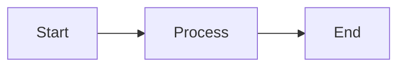
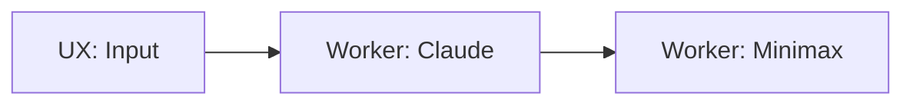
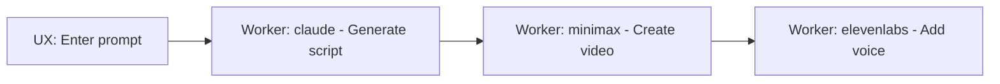
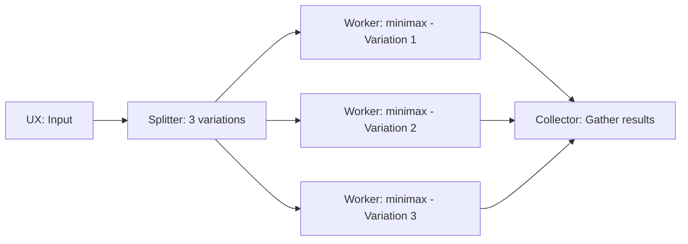
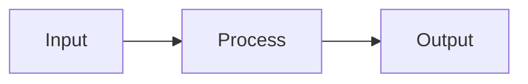

# AI Manager API Documentation

## Overview

The AI Manager API enables programmatic control of Stitch workflows through natural language. It provides REST endpoints for creating, modifying, and executing workflows, plus an AI-powered service that interprets natural language requests.

**Base URL**: `https://your-domain.com/api`

**Authentication**: All endpoints require authentication (implementation-specific)

## Table of Contents

1. [Canvas Management API](#canvas-management-api)
2. [AI Manager Service](#ai-manager-service)
3. [Error Handling](#error-handling)
4. [Natural Language Examples](#natural-language-examples)
5. [Mermaid Format](#mermaid-format)

---

## Canvas Management API

### List All Canvases

Retrieve a list of all canvases with metadata.

**Endpoint**: `GET /api/canvas`

**Requirements**: 1.1, 9.3

**Response**: `200 OK`

```json
{
  "canvases": [
    {
      "id": "550e8400-e29b-41d4-a716-446655440000",
      "name": "Video Generation Pipeline",
      "created_at": "2024-12-04T10:00:00Z",
      "updated_at": "2024-12-04T10:30:00Z",
      "node_count": 5,
      "edge_count": 4
    }
  ]
}
```

**Response Fields**:
- `canvases`: Array of canvas metadata objects
  - `id`: Unique canvas identifier (UUID)
  - `name`: Human-readable canvas name
  - `created_at`: ISO 8601 timestamp of creation
  - `updated_at`: ISO 8601 timestamp of last update
  - `node_count`: Number of nodes in the canvas
  - `edge_count`: Number of edges in the canvas

---

### Create Canvas

Create a new canvas from JSON or Mermaid format.

**Endpoint**: `POST /api/canvas`

**Requirements**: 1.2, 9.1

**Request Body**:

```json
{
  "name": "My Workflow",
  "format": "json",
  "content": {
    "nodes": [
      {
        "id": "node-1",
        "type": "ux",
        "position": { "x": 0, "y": 0 },
        "data": {
          "label": "Start",
          "prompt": "Enter your request"
        }
      },
      {
        "id": "node-2",
        "type": "worker",
        "position": { "x": 200, "y": 0 },
        "data": {
          "label": "Generate Text",
          "worker_type": "claude",
          "config": {
            "model": "claude-sonnet-4-20250514",
            "max_tokens": 1000
          }
        }
      }
    ],
    "edges": [
      {
        "id": "edge-1",
        "source": "node-1",
        "target": "node-2"
      }
    ]
  }
}
```

**Request Fields**:
- `name` (required): Canvas name
- `format` (required): Either `"json"` or `"mermaid"`
- `content` (required): Canvas content
  - For `json` format: VisualGraph object or JSON string
  - For `mermaid` format: Mermaid flowchart string

**Response**: `201 Created`

```json
{
  "id": "550e8400-e29b-41d4-a716-446655440000",
  "canvas": {
    "nodes": [...],
    "edges": [...]
  }
}
```

**Response Fields**:
- `id`: Unique identifier for the created canvas
- `canvas`: Complete VisualGraph structure

**Error Responses**:
- `400 Bad Request`: Invalid JSON, invalid format, or validation errors
- `500 Internal Server Error`: Database errors

---

### Get Canvas

Retrieve a canvas by ID.

**Endpoint**: `GET /api/canvas/{id}`

**Requirements**: 1.3, 9.2

**Path Parameters**:
- `id`: Canvas UUID

**Response**: `200 OK`

```json
{
  "id": "550e8400-e29b-41d4-a716-446655440000",
  "name": "My Workflow",
  "canvas": {
    "nodes": [...],
    "edges": [...]
  },
  "created_at": "2024-12-04T10:00:00Z",
  "updated_at": "2024-12-04T10:30:00Z"
}
```

**Response Fields**:
- `id`: Canvas identifier
- `name`: Canvas name
- `canvas`: Complete VisualGraph with nodes and edges
- `created_at`: Creation timestamp
- `updated_at`: Last update timestamp

**Error Responses**:
- `404 Not Found`: Canvas does not exist
- `500 Internal Server Error`: Database errors

---

### Update Canvas

Update an existing canvas.

**Endpoint**: `PUT /api/canvas/{id}`

**Requirements**: 1.4, 9.2

**Path Parameters**:
- `id`: Canvas UUID

**Request Body**:

```json
{
  "name": "Updated Workflow Name",
  "canvas": {
    "nodes": [...],
    "edges": [...]
  }
}
```

**Request Fields**:
- `name` (optional): New canvas name
- `canvas` (required): Updated VisualGraph structure

**Response**: `200 OK`

```json
{
  "id": "550e8400-e29b-41d4-a716-446655440000",
  "canvas": {
    "nodes": [...],
    "edges": [...]
  },
  "updated_at": "2024-12-04T11:00:00Z"
}
```

**Response Fields**:
- `id`: Canvas identifier
- `canvas`: Updated VisualGraph
- `updated_at`: New update timestamp

**Error Responses**:
- `400 Bad Request`: Invalid canvas structure
- `404 Not Found`: Canvas does not exist
- `500 Internal Server Error`: Database errors

---

### Delete Canvas

Delete a canvas by ID.

**Endpoint**: `DELETE /api/canvas/{id}`

**Requirements**: 1.5, 9.2

**Path Parameters**:
- `id`: Canvas UUID

**Response**: `200 OK`

```json
{
  "success": true,
  "id": "550e8400-e29b-41d4-a716-446655440000"
}
```

**Response Fields**:
- `success`: Always `true` on successful deletion
- `id`: ID of the deleted canvas

**Error Responses**:
- `404 Not Found`: Canvas does not exist
- `500 Internal Server Error`: Database errors

---

### Run Workflow

Start workflow execution for a canvas.

**Endpoint**: `POST /api/canvas/{id}/run`

**Requirements**: 2.1, 2.3

**Path Parameters**:
- `id`: Canvas UUID

**Request Body**:

```json
{
  "input": {
    "prompt": "Generate a video about AI",
    "duration": 30
  },
  "entityId": "customer-123"
}
```

**Request Fields**:
- `input` (required): Input data for the workflow (object)
- `entityId` (optional): Entity ID to track through the workflow

**Response**: `200 OK`

```json
{
  "runId": "660e8400-e29b-41d4-a716-446655440000",
  "versionId": "770e8400-e29b-41d4-a716-446655440000",
  "status": "running",
  "statusUrl": "https://your-domain.com/api/canvas/550e8400-e29b-41d4-a716-446655440000/status?runId=660e8400-e29b-41d4-a716-446655440000"
}
```

**Response Fields**:
- `runId`: Unique identifier for this execution
- `versionId`: Auto-created version snapshot ID (Requirement 2.3)
- `status`: Initial status (`"pending"` or `"running"`)
- `statusUrl`: URL to poll for status updates (HATEOAS)

**Process**:
1. Loads canvas by ID
2. Creates automatic version snapshot (Requirement 2.3)
3. Compiles canvas to execution graph
4. Creates run record in database
5. Starts workflow execution
6. Returns run ID and status URL

**Error Responses**:
- `400 Bad Request`: Invalid input or canvas has no visual graph
- `404 Not Found`: Canvas does not exist
- `500 Internal Server Error`: Execution errors

---

### Get Workflow Status

Query the status of a workflow execution.

**Endpoint**: `GET /api/canvas/{id}/status?runId={runId}`

**Requirements**: 2.2

**Path Parameters**:
- `id`: Canvas UUID

**Query Parameters**:
- `runId` (required): Run UUID from the run response

**Response**: `200 OK`

```json
{
  "runId": "660e8400-e29b-41d4-a716-446655440000",
  "status": "completed",
  "nodes": {
    "node-1": {
      "status": "completed",
      "output": {
        "prompt": "Generate a video about AI"
      }
    },
    "node-2": {
      "status": "completed",
      "output": {
        "text": "AI is transforming industries..."
      }
    },
    "node-3": {
      "status": "failed",
      "error": "API rate limit exceeded"
    }
  },
  "finalOutputs": {
    "node-2": {
      "text": "AI is transforming industries..."
    }
  },
  "statusUrl": "https://your-domain.com/api/canvas/550e8400-e29b-41d4-a716-446655440000/status?runId=660e8400-e29b-41d4-a716-446655440000"
}
```

**Response Fields**:
- `runId`: Run identifier
- `status`: Overall workflow status
  - `"pending"`: Not yet started
  - `"running"`: Currently executing
  - `"completed"`: All nodes completed successfully
  - `"failed"`: At least one node failed
- `nodes`: Object mapping node IDs to their states
  - `status`: Node status (`"pending"`, `"running"`, `"completed"`, `"failed"`)
  - `output` (optional): Node output data (for completed nodes)
  - `error` (optional): Error message (for failed nodes)
- `finalOutputs` (optional): Outputs from terminal nodes (only for completed workflows)
- `statusUrl`: URL to continue polling (HATEOAS)

**Error Responses**:
- `400 Bad Request`: Missing runId or run doesn't belong to canvas
- `404 Not Found`: Canvas or run not found
- `500 Internal Server Error`: Database errors

---

## AI Manager Service

### Process Natural Language Request

Send a natural language request to create, modify, or execute workflows.

**Endpoint**: `POST /api/ai-manager`

**Requirements**: 4.1, 4.2, 4.3, 4.4, 4.5, 5.1, 5.2, 5.3, 5.4, 5.5, 6.1, 6.2, 6.3, 6.4, 6.5

**Request Body**:

```json
{
  "request": "Create a workflow that generates a video from text using Claude and Minimax",
  "canvasId": "550e8400-e29b-41d4-a716-446655440000"
}
```

**Request Fields**:
- `request` (required): Natural language description of the desired action
- `canvasId` (optional): Canvas ID for modification requests

**Response**: `200 OK`

The response format depends on the action type determined by the AI:

#### CREATE_WORKFLOW Response

```json
{
  "action": "CREATE_WORKFLOW",
  "result": {
    "id": "550e8400-e29b-41d4-a716-446655440000",
    "canvas": {
      "nodes": [
        {
          "id": "ux-1",
          "type": "ux",
          "position": { "x": 0, "y": 0 },
          "data": {
            "label": "Input",
            "prompt": "Enter text for video"
          }
        },
        {
          "id": "worker-1",
          "type": "worker",
          "position": { "x": 200, "y": 0 },
          "data": {
            "label": "Generate Script",
            "worker_type": "claude",
            "config": {
              "model": "claude-sonnet-4-20250514",
              "max_tokens": 2000
            },
            "entityMovement": {
              "onSuccess": {
                "targetSectionId": "worker-2",
                "completeAs": "success"
              },
              "onFailure": {
                "targetSectionId": "ux-1",
                "completeAs": "failure"
              }
            }
          }
        },
        {
          "id": "worker-2",
          "type": "worker",
          "position": { "x": 400, "y": 0 },
          "data": {
            "label": "Generate Video",
            "worker_type": "minimax",
            "config": {
              "duration": 30
            },
            "entityMovement": {
              "onSuccess": {
                "targetSectionId": "terminal",
                "completeAs": "success"
              },
              "onFailure": {
                "targetSectionId": "ux-1",
                "completeAs": "failure"
              }
            }
          }
        }
      ],
      "edges": [
        {
          "id": "edge-1",
          "source": "ux-1",
          "target": "worker-1"
        },
        {
          "id": "edge-2",
          "source": "worker-1",
          "target": "worker-2"
        }
      ]
    }
  }
}
```

#### MODIFY_WORKFLOW Response

```json
{
  "action": "MODIFY_WORKFLOW",
  "result": {
    "id": "550e8400-e29b-41d4-a716-446655440000",
    "canvas": {
      "nodes": [...],
      "edges": [...]
    },
    "changes": [
      "Added voice generation node",
      "Connected video to voice node"
    ]
  }
}
```

#### RUN_WORKFLOW Response

```json
{
  "action": "RUN_WORKFLOW",
  "result": {
    "runId": "660e8400-e29b-41d4-a716-446655440000",
    "versionId": "770e8400-e29b-41d4-a716-446655440000",
    "status": "running",
    "statusUrl": "https://your-domain.com/api/canvas/550e8400-e29b-41d4-a716-446655440000/status?runId=660e8400-e29b-41d4-a716-446655440000"
  }
}
```

#### GET_STATUS Response

```json
{
  "action": "GET_STATUS",
  "result": {
    "runId": "660e8400-e29b-41d4-a716-446655440000",
    "status": "completed",
    "nodes": {
      "worker-1": {
        "status": "completed",
        "output": { "script": "..." }
      },
      "worker-2": {
        "status": "completed",
        "output": { "video_url": "..." }
      }
    },
    "finalOutputs": {
      "worker-2": {
        "video_url": "https://..."
      }
    }
  }
}
```

**Error Responses**:
- `400 Bad Request`: Invalid request format, parsing errors, validation errors
- `401 Unauthorized`: Missing or invalid LLM API key
- `404 Not Found`: Canvas not found (for modification requests)
- `500 Internal Server Error`: LLM errors, database errors

---

## Error Handling

All API endpoints follow a consistent error response format:

```json
{
  "error": "Human-readable error message",
  "details": [
    "Additional detail 1",
    "Additional detail 2"
  ],
  "code": "ERROR_CODE"
}
```

### Error Codes

| Code | HTTP Status | Description |
|------|-------------|-------------|
| `BAD_REQUEST` | 400 | Invalid input, malformed JSON, or validation failures |
| `NOT_FOUND` | 404 | Canvas or run not found |
| `INTERNAL_ERROR` | 500 | Database errors or unexpected failures |
| `VALIDATION_ERROR` | 400 | Canvas validation failed (cycles, disconnected nodes, etc.) |
| `PARSE_ERROR` | 400 | Mermaid parsing failed |
| `LLM_ERROR` | 401/500 | LLM API errors (401 for auth, 500 for others) |

### Example Error Responses

**Invalid JSON**:
```json
{
  "error": "Invalid JSON in request body",
  "code": "BAD_REQUEST"
}
```

**Canvas Not Found**:
```json
{
  "error": "Canvas not found: 550e8400-e29b-41d4-a716-446655440000",
  "code": "NOT_FOUND"
}
```

**Validation Error**:
```json
{
  "error": "Canvas validation failed",
  "details": [
    "Cycle detected: node-1 -> node-2 -> node-1",
    "Disconnected node: node-5"
  ],
  "code": "VALIDATION_ERROR"
}
```

**Mermaid Parse Error**:
```json
{
  "error": "Invalid Mermaid syntax: Expected node definition",
  "details": [
    "Hint: Check node syntax",
    "Line: 5"
  ],
  "code": "PARSE_ERROR"
}
```

---

## Natural Language Examples

The AI Manager understands various natural language requests:

### Creating Workflows

**Simple workflow**:
```
"Create a workflow that uses Claude to generate text"
```

**Multi-step workflow**:
```
"Create a video generation pipeline: 
1. User inputs a prompt
2. Claude generates a script
3. Minimax creates a video
4. ElevenLabs adds voiceover"
```

**Parallel workflow**:
```
"Create a workflow that generates 3 different video variations in parallel, 
then collects them for review"
```

### Modifying Workflows

**Adding nodes**:
```
"Add a voice generation step using ElevenLabs after the video generation"
```

**Removing nodes**:
```
"Remove the voiceover step from the workflow"
```

**Changing configuration**:
```
"Update the Claude node to use max_tokens of 4000"
```

### Executing Workflows

**Simple execution**:
```
"Run the workflow with input: 'Generate a video about space exploration'"
```

**With entity tracking**:
```
"Execute the workflow for customer customer-123 with their preferences"
```

### Checking Status

**Status query**:
```
"What's the status of run 660e8400-e29b-41d4-a716-446655440000?"
```

**Detailed status**:
```
"Show me the outputs from the completed workflow run"
```

---

## Mermaid Format

Stitch supports Mermaid flowchart syntax for creating workflows. This is especially useful for LLMs that can naturally generate diagrams.

### Basic Syntax



### Node Types

Specify node types in square brackets:



### Worker Configuration

Include worker types and configuration in node labels:



### Parallel Workflows

Use Splitter and Collector nodes for parallel execution:



### Creating Canvas from Mermaid

**Request**:
```json
{
  "name": "Video Pipeline",
  "format": "mermaid",
  "content": "flowchart LR\n    A[UX: Input] --> B[Worker: claude]\n    B --> C[Worker: minimax]"
}
```

**Response**:
```json
{
  "id": "550e8400-e29b-41d4-a716-446655440000",
  "canvas": {
    "nodes": [
      {
        "id": "A",
        "type": "ux",
        "data": { "label": "Input" },
        "position": { "x": 0, "y": 0 }
      },
      {
        "id": "B",
        "type": "worker",
        "data": {
          "label": "claude",
          "worker_type": "claude"
        },
        "position": { "x": 200, "y": 0 }
      },
      {
        "id": "C",
        "type": "worker",
        "data": {
          "label": "minimax",
          "worker_type": "minimax"
        },
        "position": { "x": 400, "y": 0 }
      }
    ],
    "edges": [
      { "id": "A-B", "source": "A", "target": "B" },
      { "id": "B-C", "source": "B", "target": "C" }
    ]
  }
}
```

---

## Available Workers

The AI Manager can select from the following worker types:

| Worker Type | Description | Use Cases |
|-------------|-------------|-----------|
| `claude` | Anthropic Claude LLM | Text generation, analysis, scripting |
| `minimax` | Minimax video generation | Video creation from text/images |
| `elevenlabs` | ElevenLabs voice synthesis | Voice generation, narration |
| `shotstack` | Shotstack video editing | Video assembly, editing, effects |
| `scene-parser` | Scene parsing | Extract scenes from scripts |
| `wireframe-generator` | Wireframe generation | UI mockup creation |
| `image-to-video` | Image to video conversion | Animate static images |
| `media-library` | Media library access | Retrieve stored media assets |

### Worker Configuration Examples

**Claude**:
```json
{
  "worker_type": "claude",
  "config": {
    "model": "claude-sonnet-4-20250514",
    "max_tokens": 2000,
    "temperature": 0.7
  }
}
```

**Minimax**:
```json
{
  "worker_type": "minimax",
  "config": {
    "duration": 30,
    "resolution": "1080p"
  }
}
```

**ElevenLabs**:
```json
{
  "worker_type": "elevenlabs",
  "config": {
    "voice_id": "21m00Tcm4TlvDq8ikWAM",
    "model_id": "eleven_monolingual_v1"
  }
}
```

---

## Entity Movement

Worker nodes can be configured with entity movement rules to control how entities (customers, leads) move through the Business Model Canvas when workflows complete.

### Entity Movement Configuration

```json
{
  "entityMovement": {
    "onSuccess": {
      "targetSectionId": "next-section-node-id",
      "completeAs": "success"
    },
    "onFailure": {
      "targetSectionId": "error-handling-node-id",
      "completeAs": "failure"
    }
  }
}
```

### Fields

- `onSuccess`: Behavior when worker completes successfully
  - `targetSectionId`: Node ID to move entity to
  - `completeAs`: Completion status (`"success"`, `"failure"`, `"pending"`)
- `onFailure`: Behavior when worker fails
  - `targetSectionId`: Node ID to move entity to
  - `completeAs`: Completion status

### Example

```json
{
  "id": "worker-1",
  "type": "worker",
  "data": {
    "label": "Generate Content",
    "worker_type": "claude",
    "entityMovement": {
      "onSuccess": {
        "targetSectionId": "worker-2",
        "completeAs": "success"
      },
      "onFailure": {
        "targetSectionId": "ux-error",
        "completeAs": "failure"
      }
    }
  }
}
```

---

## Rate Limiting

API endpoints implement rate limiting to prevent abuse:

- **Window**: 1 minute
- **Max Requests**: 100 requests per minute per user

When rate limit is exceeded, the API returns:

```json
{
  "error": "Rate limit exceeded",
  "code": "RATE_LIMIT_EXCEEDED",
  "details": ["Try again in 30 seconds"]
}
```

---

## Versioning

The API automatically creates version snapshots when workflows are executed (Requirement 2.3). This ensures:

1. **Reproducibility**: Each run is tied to a specific canvas version
2. **History**: Track how workflows evolve over time
3. **Rollback**: Revert to previous versions if needed

Version snapshots are created automatically and returned in the run response:

```json
{
  "runId": "660e8400-e29b-41d4-a716-446655440000",
  "versionId": "770e8400-e29b-41d4-a716-446655440000",
  "status": "running"
}
```

---

## Best Practices

### 1. Poll Status Efficiently

Use the `statusUrl` from responses for polling:

```javascript
async function waitForCompletion(statusUrl) {
  while (true) {
    const response = await fetch(statusUrl);
    const status = await response.json();
    
    if (status.status === 'completed' || status.status === 'failed') {
      return status;
    }
    
    // Poll every 2 seconds
    await new Promise(resolve => setTimeout(resolve, 2000));
  }
}
```

### 2. Handle Errors Gracefully

Always check for error responses:

```javascript
const response = await fetch('/api/canvas', {
  method: 'POST',
  body: JSON.stringify(request)
});

if (!response.ok) {
  const error = await response.json();
  console.error(`Error ${error.code}: ${error.error}`);
  if (error.details) {
    console.error('Details:', error.details);
  }
  return;
}
```

### 3. Use Natural Language Effectively

Be specific in AI Manager requests:

❌ **Vague**: "Create a workflow"
✅ **Specific**: "Create a workflow that takes user input, generates a script with Claude, creates a video with Minimax, and adds voiceover with ElevenLabs"

### 4. Validate Canvas Structure

Before creating or updating canvases, ensure:
- All nodes have unique IDs
- All edges reference existing nodes
- Required fields are present (type, data.label)
- Worker nodes have valid worker_type

### 5. Use Mermaid for Rapid Prototyping

Mermaid syntax is ideal for quickly sketching workflows:



Then refine with full JSON configuration.

---

## Support

For issues or questions:
- Check error messages and codes
- Review natural language examples
- Consult worker configuration examples
- Verify canvas structure against requirements

---

## Changelog

### Version 1.0.0 (2024-12-04)
- Initial release
- Canvas CRUD operations
- Workflow execution and status
- AI Manager natural language interface
- Mermaid format support
- Automatic versioning
- Entity movement configuration
