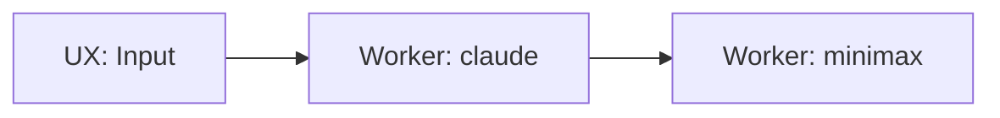

# Stitch AI Manager API

Complete REST API for programmatic control of Stitch workflows through natural language.

## 📚 Documentation

This directory contains comprehensive API documentation for the Stitch AI Manager feature:

### Quick Start
- **[QUICK_START.md](./QUICK_START.md)** - Get started in 5 minutes with curl, JavaScript, and Python examples

### Complete API Reference
- **[AI_MANAGER_API.md](./AI_MANAGER_API.md)** - Full API documentation with detailed endpoint descriptions, request/response examples, error handling, and natural language examples

### OpenAPI Specification
- **[openapi.yaml](./openapi.yaml)** - OpenAPI 3.0 specification for use with Swagger UI, Postman, or code generation tools

## 🚀 Quick Links

### Canvas Management
- `GET /api/canvas` - List all canvases
- `POST /api/canvas` - Create canvas (JSON or Mermaid)
- `GET /api/canvas/{id}` - Get canvas by ID
- `PUT /api/canvas/{id}` - Update canvas
- `DELETE /api/canvas/{id}` - Delete canvas

### Workflow Execution
- `POST /api/canvas/{id}/run` - Run workflow
- `GET /api/canvas/{id}/status` - Get workflow status

### AI Manager
- `POST /api/ai-manager` - Process natural language requests

## 🎯 Key Features

### 1. Canvas as Data
Workflows are JSON structures that can be created, modified, and executed programmatically.

### 2. Natural Language Interface
The AI Manager interprets natural language requests and executes canvas operations:
- "Create a workflow that generates a video from text using Claude and Minimax"
- "Add a voice generation step using ElevenLabs"
- "Run the workflow with input: Generate a video about space exploration"

### 3. Mermaid Support
Create workflows using Mermaid flowchart syntax:


### 4. Automatic Versioning
Every workflow execution automatically creates a version snapshot for reproducibility.

### 5. Entity Movement
Configure how entities (customers, leads) move through the Business Model Canvas when workflows complete.

## 📖 Getting Started

### 1. Install Dependencies

```bash
npm install
```

### 2. Set Environment Variables

```bash
# Required for AI Manager
ANTHROPIC_API_KEY=sk-ant-...

# Base URL for callbacks
NEXT_PUBLIC_BASE_URL=https://your-domain.com

# Optional: Customize LLM
AI_MANAGER_MODEL=claude-sonnet-4-20250514
AI_MANAGER_MAX_TOKENS=4096
```

### 3. Start the Server

```bash
npm run dev
```

### 4. Try Your First Request

```bash
# List canvases
curl http://localhost:3000/api/canvas

# Create workflow with AI
curl -X POST http://localhost:3000/api/ai-manager \
  -H "Content-Type: application/json" \
  -d '{
    "request": "Create a workflow that generates text with Claude"
  }'
```

## 🔧 Available Workers

The AI Manager can select from these worker types:

| Worker | Description | Use Cases |
|--------|-------------|-----------|
| `claude` | Anthropic Claude LLM | Text generation, analysis, scripting |
| `minimax` | Minimax video generation | Video creation from text/images |
| `elevenlabs` | ElevenLabs voice synthesis | Voice generation, narration |
| `shotstack` | Shotstack video editing | Video assembly, editing, effects |
| `scene-parser` | Scene parsing | Extract scenes from scripts |
| `wireframe-generator` | Wireframe generation | UI mockup creation |
| `image-to-video` | Image to video conversion | Animate static images |
| `media-library` | Media library access | Retrieve stored media assets |

## 📝 Example Workflows

### Simple Text Generation

```bash
curl -X POST http://localhost:3000/api/ai-manager \
  -H "Content-Type: application/json" \
  -d '{
    "request": "Create a workflow that uses Claude to generate a blog post"
  }'
```

### Video Generation Pipeline

```bash
curl -X POST http://localhost:3000/api/ai-manager \
  -H "Content-Type: application/json" \
  -d '{
    "request": "Create a video generation pipeline: user inputs prompt, Claude generates script, Minimax creates video, ElevenLabs adds voiceover"
  }'
```

### Parallel Processing

```bash
curl -X POST http://localhost:3000/api/ai-manager \
  -H "Content-Type: application/json" \
  -d '{
    "request": "Create a workflow that generates 3 different video variations in parallel, then collects them for review"
  }'
```

## 🔍 API Response Format

All endpoints return JSON responses:

### Success Response
```json
{
  "id": "550e8400-e29b-41d4-a716-446655440000",
  "canvas": {
    "nodes": [...],
    "edges": [...]
  }
}
```

### Error Response
```json
{
  "error": "Human-readable error message",
  "details": ["Additional detail 1", "Additional detail 2"],
  "code": "ERROR_CODE"
}
```

## 🛡️ Error Codes

| Code | HTTP Status | Description |
|------|-------------|-------------|
| `BAD_REQUEST` | 400 | Invalid input, malformed JSON, or validation failures |
| `NOT_FOUND` | 404 | Canvas or run not found |
| `INTERNAL_ERROR` | 500 | Database errors or unexpected failures |
| `VALIDATION_ERROR` | 400 | Canvas validation failed (cycles, disconnected nodes, etc.) |
| `PARSE_ERROR` | 400 | Mermaid parsing failed |
| `LLM_ERROR` | 401/500 | LLM API errors (401 for auth, 500 for others) |

## 🎨 Canvas Structure

A canvas consists of nodes and edges:

### Node Types
- **UX**: User interaction nodes (input prompts, forms)
- **Worker**: Asynchronous service nodes (Claude, Minimax, ElevenLabs)
- **Splitter**: Fan-out nodes for parallel execution
- **Collector**: Fan-in nodes that wait for all parallel paths

### Example Canvas
```json
{
  "nodes": [
    {
      "id": "ux-1",
      "type": "ux",
      "position": { "x": 0, "y": 0 },
      "data": {
        "label": "Input",
        "prompt": "Enter your request"
      }
    },
    {
      "id": "worker-1",
      "type": "worker",
      "position": { "x": 200, "y": 0 },
      "data": {
        "label": "Generate Text",
        "worker_type": "claude",
        "config": {
          "model": "claude-sonnet-4-20250514",
          "max_tokens": 1000
        },
        "entityMovement": {
          "onSuccess": {
            "targetSectionId": "next-section",
            "completeAs": "success"
          },
          "onFailure": {
            "targetSectionId": "error-section",
            "completeAs": "failure"
          }
        }
      }
    }
  ],
  "edges": [
    {
      "id": "edge-1",
      "source": "ux-1",
      "target": "worker-1"
    }
  ]
}
```

## 🔄 Workflow Execution Flow

1. **Create Canvas** - Define workflow structure
2. **Run Workflow** - Start execution with input data
3. **Poll Status** - Monitor progress via status endpoint
4. **Get Results** - Retrieve final outputs when complete

```bash
# 1. Create canvas
CANVAS_ID=$(curl -X POST http://localhost:3000/api/canvas \
  -H "Content-Type: application/json" \
  -d '{"name":"My Workflow","format":"json","content":{...}}' \
  | jq -r '.id')

# 2. Run workflow
RUN_ID=$(curl -X POST http://localhost:3000/api/canvas/$CANVAS_ID/run \
  -H "Content-Type: application/json" \
  -d '{"input":{"prompt":"Generate text"}}' \
  | jq -r '.runId')

# 3. Poll status
while true; do
  STATUS=$(curl -s "http://localhost:3000/api/canvas/$CANVAS_ID/status?runId=$RUN_ID" \
    | jq -r '.status')
  echo "Status: $STATUS"
  [ "$STATUS" = "completed" ] && break
  sleep 2
done

# 4. Get results
curl "http://localhost:3000/api/canvas/$CANVAS_ID/status?runId=$RUN_ID" \
  | jq '.finalOutputs'
```

## 📊 Monitoring and Debugging

### Check Workflow Status
```bash
curl "http://localhost:3000/api/canvas/{canvasId}/status?runId={runId}"
```

### View Node States
The status response includes individual node states:
```json
{
  "nodes": {
    "worker-1": {
      "status": "completed",
      "output": { "text": "Generated content..." }
    },
    "worker-2": {
      "status": "failed",
      "error": "API rate limit exceeded"
    }
  }
}
```

### Error Handling
Always check response status codes and error messages:
```javascript
const response = await fetch('/api/canvas', { method: 'POST', body: ... });

if (!response.ok) {
  const error = await response.json();
  console.error(`Error ${error.code}: ${error.error}`);
  if (error.details) {
    console.error('Details:', error.details);
  }
}
```

## 🧪 Testing

### Run Tests
```bash
# All tests
npm test

# API tests only
npm test -- src/app/api

# Integration tests
npm test -- src/app/api/__tests__/end-to-end-workflows.test.ts
```

### Test Coverage
- Unit tests for individual endpoints
- Integration tests for end-to-end workflows
- Property-based tests for validation logic
- Error handling tests

## 🔐 Security

### Authentication
All endpoints require authentication (implementation-specific). Add authentication middleware as needed.

### Rate Limiting
API endpoints implement rate limiting:
- **Window**: 1 minute
- **Max Requests**: 100 requests per minute per user

### Input Validation
All inputs are validated:
- JSON schema validation
- Canvas structure validation
- Worker type validation
- Edge integrity validation

### LLM Safety
AI Manager responses are validated before execution:
- JSON parsing with error handling
- Action type validation
- Canvas validation before storage
- Input sanitization in prompts

## 📦 Integration Examples

### CLI Tool
```bash
#!/bin/bash
# stitch-cli

case "$1" in
  create)
    curl -X POST http://localhost:3000/api/ai-manager \
      -H "Content-Type: application/json" \
      -d "{\"request\":\"$2\"}"
    ;;
  run)
    curl -X POST http://localhost:3000/api/canvas/$2/run \
      -H "Content-Type: application/json" \
      -d "{\"input\":$3}"
    ;;
  status)
    curl "http://localhost:3000/api/canvas/$2/status?runId=$3"
    ;;
esac
```

### Node.js SDK
```typescript
import { StitchClient } from './stitch-client';

const client = new StitchClient('http://localhost:3000/api');

// Create workflow with AI
const canvas = await client.ai.create(
  'Create a workflow that generates a video from text'
);

// Run workflow
const run = await client.workflows.run(canvas.id, {
  prompt: 'Generate a video about AI'
});

// Wait for completion
const result = await client.workflows.waitForCompletion(canvas.id, run.runId);
console.log('Final outputs:', result.finalOutputs);
```

### Python SDK
```python
from stitch_client import StitchClient

client = StitchClient('http://localhost:3000/api')

# Create workflow with AI
canvas = client.ai.create(
    'Create a workflow that generates a video from text'
)

# Run workflow
run = client.workflows.run(canvas['id'], {
    'prompt': 'Generate a video about AI'
})

# Wait for completion
result = client.workflows.wait_for_completion(canvas['id'], run['runId'])
print('Final outputs:', result['finalOutputs'])
```

## 🚦 Best Practices

### 1. Use Natural Language Effectively
Be specific in AI Manager requests:
- ❌ "Create a workflow"
- ✅ "Create a workflow that takes user input, generates a script with Claude, creates a video with Minimax, and adds voiceover with ElevenLabs"

### 2. Poll Status Efficiently
Use exponential backoff for polling:
```javascript
let delay = 1000; // Start with 1 second
while (status !== 'completed' && status !== 'failed') {
  await sleep(delay);
  status = await getStatus(canvasId, runId);
  delay = Math.min(delay * 1.5, 10000); // Max 10 seconds
}
```

### 3. Handle Errors Gracefully
Always check for error responses and handle them appropriately.

### 4. Validate Canvas Structure
Before creating or updating canvases, ensure all nodes have unique IDs and all edges reference existing nodes.

### 5. Use Mermaid for Rapid Prototyping
Mermaid syntax is ideal for quickly sketching workflows, then refine with full JSON configuration.

## 📚 Additional Resources

- **[Requirements Document](../../.kiro/specs/ai-manager/requirements.md)** - Detailed requirements and acceptance criteria
- **[Design Document](../../.kiro/specs/ai-manager/design.md)** - Architecture and design decisions
- **[Implementation Summary](./ai-manager/IMPLEMENTATION_SUMMARY.md)** - Implementation details and patterns

## 🤝 Contributing

When adding new endpoints or features:
1. Update the OpenAPI specification
2. Add examples to the quick start guide
3. Document error codes and responses
4. Add integration tests
5. Update this README

## 📄 License

MIT

## 📞 Support

For issues or questions:
- Review error messages and codes
- Check environment variables
- Verify canvas structure
- Consult the full API documentation
- Check server logs for detailed error information

---

**Version**: 1.0.0  
**Last Updated**: 2024-12-04  
**Requirements**: All requirements from ai-manager spec
