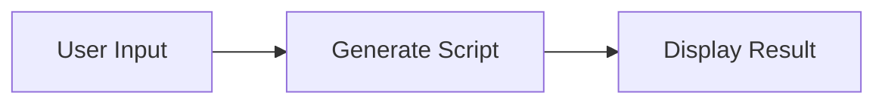
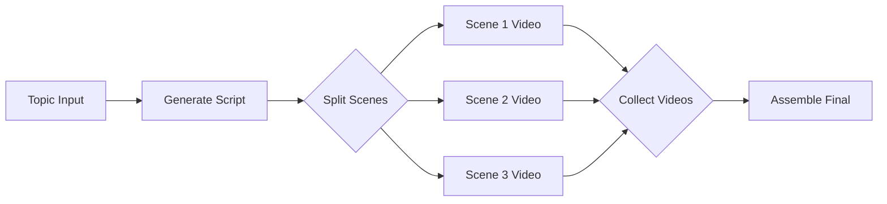
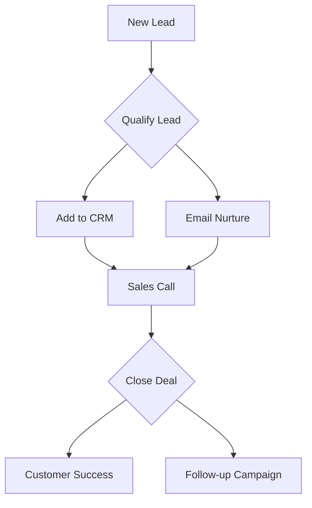
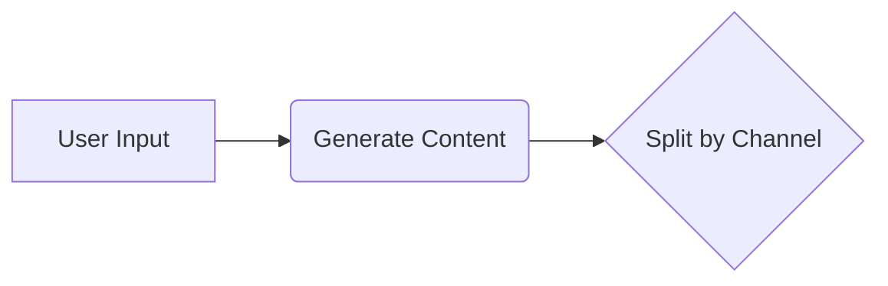
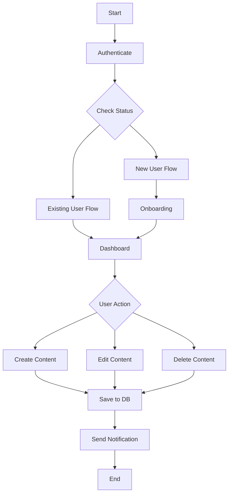
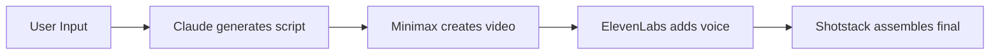
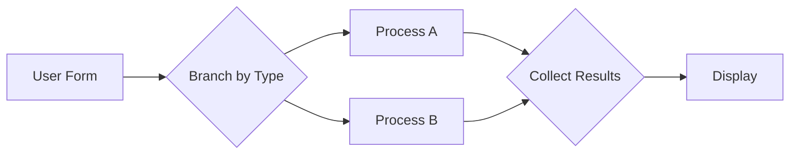

# MermaidImportExport Component Examples

## Example 1: Simple Linear Workflow

### Mermaid Input


### Generated Visual Graph
```json
{
  "nodes": [
    {
      "id": "Start",
      "type": "ux",
      "position": { "x": 0, "y": 0 },
      "data": {
        "label": "User Input"
      }
    },
    {
      "id": "Process",
      "type": "worker",
      "position": { "x": 300, "y": 0 },
      "data": {
        "label": "Generate Script",
        "worker_type": "claude"
      }
    },
    {
      "id": "Output",
      "type": "worker",
      "position": { "x": 600, "y": 0 },
      "data": {
        "label": "Display Result"
      }
    }
  ],
  "edges": [
    {
      "id": "e-Start-Process",
      "source": "Start",
      "target": "Process"
    },
    {
      "id": "e-Process-Output",
      "source": "Process",
      "target": "Output"
    }
  ]
}
```

## Example 2: Video Factory Workflow

### Mermaid Input


### Node Configs (Optional)
```json
{
  "Claude": {
    "workerType": "claude",
    "config": {
      "model": "claude-3-sonnet-20240229",
      "temperature": 0.7
    }
  },
  "Video1": {
    "workerType": "minimax",
    "config": { "duration": 5 }
  },
  "Video2": {
    "workerType": "minimax",
    "config": { "duration": 5 }
  },
  "Video3": {
    "workerType": "minimax",
    "config": { "duration": 5 }
  },
  "Assemble": {
    "workerType": "shotstack"
  }
}
```

### Edge Mappings (Optional)
```json
{
  "Claude->Split": {
    "scenes": "output.script.scenes"
  },
  "Split->Video1": {
    "prompt": "scenes[0].description"
  },
  "Split->Video2": {
    "prompt": "scenes[1].description"
  },
  "Split->Video3": {
    "prompt": "scenes[2].description"
  },
  "Video1->Collect": {
    "clip1": "output.videoUrl"
  },
  "Video2->Collect": {
    "clip2": "output.videoUrl"
  },
  "Video3->Collect": {
    "clip3": "output.videoUrl"
  },
  "Collect->Assemble": {
    "clips": "output.allClips"
  }
}
```

## Example 3: Business Model Canvas Workflow

### Mermaid Input


### Generated Structure
- **Lead**: UX node (user input)
- **Qualify**: Splitter node (branching logic)
- **CRM**: Worker node (integration)
- **Nurture**: Worker node (email automation)
- **Sales**: Worker node (scheduling)
- **Close**: Collector node (merge paths)
- **Success**: Worker node (onboarding)
- **Followup**: Worker node (marketing automation)

## Example 4: Export from Existing Canvas

### Input Visual Graph
```json
{
  "nodes": [
    {
      "id": "A",
      "type": "ux",
      "position": { "x": 0, "y": 0 },
      "data": {
        "label": "User Input",
        "config": { "placeholder": "Enter topic" }
      }
    },
    {
      "id": "B",
      "type": "worker",
      "position": { "x": 300, "y": 0 },
      "data": {
        "label": "Generate Content",
        "worker_type": "claude",
        "config": {
          "model": "claude-3-sonnet-20240229"
        }
      }
    },
    {
      "id": "C",
      "type": "splitter",
      "position": { "x": 600, "y": 0 },
      "data": {
        "label": "Split by Channel"
      }
    }
  ],
  "edges": [
    {
      "id": "e1",
      "source": "A",
      "target": "B",
      "data": {
        "mapping": { "prompt": "input.topic" }
      }
    },
    {
      "id": "e2",
      "source": "B",
      "target": "C"
    }
  ]
}
```

### Exported Mermaid


**Note:** Detailed configurations are not included in the export. The Mermaid output focuses on structure only.

## Example 5: Complex Multi-Path Workflow

### Mermaid Input


### Auto-Layout Result
The auto-layout algorithm will:
1. Compute topological levels for each node
2. Position nodes horizontally by level
3. Position nodes vertically to avoid overlap
4. Generate coordinates for all nodes

**Level Assignment:**
- Level 0: Start
- Level 1: Auth
- Level 2: Check
- Level 3: New, Existing
- Level 4: Onboard, Dashboard
- Level 5: Action
- Level 6: Create, Edit, Delete
- Level 7: Save
- Level 8: Notify
- Level 9: End

## Example 6: Worker Type Inference

The parser automatically infers worker types from labels:

### Input


### Inferred Worker Types
- **A**: `ux` (contains "User Input")
- **B**: `worker` with `worker_type: "claude"` (contains "Claude")
- **C**: `worker` with `worker_type: "minimax"` (contains "Minimax" and "video")
- **D**: `worker` with `worker_type: "elevenlabs"` (contains "ElevenLabs" and "voice")
- **E**: `worker` with `worker_type: "shotstack"` (contains "Shotstack" and "assembles")

## Example 7: Node Type Inference

The parser infers node types from keywords:

### Input


### Inferred Node Types
- **Form**: `ux` (contains "Form")
- **Split**: `splitter` (contains "Branch")
- **Process1**: `worker` (default)
- **Process2**: `worker` (default)
- **Merge**: `collector` (contains "Collect")
- **Display**: `worker` (default)

## Example 8: Error Handling

### Invalid Mermaid Syntax
```mermaid
flowchart LR
  A[Start] -> B[End]  ❌ Wrong arrow syntax
```

**Error:** `Failed to parse Mermaid: Expected '-->' but found '->'`

### Invalid Node Configs JSON
```json
{
  "A": {
    "workerType": "claude",
    "config": {
      "model": "claude-3-sonnet-20240229"
    }  ❌ Missing closing brace
}
```

**Error:** `Invalid nodeConfigs JSON: Unexpected end of JSON input`

### Invalid Edge Mappings JSON
```json
{
  "A->B": {
    prompt: "output.text"  ❌ Missing quotes around key
  }
}
```

**Error:** `Invalid edgeMappings JSON: Expected property name or '}' in JSON at position 12`

## Example 9: Preview Before Import

When user clicks "Preview", they see:

```
Preview
✓ 5 nodes, 4 edges

Nodes: Start (ux), Process (worker: claude), Split (splitter), Collect (collector), End (worker)
Edges: Start → Process, Process → Split, Split → Collect, Collect → End
```

This allows verification before importing into the canvas.

## Example 10: Integration with Version Control

```typescript
import { MermaidImportExport } from '@/components/canvas/MermaidImportExport';
import { createVersion } from '@/lib/canvas/version-manager';

function FlowEditor({ flowId }: { flowId: string }) {
  const handleImport = async (graph: VisualGraph) => {
    // Create new version with imported graph
    const { versionId } = await createVersion(
      flowId,
      graph,
      'Imported from Mermaid'
    );
    
    console.log('Created version:', versionId);
    
    // Optionally navigate to the new version
    router.push(`/canvas/${flowId}?version=${versionId}`);
  };

  return (
    <MermaidImportExport onImport={handleImport} />
  );
}
```

## Tips for Best Results

### 1. Use Descriptive Labels
Good labels help with type inference:
- ✅ `Claude[Generate Script]` → Infers claude worker
- ❌ `A[Process]` → Generic worker, needs config

### 2. Use Consistent Naming
- Use clear node IDs: `scriptGen`, `videoGen`, `assemble`
- Avoid generic IDs: `A`, `B`, `C` (unless intentional)

### 3. Provide Configs for Complex Workflows
For production workflows, always provide:
- Node configs with specific worker settings
- Edge mappings for data flow
- Entity movement configurations

### 4. Test with Preview
Always preview before importing to catch:
- Incorrect type inference
- Missing connections
- Unexpected node types

### 5. Export for Documentation
Use export to:
- Document workflows in README files
- Share workflow structure with team
- Create visual diagrams for presentations
