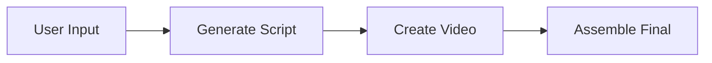
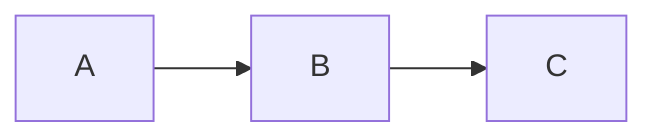
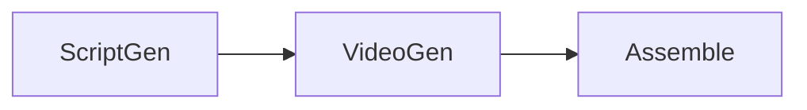
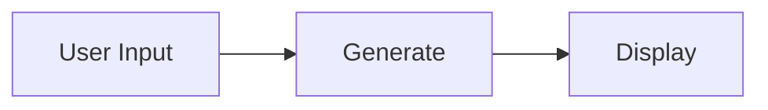
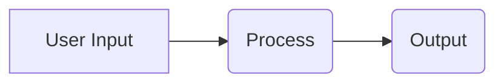

# MermaidImportExport Component Usage Guide

## Overview

The `MermaidImportExport` component provides UI for importing workflows from Mermaid syntax and exporting to Mermaid. It supports the hybrid Mermaid + JSON approach for flexible workflow creation.

## Features

- **Import from Mermaid**: Parse Mermaid flowchart syntax into visual graphs
- **Export to Mermaid**: Convert visual graphs to Mermaid syntax
- **Optional Configurations**: Support for nodeConfigs and edgeMappings
- **Preview**: Visual preview of generated canvas before import
- **Validation**: Error handling for invalid Mermaid or JSON

## Requirements

Validates requirements: 6.1, 6.3, 7.1, 7.2, 7.3, 7.4

## Basic Usage

### Import Only

```tsx
import { MermaidImportExport } from '@/components/canvas/MermaidImportExport';

function MyCanvas() {
  const handleImport = (graph: VisualGraph) => {
    console.log('Imported graph:', graph);
    // Update your canvas with the imported graph
  };

  return (
    <MermaidImportExport onImport={handleImport} />
  );
}
```

### Export Only

```tsx
import { MermaidImportExport } from '@/components/canvas/MermaidImportExport';

function MyCanvas() {
  const currentGraph: VisualGraph = {
    nodes: [...],
    edges: [...]
  };

  const handleExport = (mermaid: string) => {
    console.log('Exported Mermaid:', mermaid);
    // Copy to clipboard or save to file
  };

  return (
    <MermaidImportExport 
      currentGraph={currentGraph}
      onExport={handleExport}
    />
  );
}
```

### Full Integration with Unsaved Changes Protection

```tsx
import { MermaidImportExport } from '@/components/canvas/MermaidImportExport';
import { VisualGraph } from '@/types/canvas-schema';
import { createVersion } from '@/lib/canvas/version-manager';

function MyCanvas() {
  const [graph, setGraph] = useState<VisualGraph>({ nodes: [], edges: [] });
  const [hasUnsavedChanges, setHasUnsavedChanges] = useState(false);

  const handleImport = (importedGraph: VisualGraph) => {
    setGraph(importedGraph);
    setHasUnsavedChanges(false);
    // Optionally save to database
  };

  const handleSaveBeforeImport = async () => {
    // Save current changes before importing
    await createVersion(flowId, graph, 'Auto-save before import');
    setHasUnsavedChanges(false);
  };

  const handleExport = (mermaid: string) => {
    // Copy to clipboard
    navigator.clipboard.writeText(mermaid);
    // Show success message
  };

  return (
    <div>
      <MermaidImportExport 
        currentGraph={graph}
        onImport={handleImport}
        onExport={handleExport}
        hasUnsavedChanges={hasUnsavedChanges}
        onSaveBeforeImport={handleSaveBeforeImport}
      />
      {/* Your canvas rendering */}
    </div>
  );
}
```

## Integration with StitchCanvas

To integrate with the existing StitchCanvas component with unsaved changes protection:

```tsx
import { StitchCanvas } from '@/components/canvas/StitchCanvas';
import { MermaidImportExport } from '@/components/canvas/MermaidImportExport';
import { createVersion } from '@/lib/canvas/version-manager';

function FlowEditor({ flow }: { flow: StitchFlow }) {
  const [hasUnsavedChanges, setHasUnsavedChanges] = useState(false);
  
  const handleImport = async (graph: VisualGraph) => {
    // Create a new version with the imported graph
    await createVersion(flow.id, graph, 'Imported from Mermaid');
    setHasUnsavedChanges(false);
    // Refresh the page to show the new version
    router.refresh();
  };
  
  const handleSaveBeforeImport = async () => {
    // Save current changes before importing
    await createVersion(flow.id, flow.graph, 'Auto-save before import');
    setHasUnsavedChanges(false);
  };

  return (
    <div className="relative w-full h-full">
      {/* Add to toolbar */}
      <div className="absolute top-4 left-4 z-10">
        <MermaidImportExport 
          currentGraph={flow.graph}
          onImport={handleImport}
          hasUnsavedChanges={hasUnsavedChanges}
          onSaveBeforeImport={handleSaveBeforeImport}
        />
      </div>
      
      {/* Existing canvas */}
      <StitchCanvas 
        flow={flow} 
        editable 
        onGraphChange={() => setHasUnsavedChanges(true)}
      />
    </div>
  );
}
```

## Import Workflow

### 1. Mermaid-Only (Quick Sketch)

User provides only Mermaid syntax. The system infers node types and worker types:



**Result:**
- `Start` → inferred as `ux` node (contains "User Input")
- `Claude` → inferred as `worker` node with `worker_type: "claude"`
- `Video` → inferred as `worker` node with `worker_type: "minimax"`
- `Assemble` → inferred as `worker` node with `worker_type: "shotstack"`

### 2. Mermaid + Node Configs (Detailed)

User provides Mermaid for structure and JSON for detailed configuration:

**Mermaid:**


**Node Configs:**
```json
{
  "A": {
    "workerType": "claude",
    "config": {
      "model": "claude-3-sonnet-20240229",
      "temperature": 0.7
    }
  },
  "B": {
    "workerType": "minimax",
    "config": {
      "duration": 5
    }
  },
  "C": {
    "workerType": "shotstack"
  }
}
```

### 3. Mermaid + Edge Mappings (Data Flow)

User provides Mermaid and specifies how data flows between nodes:

**Mermaid:**


**Edge Mappings:**
```json
{
  "ScriptGen->VideoGen": {
    "prompt": "output.script.scenes[0].description",
    "duration": "5"
  },
  "VideoGen->Assemble": {
    "clips": "output.videoUrl"
  }
}
```

### 4. Full Hybrid (Complete Control)

Combine all three for maximum control:

**Mermaid:**


**Node Configs:**
```json
{
  "Process": {
    "workerType": "claude",
    "config": {
      "model": "claude-3-sonnet-20240229"
    },
    "entityMovement": {
      "onSuccess": {
        "targetSectionId": "production",
        "completeAs": "success"
      }
    }
  }
}
```

**Edge Mappings:**
```json
{
  "Input->Process": {
    "prompt": "input.text"
  },
  "Process->Output": {
    "result": "output.text"
  }
}
```

## Export Workflow

The export function converts the current visual graph to Mermaid syntax:

**Input (Visual Graph):**
```typescript
{
  nodes: [
    { id: 'A', type: 'ux', data: { label: 'User Input' }, ... },
    { id: 'B', type: 'worker', data: { label: 'Process', worker_type: 'claude' }, ... },
    { id: 'C', type: 'worker', data: { label: 'Output', worker_type: 'minimax' }, ... }
  ],
  edges: [
    { id: 'e1', source: 'A', target: 'B' },
    { id: 'e2', source: 'B', target: 'C' }
  ]
}
```

**Output (Mermaid):**


**Note:** Detailed configurations (worker configs, entity movement, edge mappings) are not included in the Mermaid export. These should be managed separately if needed.

## Node Shape Mapping

The component uses different Mermaid shapes for different node types:

- **UX nodes**: `[Label]` - Rectangle
- **Worker nodes**: `(Label)` - Rounded rectangle
- **Splitter/Collector nodes**: `{Label}` - Diamond
- **Other nodes**: `[Label]` - Rectangle (default)

## Unsaved Changes Protection

The component includes built-in protection against accidentally losing unsaved work:

### How It Works

1. **Detection**: Pass `hasUnsavedChanges={true}` when the canvas has unsaved changes
2. **Warning**: When user clicks "Import", they see a warning dialog
3. **Options**: User can choose to:
   - **Cancel**: Go back without importing
   - **Discard Changes**: Proceed with import, losing current work
   - **Save & Import**: Save current work first, then import (requires `onSaveBeforeImport` callback)

### Example Warning Dialog

```
⚠️ Unsaved Changes

You have unsaved changes in your current canvas. Importing will replace your current work.
What would you like to do?

[Cancel]  [Discard Changes]  [Save & Import]
```

### Implementation

```tsx
<MermaidImportExport 
  currentGraph={currentGraph}
  onImport={handleImport}
  hasUnsavedChanges={isDirty}  // Track dirty state
  onSaveBeforeImport={async () => {
    // Save current changes
    await createVersion(flowId, currentGraph, 'Auto-save before import');
  }}
/>
```

### Without Save Callback

If you don't provide `onSaveBeforeImport`, users will only see:
- Cancel
- Discard Changes

This is useful when you want to warn users but don't have a save mechanism available.

## Error Handling

The component handles various error scenarios:

### Invalid Mermaid Syntax
```
Error: Failed to parse Mermaid: Unexpected token at line 2
```

### Invalid JSON in Configs
```
Error: Invalid nodeConfigs JSON: Unexpected token } in JSON at position 45
```

### Invalid JSON in Mappings
```
Error: Invalid edgeMappings JSON: Expected property name or '}' in JSON at position 12
```

## Preview Feature

Before importing, users can preview the generated graph:

1. Enter Mermaid syntax (and optional configs)
2. Click "Preview" button
3. See summary of nodes and edges
4. Verify structure is correct
5. Click "Import" to apply

**Preview Display:**
```
Preview
3 nodes, 2 edges

Nodes: A (worker: claude), B (worker: minimax), C (worker: shotstack)
Edges: A → B, B → C
```

## Styling

The component uses the existing Stitch design system:

- Dark theme (slate-900 background)
- Cyan accent colors for interactive elements
- Monospace font for code/JSON inputs
- Consistent button and dialog styling

## API Reference

### Props

```typescript
interface MermaidImportExportProps {
  /**
   * Current visual graph (for export)
   */
  currentGraph?: VisualGraph;
  
  /**
   * Callback when import is confirmed
   * Receives the generated visual graph
   */
  onImport?: (graph: VisualGraph) => void;
  
  /**
   * Callback when export is triggered
   * Receives the generated Mermaid syntax
   */
  onExport?: (mermaid: string) => void;
  
  /**
   * Whether there are unsaved changes in the current canvas
   * If true, user will be warned before importing
   * @default false
   */
  hasUnsavedChanges?: boolean;
  
  /**
   * Callback to save current changes before importing
   * Called when user chooses to save before import
   * If not provided, only "Cancel" and "Discard" options shown
   */
  onSaveBeforeImport?: () => Promise<void>;
}
```

### Dependencies

- `@/lib/canvas/mermaid-parser` - Parses Mermaid to visual graph
- `@/lib/canvas/mermaid-generator` - Converts visual graph to Mermaid
- `@/types/canvas-schema` - Visual graph type definitions
- `@/types/workflow-creation` - Workflow creation request types

## Testing

The component includes comprehensive tests:

```bash
npm test src/components/canvas/__tests__/MermaidImportExport.test.tsx
```

Tests cover:
- Props interface validation
- NodeConfig structure
- WorkflowCreationRequest structure
- Mermaid-only workflow creation
- Full graph workflow creation
- Hybrid approach
- Callback function signatures

## Future Enhancements

Potential improvements for future versions:

1. **Live Preview**: Real-time canvas preview as user types Mermaid
2. **Syntax Highlighting**: Color-coded Mermaid syntax in textarea
3. **Auto-completion**: Suggest node IDs and worker types
4. **Templates**: Pre-built Mermaid templates for common workflows
5. **Validation**: Real-time validation of Mermaid syntax
6. **Diff View**: Show differences between current and imported graph
7. **Batch Import**: Import multiple workflows at once
8. **Export Options**: Export with or without configs/mappings

## Related Documentation

- [Mermaid Parser](../../lib/canvas/mermaid-parser.ts)
- [Mermaid Generator](../../lib/canvas/mermaid-generator.ts)
- [Canvas Schema Types](../../types/canvas-schema.ts)
- [Workflow Creation Types](../../types/workflow-creation.ts)
- [Version Manager](../../lib/canvas/version-manager.ts)
